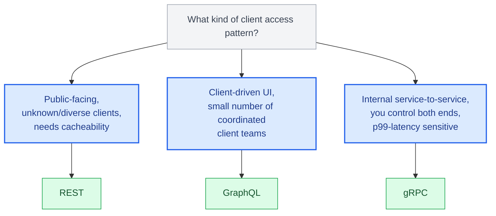
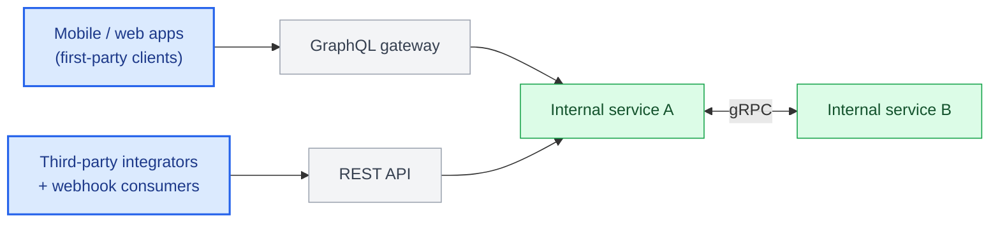

# Chapter 1: The API Architecture Landscape

## Why protocol choice is an architecture decision, not a style preference

Junior teams pick an API style because it's what the framework tutorial used. Senior and lead engineers pick one because they've mapped it against access patterns, client diversity, latency budgets, and the organizational boundaries the API has to survive. REST, GraphQL, and gRPC are not competing implementations of the same idea — they optimize for different failure modes, and choosing wrong shows up eighteen months later as a rewrite.

## Three protocols, three contracts

**REST** is a resource-oriented style built on HTTP semantics. A REST API exposes nouns (`/orders/42`) and lets HTTP verbs (`GET`, `POST`, `PATCH`, `DELETE`) express intent. Its contract is loose by design — the client and server agree on media types and status codes, but the shape of the payload is whatever the server decides to send. This looseness is REST's biggest strength (any HTTP client can talk to it, caching works for free) and its biggest weakness (over-fetching, under-fetching, and undocumented payload drift).

**GraphQL** is a query-oriented style built on a single endpoint and a strongly typed schema. The client specifies the exact shape of the data it wants, and the server resolves it field by field. This solves REST's over-fetching problem at the cost of moving complexity into the resolver graph — a single query can now trigger dozens of downstream calls, and the server has to defend itself against expensive queries at request time rather than at design time.

**gRPC** is a contract-first RPC framework built on HTTP/2 and Protocol Buffers. The client calls what looks like a local function; the wire format is a compact binary encoding, and the contract is a `.proto` file that generates client and server stubs in whatever language you need. gRPC trades human-readability and browser-nativeness for performance, strong typing, and native support for streaming — this is why it dominates service-to-service communication inside a datacenter but rarely faces an external mobile client directly.

| Aspect | REST | GraphQL | gRPC |
|---|---|---|---|
| Contract | Loose — HTTP verbs and media types; payload shape decided by the server | Strongly typed schema; client specifies the exact shape it wants | Contract-first `.proto` file; generates typed client/server stubs |
| Biggest strength | Any HTTP client can talk to it; caching works for free | Solves over-fetching and under-fetching | Compact binary wire format, strong typing, native streaming |
| Biggest weakness | Over-fetching, under-fetching, undocumented payload drift | Complexity moves into the resolver graph; server must defend against expensive queries | Not browser-native; trades human-readability for performance |

## Same operation, three shapes

Fetching order `42` and its line items looks different in each protocol. Seeing the same request side by side is the fastest way to internalize what each one actually optimizes for.

**REST**

```
GET /v1/orders/42 HTTP/1.1
Host: api.example.com
Authorization: Bearer <token>
```

```json
{
  "id": "42",
  "status": "SHIPPED",
  "customer_id": "cus_9",
  "line_items": [
    {"sku": "WIDGET-1", "quantity": 2},
    {"sku": "GADGET-7", "quantity": 1}
  ],
  "shipping_address": { "...": "..." },
  "billing_address": { "...": "..." }
}
```

The server decides the shape. If the client only needed `status`, it still paid for `shipping_address` and `billing_address` — classic over-fetching.

**GraphQL**

```graphql
query {
  order(id: "42") {
    status
    lineItems { sku quantity }
  }
}
```

```json
{
  "data": {
    "order": {
      "status": "SHIPPED",
      "lineItems": [
        {"sku": "WIDGET-1", "quantity": 2},
        {"sku": "GADGET-7", "quantity": 1}
      ]
    }
  }
}
```

The client asked for exactly `status` and `lineItems`. No addresses, nothing unused — but the server now had to resolve `lineItems` as an independent field, which is where Chapter 9's N+1 problem originates.

**gRPC**

```protobuf
rpc GetOrder(GetOrderRequest) returns (Order);
```

```python
response = await stub.GetOrder(GetOrderRequest(order_id="42"), timeout=2.0)
print(response.status, response.line_items)
```

No JSON parsing, no URL construction — the client calls a typed method and gets a typed object back. The contract (`Order`, `GetOrderRequest`) is generated from the `.proto` file, so a field typo is a build error, not a runtime surprise.

## A decision framework, previewed

The full framework arrives in Chapter 20, once you've seen the mechanics of all three. For now, the short version:

- Public-facing APIs with unknown, diverse clients and a need for cacheability → **REST**.
- Client-driven UIs (especially mobile, where every unnecessary byte costs battery and latency) with a small number of client teams you can coordinate schema changes with → **GraphQL**.
- Internal service-to-service calls where you control both ends, care about p99 latency, and want compile-time contract safety → **gRPC**.



Most real systems don't pick one. A production platform commonly runs gRPC internally between services, exposes a GraphQL gateway to first-party client apps, and maintains a REST API for third-party integrators and webhooks. Chapter 21 walks through exactly this architecture end to end.



## What "senior-level" means for this book

This book does not re-explain what JSON is or how to define a Flask route. Each protocol chapter assumes you can read Python comfortably and have shipped at least one production API. The value here is in the second-order concerns: what breaks under load, what breaks under schema change, what breaks when a client team you don't control ships a mobile release you can't force-update.

## What's next

Chapter 2 covers the HTTP and networking layer that REST, GraphQL, and (transport-wise) gRPC all sit on top of.

---

## Exercises

Exercises for this chapter live in [01a-introduction-exercises.md](01a-introduction-exercises.md). Solutions are available separately in [resources/solutions/](../resources/solutions/).
