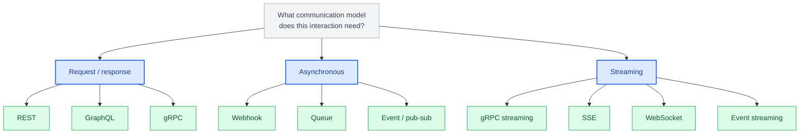
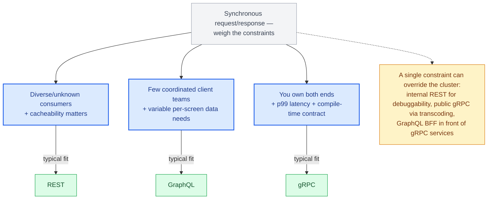
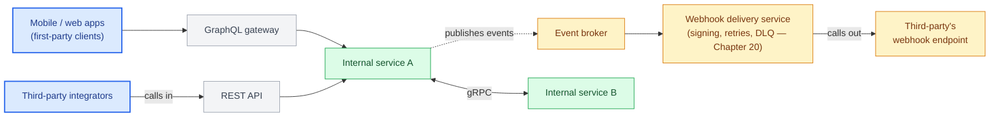

# Chapter 1: The API Architecture Landscape

## Why protocol choice is an architecture decision, not a style preference

Junior teams pick an API style because it's what the framework tutorial used. Senior and lead engineers pick one because they've mapped it against access patterns, client diversity, latency budgets, and the organizational boundaries the API has to survive. REST, GraphQL, and gRPC are not competing implementations of the same idea — they optimize for different failure modes, and choosing wrong shows up eighteen months later as a rewrite.

## Three protocols, three contracts

**REST** is a resource-oriented style built on HTTP semantics. A REST API exposes nouns (`/orders/42`) and lets HTTP verbs (`GET`, `POST`, `PATCH`, `DELETE`) express intent. Its contract is loose *at the protocol level* — HTTP itself enforces media types and status codes but not payload shape. Teams routinely impose a strong contract on top with OpenAPI, JSON Schema, and consumer-driven contract tests; the point is that this is a discipline the organization adds, not something the protocol checks for you the way a GraphQL schema or a `.proto` file does. That looseness is REST's biggest strength — any HTTP client can talk to it, and REST can take advantage of standardized HTTP caching semantics at browsers, CDNs, and proxies (Chapter 2) by setting the right headers, not automatically — and, left undisciplined, its biggest weakness (over-fetching, under-fetching, and undocumented payload drift).

**GraphQL** is a query-oriented style built on a single endpoint and a strongly typed schema. The client specifies the exact fields it wants from the schema, and the server resolves each one field by field — regardless of whether a given field comes from a database column, a downstream service call, or a value computed on the fly. This solves REST's over-fetching problem at the cost of moving complexity into the resolver graph — a single query can now trigger dozens of downstream calls, and the server has to defend itself against expensive queries at request time rather than at design time.

**gRPC** is a contract-first RPC framework built on HTTP/2 and Protocol Buffers. The client calls what looks like a local function; the wire format is a compact binary encoding, and the contract is a `.proto` file that generates client and server stubs in whatever language you need. gRPC trades human-readability and browser-nativeness for performance, strong typing, and native support for streaming — this makes it particularly well suited to service-to-service communication where both ends are controlled and strong contracts, efficient serialization, or streaming actually matter, though plenty of internal traffic also runs over REST/HTTP, message queues, or event streams like Kafka, and a service mesh doesn't imply gRPC any more than it implies any other protocol; gRPC rarely faces an external mobile client directly.

| Aspect | REST | GraphQL | gRPC |
|---|---|---|---|
| Contract | Loose at the protocol level — HTTP verbs and media types; strong payload contracts (OpenAPI/JSON Schema) are a convention layered on top | Strongly typed schema; client specifies the exact fields it wants | Contract-first `.proto` file; generates typed client/server stubs |
| Biggest strength | Any HTTP client can talk to it; standardized HTTP caching semantics are available when headers are set correctly | Solves over-fetching and under-fetching | Compact binary wire format, strong typing, native streaming |
| Biggest weakness | Over-fetching, under-fetching, undocumented payload drift | Complexity moves into the resolver graph; server must defend against expensive queries | Not browser-native; trades human-readability for performance |

## Same operation, three shapes

Fetching order `42` and its line items looks different in each protocol. Seeing the same request side by side is the fastest way to internalize what each one actually optimizes for.

**REST**

```
GET /v1/orders/42 HTTP/1.1
Host: api.example.com
Authorization: Bearer <token>
```

```json
{
  "id": "42",
  "status": "SHIPPED",
  "customer_id": "cus_9",
  "line_items": [
    {"sku": "WIDGET-1", "quantity": 2},
    {"sku": "GADGET-7", "quantity": 1}
  ],
  "shipping_address": { "...": "..." },
  "billing_address": { "...": "..." }
}
```

If this representation is the contract for `GET /orders/{id}`, a client that only needed `status` still receives `shipping_address` and `billing_address` — classic over-fetching, not a flaw REST requires, but a cost of a single representation serving every caller of that endpoint.

**GraphQL**

```graphql
query {
  order(id: "42") {
    status
    lineItems { sku quantity }
  }
}
```

```json
{
  "data": {
    "order": {
      "status": "SHIPPED",
      "lineItems": [
        {"sku": "WIDGET-1", "quantity": 2},
        {"sku": "GADGET-7", "quantity": 1}
      ]
    }
  }
}
```

The client asked for exactly `status` and `lineItems`. No addresses, nothing unused — but the server now had to resolve `lineItems` as an independent field, which is where Chapter 9's N+1 problem originates.

**gRPC**

```protobuf
rpc GetOrder(GetOrderRequest) returns (Order);
```

```python
response = await stub.GetOrder(GetOrderRequest(order_id="42"), timeout=2.0)
print(response.status, response.line_items)
```

No JSON parsing, no URL construction — the client calls a typed method and gets a typed object back. The contract (`Order`, `GetOrderRequest`) is generated from the `.proto` file, giving clients and servers strongly typed APIs and far stronger tooling than an untyped JSON payload — IDE autocomplete, static analysis, and generated types across every language on both ends of the wire. In a statically typed language, a field typo like `response.line_itmes` is a compile error; in Python specifically, the generated types improve tooling and catch plenty of mistakes via IDE support and runtime validation, but a typo'd attribute access is still an `AttributeError` at runtime, not a build failure — the contract is real, but Python doesn't compile.

## First, a prior question: which communication model?

The primary interaction model for REST, GraphQL queries/mutations, and unary gRPC calls is **synchronous request/response**: a client sends a request, waits, and gets a response on the same connection. That's the right model for most API interactions, and it's what Parts II through IV cover in depth. But it isn't the only model even within these three protocols — GraphQL has subscriptions, gRPC has server/client/bidirectional streaming, and REST can ride on SSE or long polling — and choosing synchronous request/response by default is itself an architecture decision worth making consciously.

- **Synchronous request/response** — the caller needs the answer now and will wait for it (fetch an order, validate a form, run a search). REST / GraphQL / gRPC.
- **Asynchronous** — the work takes longer than a caller should hold a connection for, or no single caller is waiting for "the answer" at all (a bulk import, a payment settlement, an event other systems react to). Webhooks, message queues, or an event stream — covered in Chapter 20.
- **Streaming** — a continuous flow of messages in one or both directions rather than a single response (live updates, telemetry ingestion, large result sets). gRPC streaming, Server-Sent Events, WebSockets, or a subscribed event stream. SSE and WebSockets solve different shapes of this: SSE is server-to-client only, rides on plain HTTP, and gets reconnection handling for free from the browser — the right default when the client only ever receives (a live order-status feed, a progress indicator). WebSockets are bidirectional and need their own reconnect/heartbeat logic, but are necessary the moment the client also needs to send messages on the same connection (chat, collaborative editing) — reaching for a WebSocket when SSE would do just adds protocol and infrastructure the interaction doesn't need.



These three branches aren't mutually exclusive categories, and the diagram's placement of "Event / pub-sub" under Asynchronous and "Event streaming" under Streaming is easy to misread as a claim that they are. **Asynchronous** describes whether the caller waits for completion; **streaming** describes whether data is delivered as an ongoing sequence rather than a single response. The two axes can and usually do overlap — a Kafka-style event stream is typically both: nobody's holding a connection open waiting for "the answer" (asynchronous), and what a consumer receives is a continuous, ongoing sequence of records, not one reply (streaming). The diagram splits them by which property is most architecturally relevant to *that specific pattern* — a webhook's defining trait is that the caller doesn't wait, so it's filed under Asynchronous; a subscribed event stream's defining trait, once you're past "the caller doesn't wait," is that the data keeps coming, so it's filed under Streaming — not because one pattern is asynchronous and the other isn't.

A large share of "we chose the wrong API style" pain is really "we modeled an asynchronous interaction synchronously" — a 30-second operation forced into a blocking request. Settle the communication model first; the rest of this framework assumes you've landed on synchronous request/response.

## A decision framework, previewed

The full framework arrives in Chapter 21, once you've seen the mechanics of all three. Within synchronous request/response, protocol choice is the *result* of a set of constraints, not a lookup by client type:

- **Interaction model** — simple resource fetches, or client-driven queries over a variable graph of data?
- **Client diversity** — a bounded set of client teams you can coordinate with, or unknown third parties you can't?
- **Contract strength** — is a loose, self-describing contract acceptable, or do you need compile-time enforcement?
- **Latency** — is this on a p99-sensitive internal path, or a human-facing request where tens of milliseconds don't matter?
- **Failure and reliability semantics** — does the caller need an immediate success/failure answer, can the operation be retried safely, or is completing eventually acceptable? This is often the real reason an operation lands on `202` + a job resource instead of a synchronous `200`, and it's easy to mistake for a latency question when it isn't one: `POST /reports` returning `200` once the report is actually built, versus `202` with the report generated by a worker afterward, isn't primarily about how long report generation takes — a fast report and a slow one can both legitimately choose either shape. It's about whether the caller needs to know success or failure *now*, and whether "retry the request" is even a safe thing for a client to do if the connection drops partway through (Chapter 3's idempotency discipline, Chapter 20's job-resource pattern).
- **Cacheability** — does URL-keyed HTTP caching at the CDN/proxy layer materially help this workload?
- **Payload and query characteristics** — small and uniform, or large with per-client field selection needs?
- **Ownership** — do you control both ends, or only one?
- **Ecosystem and operational maturity** — is your team already fluent in Protobuf toolchains and L7 load balancing, or is HTTP/JSON the path of least resistance?
- **Streaming** — does any part of this need server-push or bidirectional streams?

As a starting heuristic, those constraints tend to cluster: unknown/diverse public consumers that benefit from caching lean **REST**; a few coordinated first-party UI teams that need to minimize over-fetching lean **GraphQL**; internal service-to-service calls where you own both ends and care about p99 latency and compile-time safety lean **gRPC**. But the clustering is a consequence of the constraints, not a rule — an internal path can rationally stay REST for debuggability and HTTP-centric infra, and a public API can rationally be gRPC-with-transcoding. Chapter 21 works through the constraint set in full.



Most real systems don't pick one. A production platform commonly runs gRPC internally between services, exposes a GraphQL gateway to first-party client apps, maintains a REST API that third-party integrators call into, and — running the other direction entirely — publishes events to a broker that drives internal consumers and delivers outbound webhooks to those same integrators' own endpoints. It's worth keeping that last pair straight: a REST API is *your* server receiving requests; a webhook is *your* system making the request, to a URL someone else registered. They're both part of serving third-party integrators, but they're opposite communication directions with opposite failure modes (Chapter 20 covers webhooks as a client-role design problem, not just an endpoint you expose). Chapter 22 walks through exactly this architecture end to end.



That delivery service is doing real, non-trivial work between the broker and the third party — signing each payload, retrying failed deliveries with backoff, tracking per-delivery state, rate-limiting itself against a slow endpoint, and dead-lettering an endpoint that never succeeds — not just relaying events. Chapter 20 covers all of it; Chapter 22's case study names this component the seller-notification service.

## What "senior-level" means for this book

This book does not re-explain what JSON is or how to define a Flask route. Each protocol chapter assumes you can read Python comfortably and have shipped at least one production API. The value here is in the second-order concerns: what breaks under load, what breaks under schema change, what breaks when a client team you don't control ships a mobile release you can't force-update.

## What's next

Chapter 2 covers the HTTP and networking layer that REST, GraphQL, and (transport-wise) gRPC all sit on top of.

---

## Exercises

Exercises for this chapter live in [01a-introduction-exercises.md](01a-introduction-exercises.md). Solutions are available separately in [resources/solutions/](../resources/solutions/).
