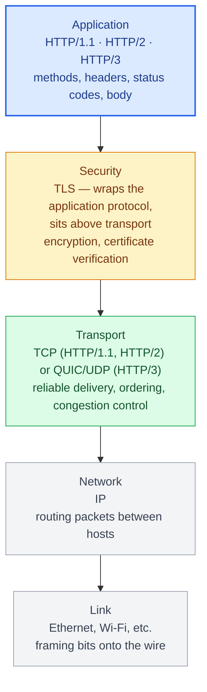
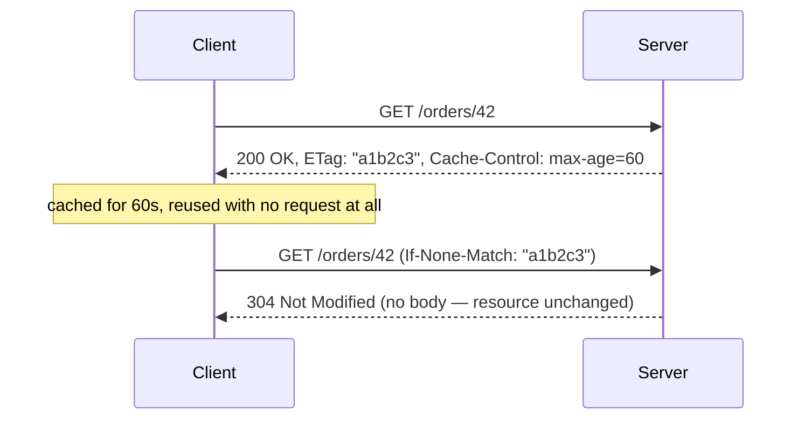
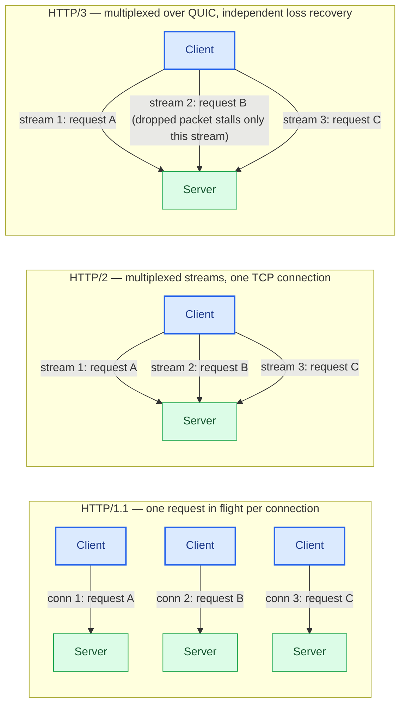
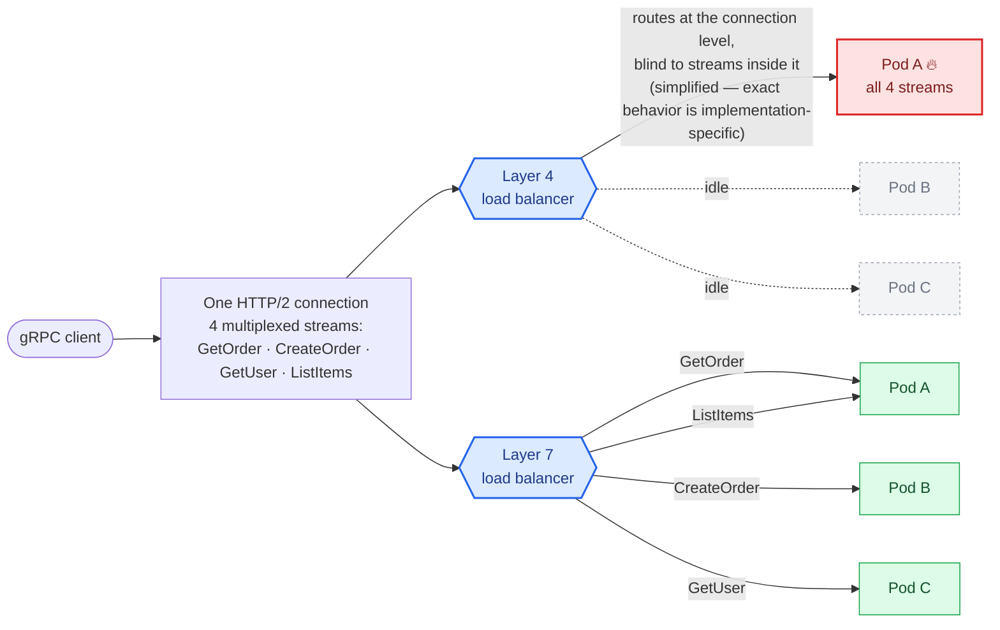

# Chapter 2: HTTP Transport Internals

## Why this chapter exists

REST is defined by HTTP semantics. GraphQL usually rides on top of HTTP as a transport it barely uses. gRPC requires HTTP/2 specifically and depends on its multiplexing to deliver on its performance promises. You cannot reason about any of the three protocols' real-world behavior without a working model of the transport underneath them.

## Where HTTP fits in the network stack

HTTP is commonly described as an application-layer protocol — Layer 7 in the OSI model. That reference is useful shorthand, but worth a caveat up front: the practical Internet protocol stack doesn't map cleanly onto OSI's seven layers, and TLS is the clearest example — it doesn't have a clean OSI layer of its own, sitting instead between the application protocol and the transport layer, wrapping HTTP without being part of either. The diagram below uses a practical stack instead of forcing everything into OSI numbering. Everything below HTTP is invisible to the code you write against `httpx` or `grpc`, but the failure modes covered later in this chapter (head-of-line blocking, TLS handshake cost, load balancer blindness) only make sense once you can place HTTP relative to what actually carries it.



Two things fall out of this that matter for the rest of the chapter:

- **HTTPS is not a separate protocol from HTTP** — it's HTTP layered on top of TLS. That's why HTTP/3 folding the TLS handshake into the QUIC handshake (see below) is a transport-layer optimization, not an application-layer one; the HTTP semantics above it don't change at all.
- **Everything from "HTTP/2: multiplexing" through "Load balancing at Layer 4 vs Layer 7"** is really a story about Layer 7 (HTTP) being built on top of a Layer 4 (TCP/UDP) transport that doesn't share its abstractions. A Layer 4 load balancer operates one layer below HTTP and is structurally blind to everything HTTP does — which is exactly the gap the load-balancing section works through.

## HTTP methods and their semantics

Every HTTP request carries a method that tells the server what kind of operation to perform. REST's design (Part II) leans directly on the semantics defined here, so getting them right matters beyond this chapter.

| Method | Safe | Idempotent | Typical use |
|---|---|---|---|
| GET | Yes | Yes | Retrieve a resource, no side effects |
| HEAD | Yes | Yes | Same as GET but headers only, no body |
| OPTIONS | Yes | Yes | Discover allowed methods, CORS preflight |
| PUT | No | Yes | Replace a resource entirely |
| DELETE | No | Yes | Remove a resource |
| POST | No | No | Create a resource, or trigger a non-idempotent action |
| PATCH | No | No (not guaranteed) | Partial update to a resource |

**Safe** means the method must not change server state — a GET that triggers a write is a spec violation, and it breaks caching, prefetching, and link-crawling, all of which assume GET is free to repeat. **Idempotent** means issuing the same request *N* times has the same server-side effect as issuing it once. That's what makes it safe for an HTTP client, a proxy, or a load balancer to automatically retry a PUT or DELETE after a timeout — but not a POST: blindly retrying a POST after an ambiguous failure (did the server process it before the connection dropped?) can create duplicate resources, which is the mechanism behind the classic double-charged-payment bug.

```python
import httpx

with httpx.Client() as client:
    client.get("https://api.example.com/orders/42")              # safe, idempotent — freely retryable
    client.put("https://api.example.com/orders/42", json={...})  # idempotent, not safe — retryable
    client.post("https://api.example.com/orders", json={...})    # neither — retries risk duplicates
```

This is also why HTTP/2's request multiplexing doesn't change retry semantics: multiplexing changes how requests travel over the wire, not whether the operation a method triggers is safe to repeat when a stream fails partway through.

## HTTP caching: what "free at every layer" actually means

REST's caching advantage, referenced throughout this book, isn't automatic — it's built on a specific set of headers that a browser, CDN, or reverse proxy all understand without any protocol-specific configuration. `Cache-Control` on the response tells any cache how (and whether) to store it: `max-age=60` says "reusable for 60 seconds without asking," `no-cache` says "reusable only after revalidating with the origin," `no-store` says "never cache this at all" (the correct setting for anything containing per-user data), and `private` vs `public` says whether a shared cache (a CDN) may store it or only the requesting client may.

For a resource that changes but is expensive to regenerate, **conditional requests** avoid re-sending the full body when nothing changed. The server includes an `ETag` (an opaque fingerprint of the current representation) on the response; the client's next request sends that value back as `If-None-Match`, and the server replies `304 Not Modified` with no body at all if the fingerprint still matches — the client keeps using its cached copy, and the only cost was one small round trip instead of the full payload. `Last-Modified` / `If-Modified-Since` is the older, coarser-grained equivalent (timestamp precision instead of a content fingerprint), still common where computing an ETag would itself be expensive.



| Directive / header | Meaning |
|---|---|
| `Cache-Control: max-age=N` | Reusable without revalidation for N seconds |
| `Cache-Control: no-cache` | Must revalidate with the origin before reuse |
| `Cache-Control: no-store` | Never cache — required for per-user or sensitive responses |
| `Cache-Control: private` / `public` | Only the client may cache / any shared cache (CDN) may cache |
| `ETag` + `If-None-Match` | Content-fingerprint validation — `304` skips resending an unchanged body |

None of this is protocol-specific machinery — it's why a REST API can take advantage of CDN and browser caching the moment it sets these headers correctly, and why GraphQL and gRPC can't in the same way: a GraphQL endpoint is a single URL (`POST /graphql`) that returns a different shape per query body, and gRPC doesn't ride on cacheable HTTP semantics at all, so neither has a URL-keyed cache entry for any of this machinery to attach to (Chapter 9 covers GraphQL's alternative, query-hash-keyed caching).

### Beyond HTTP: application and distributed caching

HTTP caching sits *in front of* your service and works for any protocol; it doesn't help with the expensive work *inside* a request handler that runs regardless of style. That's what an application cache (typically Redis or Memcached) is for, and the read pattern is almost always **cache-aside**: check the cache, on a miss read the source of truth and populate the cache, return. Write-through (write cache and store together) and write-behind (write cache now, flush to store asynchronously) trade consistency for latency and are worth reaching for only when the access pattern specifically calls for it.

Two hard problems come with it, and they're the same regardless of API style:

- **Invalidation.** A cached value that outlives a change to its source serves stale data. TTLs bound the staleness; explicit invalidation on write removes it but adds a consistency burden and its own race conditions.
- **The stampede.** When a popular key expires, every concurrent request misses at once and all of them hit the database together — a self-inflicted load spike precisely on your hottest data. Mitigations: a short lock so one request recomputes while others serve the stale value, early/probabilistic recomputation before expiry, or serving stale-while-revalidate. The related failures are cache *penetration* (many requests for a key that doesn't exist, so nothing is ever cached — cache the negative result) and cache *avalanche* (many keys expiring at the same instant — jitter the TTLs).

These are out of scope for the rest of this book, which stays focused on the API surface, but an architect choosing a protocol should know that REST's ability to take advantage of standardized HTTP caching applies only to that HTTP layer — the application-cache work above is the same whether the endpoint is REST, GraphQL, or gRPC.

## HTTP/1.1: the baseline

HTTP/1.1 is request-response over a TCP connection, with keep-alive allowing connection reuse across sequential requests. Its core limitation is **head-of-line blocking**: a connection normally processes one request/response at a time. Pipelining exists in the specification and technically allows multiple requests to be sent before their responses arrive, but responses must still come back in the same order they were requested — a slow response at the front of the queue blocks every response behind it — and browser/client support for pipelining is poor enough that it's effectively unusable in modern practice. Browsers work around the underlying limitation by opening multiple parallel connections per host (historically 6), which is why REST APIs under HTTP/1.1 benefit from splitting requests across hostnames — a hack that HTTP/2 makes obsolete.

```python
import httpx

# httpx defaults to HTTP/1.1 unless http2=True is set
with httpx.Client() as client:
    response = client.get("https://api.example.com/orders/42")
    print(response.http_version)  # "HTTP/1.1"
```

## HTTP/2: multiplexing changes everything

HTTP/2 introduces a binary framing layer and **stream multiplexing**: many logical request/response streams share a single TCP connection, interleaved at the frame level. This eliminates connection-per-request overhead and head-of-line blocking at the HTTP layer (it still exists at the TCP layer — see below). HTTP/2 also adds HPACK header compression, which matters a lot for gRPC and GraphQL, where repeated metadata (auth tokens, content-type headers) would otherwise be resent on every call.

This is the transport gRPC is built on. A single HTTP/2 connection between two services can carry hundreds of concurrent gRPC calls without the connection-pool exhaustion problems that plague HTTP/1.1-based REST clients under load.

```python
import httpx

with httpx.Client(http2=True) as client:
    response = client.get("https://api.example.com/orders/42")
    print(response.http_version)  # "HTTP/2"
```

## HTTP/3 and QUIC: fixing TCP's head-of-line blocking

HTTP/2's multiplexing is undone by a single dropped TCP packet: because all streams share one TCP connection, one lost packet blocks every stream until it's retransmitted. HTTP/3 replaces TCP with **QUIC**, a UDP-based transport with per-stream loss recovery, so a dropped packet only blocks the stream it belongs to. QUIC also folds the TLS handshake into the transport handshake, cutting connection setup latency — meaningful for mobile clients on lossy networks. QUIC connections are also identified by a connection ID rather than the traditional (source IP, source port) tuple, which enables **connection migration**: a client that switches networks mid-request (Wi-Fi to cellular, for instance) keeps the same QUIC connection instead of tearing down and renegotiating a new TCP+TLS session. This is where HTTP/3 matters most — mobile and edge-facing traffic on unreliable networks — rather than for stable service-to-service links inside a datacenter, where TCP's head-of-line blocking rarely bites in practice.

gRPC's performance story is built specifically on HTTP/2's multiplexing and flow control, and that doesn't carry over to HTTP/3 automatically: `grpc/grpc-http3` support is still maturing across languages (Python included), and moving gRPC onto QUIC changes its congestion-control and flow-control behavior in ways that need separate validation rather than assuming an HTTP/2 deployment's tuning still applies. Support for HTTP/3 in Python server stacks (via `aioquic`-backed servers) is also still maturing relative to Go and Rust. Python production deployments commonly use HTTP/1.1 and HTTP/2 today, while HTTP/3 support across Python server and gRPC stacks remains less mature and requires stack-specific validation before depending on it directly — HTTP/3 more commonly reaches these systems by rolling out at the CDN/edge layer in front of them, terminating QUIC at the edge and speaking HTTP/2 onward to the Python backend, rather than through the Python process itself.



## DNS resolution: the step before any of this

Before a TCP handshake, a TLS handshake, or an HTTP request can happen at all, the client has to resolve a hostname to an IP address — a round trip of its own, to a resolver that may or may not have the answer cached. A fresh, uncached DNS lookup adds real latency on top of everything else in this chapter, which is why a connection reused across many requests (below) amortizes not just the TLS handshake but the DNS lookup too — one resolution serves every request sent over that connection's lifetime, not just the first one.

DNS caching cuts both ways operationally. A short TTL means clients notice a changed IP (a failover, a deployment behind a new load balancer) quickly, at the cost of more frequent lookups; a long TTL reduces lookup overhead but means a client can keep sending traffic to a now-stale address for as long as its cache entry lives — a common cause of "we failed over but some clients kept hitting the old instance for minutes." This matters directly for gRPC's client-side load balancing (Chapter 12): a client that resolves backend addresses via DNS is only as fresh as its resolver's cache, so a backend added or removed from the DNS record doesn't take effect for existing long-lived connections until they're re-resolved — one more reason a headless Kubernetes Service or a service registry (Chapter 12) is often preferred over relying on DNS TTLs alone for that specific use case.

## TLS overhead and connection reuse

Every new TLS connection costs a handshake — one to three round trips depending on TLS version and session resumption support. This is why connection pooling is not an optimization, it's a requirement: a REST client that opens a fresh connection per request pays the TLS handshake cost every time. gRPC channels are designed to be long-lived and reused across many calls specifically to amortize this cost to near zero.

```python
import grpc

# A gRPC channel is meant to be created once and reused for the life
# of the process, not per-call.
channel = grpc.insecure_channel("service.internal:50051")
# ... reuse `channel` to construct multiple stubs over its lifetime
```

| Concern | Fresh connection per request | Pooled / long-lived connection |
|---|---|---|
| TLS handshake cost | Paid on every request (1-3 round trips) | Paid once, amortized across many calls |
| Typical example | A REST client that doesn't reuse connections | A gRPC channel created once and reused for the life of the process |

## Load balancing at Layer 4 vs Layer 7



A Layer 4 load balancer routes at the connection/flow level and cannot distinguish the individual HTTP/2 streams multiplexed inside a single connection — it has no visibility into the HTTP/2 frames flowing through it at all. The specific behavior varies by implementation (connection hashing, reuse policy, and so on), but the architectural consequence is the same regardless: a typical L4 balancer's routing decision is tied to the connection, so once one is established, every stream multiplexed inside it tends to ride along to whatever backend that connection landed on — in the common case, all four multiplexed streams end up on the same pod. A Layer 7 load balancer parses up into the HTTP layer and can route each stream independently, spreading the same four calls across the fleet. This gap is exactly why HTTP/2's multiplexing, which is a win for REST and GraphQL clients, becomes a load-balancing liability for gRPC unless the balancer is L7-aware.

A Layer 4 (TCP) load balancer distributes connections without understanding HTTP semantics — it's fast, but with HTTP/2's multiplexing, everything riding inside a single connection is invisible to it as separate requests, which can badly skew load distribution for gRPC traffic in particular once a connection's worth of multiplexed streams lands on one backend for that connection's lifetime. This is why gRPC deployments typically require Layer 7 (HTTP/2-aware) load balancing or client-side load balancing to distribute individual RPCs across backends rather than distributing connections. This distinction is one of the most common production surprises for teams migrating from REST-over-HTTP/1.1 to gRPC — the load balancer that worked fine for years suddenly concentrates all traffic on one pod.

## Failure modes

- **Missing `no-store` on personalized responses**: an endpoint returning per-user data without `Cache-Control: no-store`, letting a shared cache serve one user's cached response to another.
- **Connection pool exhaustion**: REST clients that don't reuse connections under high concurrency exhaust ephemeral ports or hit backend connection limits.
- **gRPC load imbalance**: long-lived HTTP/2 connections pinned to one backend by a Layer 4 load balancer, causing uneven CPU load across a service's pods.
- **Head-of-line blocking misdiagnosis**: intermittent latency spikes attributed to application code that are actually TCP-level retransmission stalls on a shared HTTP/2 connection.
- **Stale DNS caching outliving a failover**: clients holding a long-TTL-cached IP for a backend that no longer exists, continuing to send (and fail) requests for minutes after traffic was supposed to have moved.

## What's next

With the transport layer established, Part II moves into REST API design — starting with resource modeling and the constraints that make an API actually RESTful rather than just "JSON over HTTP."

---

## Exercises

Exercises for this chapter live in [02a-http-fundamentals-exercises.md](02a-http-fundamentals-exercises.md). Solutions are available separately in [resources/solutions/](../resources/solutions/).
