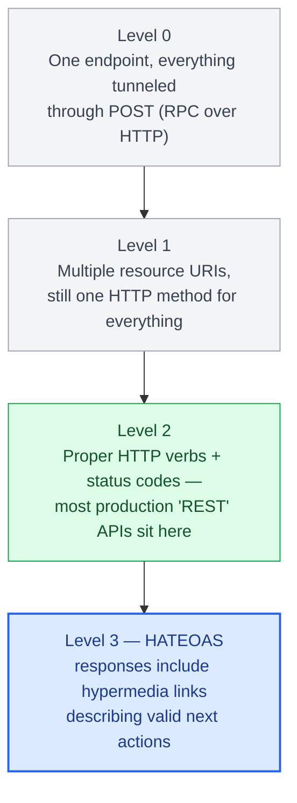
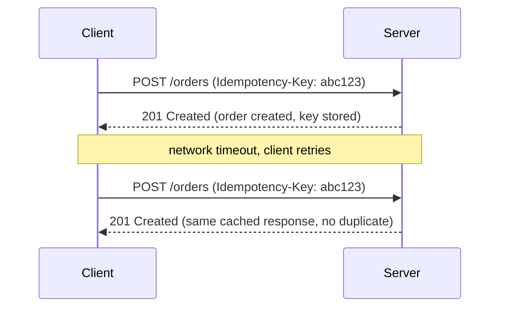

# Chapter 3: REST API Design Principles

## Resources, not actions

The core discipline of REST is modeling your domain as addressable resources (`/orders`, `/orders/42/line-items`) rather than as remote procedure calls dressed up as URLs (`/getOrderById?id=42`, `/createOrder`). This isn't pedantry — resource orientation is what makes HTTP's caching, method semantics, and status codes actually mean something. A URL is a noun; the HTTP method is the verb.

```
GET    /orders/42          → fetch order 42
PATCH  /orders/42          → partially update order 42
DELETE /orders/42          → delete order 42
POST   /orders/42/cancel   → an action that doesn't map to CRUD (acceptable escape hatch)
```

That last line matters: not everything is CRUD. Trying to force a "cancel this order" operation into a `PATCH` with a status field buries intent in payload data instead of the URL. A well-designed REST API allows action-oriented sub-resources for genuine business operations rather than contorting itself to stay "pure."

## The Richardson Maturity Model

Leonard Richardson's model gives a useful yardstick for how "RESTful" an API actually is:

- **Level 0**: A single endpoint, everything tunneled through POST (essentially RPC over HTTP).
- **Level 1**: Multiple resource URIs, but still one HTTP method for everything.
- **Level 2**: Proper use of HTTP verbs and status codes — this is where most production "REST" APIs actually sit, and it's a perfectly reasonable place to stop.
- **Level 3**: HATEOAS — responses include hypermedia links describing valid next actions.

Level 3 is rarely worth the complexity for typical B2B or mobile-backend APIs. It earns its keep in APIs where the client genuinely needs to discover available actions dynamically (workflow engines, some public banking APIs under regulatory hypermedia requirements). Don't implement HATEOAS because a blog post told you REST requires it — REST does not require it, Fielding's dissertation just describes it as one possible constraint.



## Idempotency is not optional

`GET`, `PUT`, and `DELETE` are defined as idempotent: calling them N times has the same effect as calling them once. This is a contract clients rely on for safe retries. If your `PUT /orders/42` handler increments a counter as a side effect instead of replacing state, you've broken the HTTP contract, and any client-side or gateway-level retry logic will silently corrupt data.

`POST` is not idempotent by default, which is exactly why payment and order-creation endpoints need an explicit idempotency key:

```python
from fastapi import FastAPI, Header, HTTPException
import hashlib

app = FastAPI()
_seen_keys: dict[str, dict] = {}  # replace with Redis/DB in production

@app.post("/orders")
async def create_order(payload: dict, idempotency_key: str = Header(...)):
    if idempotency_key in _seen_keys:
        return _seen_keys[idempotency_key]

    order = {"id": "ord_123", **payload}
    _seen_keys[idempotency_key] = order
    return order
```



## Status codes as part of the contract

Status codes are not decoration — they're machine-readable signal. `422` (validation failure) is not the same as `400` (malformed request) is not the same as `409` (conflict, e.g. optimistic concurrency failure). Clients, retry middleware, and monitoring dashboards all key off status codes; collapsing everything to `200` with an `"error"` field in the body (a surprisingly common anti-pattern) breaks every layer of standard HTTP tooling built over the last 25 years, from CDNs to service meshes to client libraries' built-in retry logic.

| Status | Meaning | Example trigger |
|---|---|---|
| 400 | Malformed request | Request body isn't valid JSON |
| 422 | Validation failure | Well-formed JSON that fails schema validation |
| 409 | Conflict | Optimistic concurrency failure |

## Pagination, filtering, and sorting as first-class design

A resource collection endpoint (`GET /orders`) needs an explicit pagination strategy from day one — retrofitting it after clients depend on unpaginated full-collection responses is a breaking change. Cursor-based pagination (`?cursor=eyJpZCI6NDJ9`) is generally preferable to offset-based (`?offset=100&limit=20`) for anything with high write volume, since offset pagination shifts under concurrent inserts and deletes, silently skipping or duplicating rows.

| Concern | Offset-based (`?offset=100&limit=20`) | Cursor-based (`?cursor=eyJpZCI6NDJ9`) |
|---|---|---|
| Behavior under concurrent writes | Shifts — can silently skip or duplicate rows | Stable |
| Best suited to | Low write volume | High write volume |

Filtering and sorting need the same explicit-contract discipline as pagination. A collection endpoint should expose filters as query parameters mapped to an allowlist of indexed columns (`?status=SHIPPED&customer_id=cus_9`), not an open-ended query language — accepting an arbitrary field name and passing it straight into a `WHERE` clause both risks SQL injection if done carelessly and, even done safely, invites a client to filter on an unindexed column and trigger a full table scan under load. Sorting follows the same rule: a `?sort=-created_at,status` convention (a leading `-` for descending) is simple for clients to construct, but the set of sortable fields still needs to be an explicit allowlist tied to what's actually indexed, not "whatever column name the client happens to send."

```python
ALLOWED_FILTER_FIELDS = {"status", "customer_id"}
ALLOWED_SORT_FIELDS = {"created_at", "status", "total"}

@app.get("/orders")
async def list_orders(status: str | None = None, customer_id: str | None = None, sort: str = "-created_at"):
    sort_field = sort.lstrip("-")
    if sort_field not in ALLOWED_SORT_FIELDS:
        raise HTTPException(422, f"cannot sort by '{sort_field}'")
    direction = "DESC" if sort.startswith("-") else "ASC"
    filters = {"status": status, "customer_id": customer_id}  # both already in ALLOWED_FILTER_FIELDS by construction
    return await db.query_orders(filters=filters, sort_field=sort_field, direction=direction)
```

The allowlist is doing real work in both directions: it's what stops a client-supplied field name from ever reaching a query builder unchecked, and it's what keeps "sortable/filterable" in sync with "actually has a database index" — a sort field that isn't indexed doesn't fail, it just gets slow under production data volume in a way that's invisible in development with a handful of test rows.

## Failure modes

- **Action-as-noun leakage**: `POST /updateOrderStatus` instead of `PATCH /orders/42` — a sign the API was designed RPC-first and REST-wrapped after the fact.
- **Broken idempotency**: retried `PUT` requests (common under mobile network flakiness) silently double-applying non-idempotent side effects.
- **Offset pagination drift**: clients missing or double-receiving rows during paginated exports because the underlying table was being written to concurrently.
- **Unbounded sort/filter surface**: accepting any client-supplied field name for `sort` or a filter instead of checking it against an allowlist, risking both unindexed full-table-scan queries and, if the field name reaches a query builder unsanitized, injection.

## What's next

Chapter 4 moves from design to implementation — building REST APIs in Python with FastAPI and Django REST Framework, and what the request lifecycle actually looks like under each.

---

## Exercises

Exercises for this chapter live in [03a-rest-design-principles-exercises.md](03a-rest-design-principles-exercises.md). Solutions are available separately in [resources/solutions/](../resources/solutions/).
