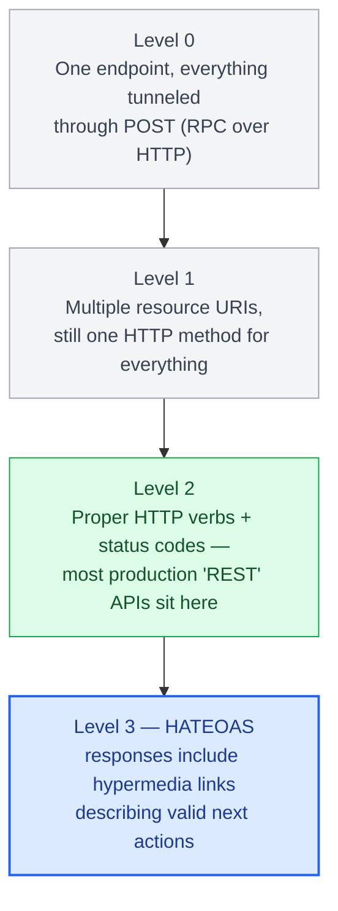
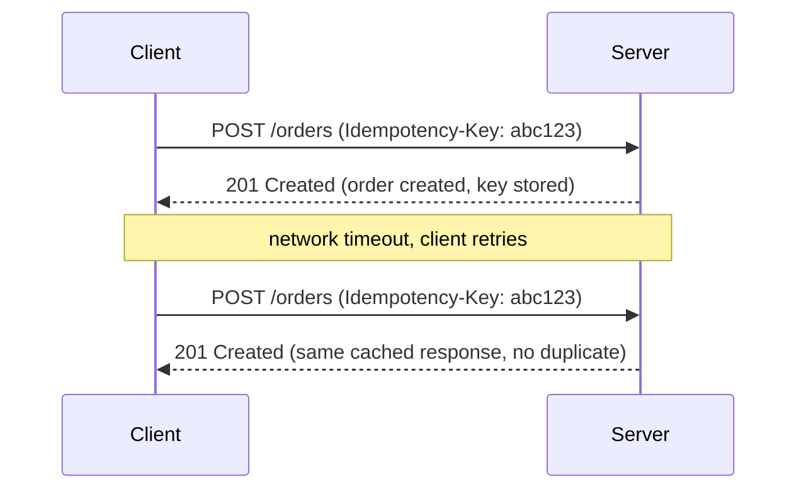

# Chapter 3: REST API Design Principles

## Resources, not actions

The core discipline of REST is modeling your domain as addressable resources (`/orders`, `/orders/42/line-items`) rather than as remote procedure calls dressed up as URLs (`/getOrderById?id=42`, `/createOrder`). This isn't pedantry — resource orientation is what makes HTTP's caching, method semantics, and status codes actually mean something. A URL is a noun; the HTTP method is the verb.

```
GET    /orders/42          → fetch order 42
PATCH  /orders/42          → partially update order 42
DELETE /orders/42          → delete order 42
POST   /orders/42/cancel   → an action that doesn't map to CRUD (acceptable escape hatch)
```

That last line matters: not everything is CRUD. Trying to force a "cancel this order" operation into a `PATCH` with a status field buries intent in payload data instead of the URL. A well-designed REST API allows action-oriented sub-resources for genuine business operations rather than contorting itself to stay "pure."

## HTTP semantics as design constraints

Chapter 2 covers method semantics at the transport level; here they're constraints your resource design has to honor at every endpoint, not background trivia.

| Method | Safe (no side effects) | Idempotent | Cacheable | Typical REST use |
|---|---|---|---|---|
| GET | Yes | Yes | Yes | Fetch a resource or collection |
| PUT | No | Yes | No | Replace a resource entirely, using the full representation the client sends |
| PATCH | No | Not guaranteed | No | Apply a partial update — a diff, not a full representation |
| POST | No | No | No (unless explicitly marked cacheable) | Create a resource, or a non-CRUD action (`POST /orders/42/cancel`) |
| DELETE | No | Yes | No | Remove a resource |

**PUT vs PATCH** is a design decision, not a formatting choice. PUT means "here is the complete resource, replace whatever's there" — a client that fetches an order, changes one field, and PUTs back a payload built from a stale local copy silently wipes every field it didn't include, because PUT treats the request body as the entire representation. PATCH means "apply this partial change"; fields the client omits are left alone. That makes PATCH the right choice for most real-world partial updates, but its non-idempotency is real — "increment quantity by 1" applied twice by a naive retry is not the same as applying it once — so a well-designed PATCH endpoint accepts an idempotent description of the change (an absolute new value, or a versioned instruction) rather than a relative delta, if it needs to be safely retryable.

**Conditional requests** — `ETag`, `If-None-Match`, `If-Match`, `Cache-Control` — are how "safe to cache" and "safe to overwrite" both get enforced by the protocol instead of by convention. Chapter 2 covers `ETag` / `If-None-Match` / `Cache-Control` for caching a `GET`. The rest of this chapter reuses the same `ETag` on the write side, via `If-Match`, for optimistic concurrency.

## The Richardson Maturity Model

Leonard Richardson's model gives a useful yardstick for how "RESTful" an API actually is:

- **Level 0**: A single endpoint, everything tunneled through POST (essentially RPC over HTTP).
- **Level 1**: Multiple resource URIs, but still one HTTP method for everything.
- **Level 2**: Proper use of HTTP verbs and status codes — this is where most production "REST" APIs actually sit, and it's a perfectly reasonable place to stop.
- **Level 3**: HATEOAS — responses include hypermedia links describing valid next actions.

Level 3 is rarely worth the complexity for typical B2B or mobile-backend APIs. It earns its keep in APIs where the client genuinely needs to discover available actions dynamically (workflow engines, some public banking APIs under regulatory hypermedia requirements). Don't implement HATEOAS because a blog post told you REST requires it — REST does not require it, Fielding's dissertation just describes it as one possible constraint.



## Idempotency is not optional

`GET`, `PUT`, and `DELETE` are defined as idempotent: calling them N times has the same effect as calling them once. This is a contract clients rely on for safe retries. If your `PUT /orders/42` handler increments a counter as a side effect instead of replacing state, you've broken the HTTP contract, and any client-side or gateway-level retry logic will silently corrupt data.

`POST` is not idempotent by default, which is exactly why payment and order-creation endpoints need an explicit idempotency key:

```python
from fastapi import FastAPI, Header, HTTPException
import hashlib

app = FastAPI()
_seen_keys: dict[str, dict] = {}  # replace with Redis/DB in production

@app.post("/orders")
async def create_order(payload: dict, idempotency_key: str = Header(...)):
    if idempotency_key in _seen_keys:
        return _seen_keys[idempotency_key]

    order = {"id": "ord_123", **payload}
    _seen_keys[idempotency_key] = order
    return order
```



The in-memory dict hides two production problems. The obvious one is persistence — a process restart forgets every key. The subtler one is atomicity: under concurrent retries (exactly the network conditions that trigger a retry in the first place), two requests can both evaluate `if idempotency_key in _seen_keys`, both miss, and both create an order before either writes the key back. A correct implementation collapses "claim the key" and "record the result" into a single atomic operation — a `UNIQUE` constraint on the key column with `INSERT ... ON CONFLICT`, or a Redis `SET key NX` — so the second request loses the race deterministically and returns the first request's stored response instead of duplicating the write. "Store the key after doing the work" is not enough; the key has to be claimed before the work, atomically.

## Status codes as part of the contract

Status codes are not decoration — they're machine-readable signal. `422` (validation failure) is not the same as `400` (malformed request) is not the same as `409` (conflict, e.g. optimistic concurrency failure). Clients, retry middleware, and monitoring dashboards all key off status codes; collapsing everything to `200` with an `"error"` field in the body (a surprisingly common anti-pattern) breaks every layer of standard HTTP tooling built over the last 25 years, from CDNs to service meshes to client libraries' built-in retry logic.

| Status | Meaning | Example trigger |
|---|---|---|
| 400 | Malformed request | Request body isn't valid JSON |
| 422 | Validation failure | Well-formed JSON that fails schema validation |
| 409 | Conflict | Optimistic concurrency failure |

## One ETag, two jobs: caching and concurrency

The same response header does double duty in REST design, and it's worth being explicit about both uses on the same resource rather than treating them as unrelated mechanisms.

**Reading `/orders/42`** — the `ETag` lets a client or shared cache skip re-fetching a body that hasn't changed:

```
GET /orders/42
                         →  200 OK
                             ETag: "v7"
                             Cache-Control: private, max-age=30
                             Vary: Accept, Authorization

GET /orders/42
If-None-Match: "v7"     →  304 Not Modified   (no body — the client's cached copy is still valid)
```

`Cache-Control: private` matters here specifically because order data is per-customer — `public` would let a shared proxy serve one customer's order to another. `Vary: Accept, Authorization` tells any cache that a response can differ by content negotiation and by *who's asking*, so it must key the cache entry on those headers too, not just the URL — omitting `Vary: Authorization` on a per-user resource is how one user's cached response ends up served to a different user with a different token.

**Writing to `/orders/42`** — the same `ETag` prevents a lost update. Without a mechanism here, two clients that both `GET /orders/42`, both edit their copy, and both `PUT` it back produce a lost update: the second write silently overwrites the first, and neither client ever finds out. The client echoes the `ETag` it read back on the next write as `If-Match`, and the server rejects the write with `412 Precondition Failed` (or `409`) if the resource has changed since:

```
GET /orders/42          →  200 OK, ETag: "v7"
PUT /orders/42
If-Match: "v7"           →  200 OK, ETag: "v8"      (nobody else wrote in between)

PUT /orders/42
If-Match: "v7"           →  412 Precondition Failed  (someone advanced it to "v8" first)
```

```python
@app.put("/orders/{order_id}")
async def replace_order(order_id: str, payload: dict, if_match: str = Header(...)):
    current = await db.get_order(order_id)
    if if_match != current["etag"]:
        raise HTTPException(412, "order was modified by someone else; re-fetch and retry")
    # compare-and-swap: the WHERE clause makes the check and the write atomic
    updated = await db.update_order_if_version(order_id, expected_etag=if_match, data=payload)
    if updated is None:
        raise HTTPException(412, "lost the race between the check above and this write")
    return updated
```

The `if_match != current["etag"]` check is a fast pre-filter, not the guarantee — two concurrent requests can both pass it. The actual safety comes from the conditional `UPDATE ... WHERE etag = :expected` (a compare-and-swap on a version column or row-version), which the database applies atomically; the losing request updates zero rows and gets the `412`. This is the same "claim atomically, don't check-then-act" discipline as the idempotency key above, applied to updates instead of creates. The client's correct response to `412` is to re-fetch, re-apply its change, and retry — which means the API contract should tell it so.

## Pagination, filtering, and sorting as first-class design

A resource collection endpoint (`GET /orders`) needs an explicit pagination strategy from day one — retrofitting it after clients depend on unpaginated full-collection responses is a breaking change. Cursor-based pagination (`?cursor=eyJpZCI6NDJ9`) is generally preferable to offset-based (`?offset=100&limit=20`) for anything with high write volume, since offset pagination shifts under concurrent inserts and deletes, silently skipping or duplicating rows.

| Concern | Offset-based (`?offset=100&limit=20`) | Cursor-based (`?cursor=eyJpZCI6NDJ9`) |
|---|---|---|
| Behavior under concurrent writes | Shifts — can silently skip or duplicate rows | Stable |
| Best suited to | Low write volume | High write volume |

Filtering and sorting need the same explicit-contract discipline as pagination. A collection endpoint should expose filters as query parameters mapped to an allowlist of indexed columns (`?status=SHIPPED&customer_id=cus_9`), not an open-ended query language — accepting an arbitrary field name and passing it straight into a `WHERE` clause both risks SQL injection if done carelessly and, even done safely, invites a client to filter on an unindexed column and trigger a full table scan under load. Sorting follows the same rule: a `?sort=-created_at,status` convention (a leading `-` for descending) is simple for clients to construct, but the set of sortable fields still needs to be an explicit allowlist tied to what's actually indexed, not "whatever column name the client happens to send."

```python
ALLOWED_FILTER_FIELDS = {"status", "customer_id"}
ALLOWED_SORT_FIELDS = {"created_at", "status", "total"}

@app.get("/orders")
async def list_orders(status: str | None = None, customer_id: str | None = None, sort: str = "-created_at"):
    sort_field = sort.lstrip("-")
    if sort_field not in ALLOWED_SORT_FIELDS:
        raise HTTPException(422, f"cannot sort by '{sort_field}'")
    direction = "DESC" if sort.startswith("-") else "ASC"
    filters = {"status": status, "customer_id": customer_id}  # both already in ALLOWED_FILTER_FIELDS by construction
    return await db.query_orders(filters=filters, sort_field=sort_field, direction=direction)
```

The allowlist is doing real work in both directions: it's what stops a client-supplied field name from ever reaching a query builder unchecked, and it's what keeps "sortable/filterable" in sync with "actually has a database index" — a sort field that isn't indexed doesn't fail, it just gets slow under production data volume in a way that's invisible in development with a handful of test rows.

## Failure modes

- **Action-as-noun leakage**: `POST /updateOrderStatus` instead of `PATCH /orders/42` — a sign the API was designed RPC-first and REST-wrapped after the fact.
- **Broken idempotency**: retried `PUT` requests (common under mobile network flakiness) silently double-applying non-idempotent side effects.
- **Non-atomic idempotency or concurrency checks**: a check-then-act (`if key in seen` / `if if_match == current.etag`) with no atomic claim behind it, so two concurrent requests both pass the check and both proceed — duplicate creates, or a lost update that overwrites another client's write with no `409`/`412`.
- **Offset pagination drift**: clients missing or double-receiving rows during paginated exports because the underlying table was being written to concurrently.
- **Unbounded sort/filter surface**: accepting any client-supplied field name for `sort` or a filter instead of checking it against an allowlist, risking both unindexed full-table-scan queries and, if the field name reaches a query builder unsanitized, injection.

## What's next

Chapter 4 moves from design to implementation — building REST APIs in Python with FastAPI and Django REST Framework, and what the request lifecycle actually looks like under each.

---

## Exercises

Exercises for this chapter live in [03a-rest-design-principles-exercises.md](03a-rest-design-principles-exercises.md). Solutions are available separately in [resources/solutions/](../resources/solutions/).
