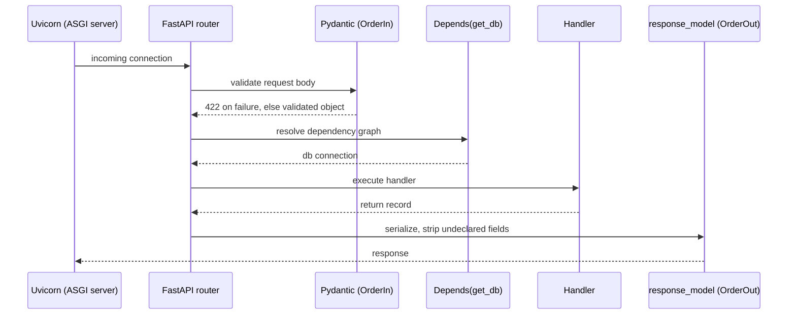
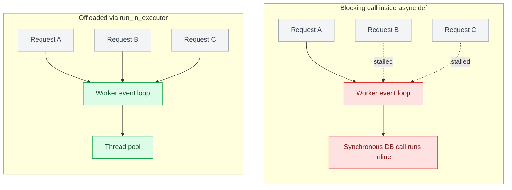

# Chapter 4: Building REST APIs in Python

## Framework choice as an architectural decision

The framework you pick isn't a style preference — it fixes your concurrency model, how validation and dependency injection work, what middleware is available, and how the service gets deployed and operated. Those effects outlast whichever framework happens to be fashionable this year.

**FastAPI** is built on Starlette (ASGI) and Pydantic. It's async-native, generates OpenAPI schemas automatically from type hints, and is a popular choice for greenfield Python APIs, particularly where async I/O and type-driven validation matter. **Django REST Framework (DRF)** is built on Django's WSGI core — its async support has been growing and continues to evolve — and earns its keep when you need Django's ORM, admin panel, and migrations ecosystem — most commonly when the API sits inside a larger Django monolith rather than as a standalone service. **Flask** with Flask-RESTful or Flask-Smorest remains common in legacy codebases and is still a reasonable choice for small, mostly synchronous services, though it leaves async performance and request validation for you to add yourself.

This chapter uses FastAPI for code examples, since its async-first design maps cleanly onto gRPC-adjacent microservices — but the design principles apply regardless of framework.

| Concern | FastAPI | Django REST Framework | Flask (+ Flask-RESTful/Smorest) |
|---|---|---|---|
| Foundation | Starlette (ASGI) + Pydantic | Django's WSGI core (async support growing) | Flask |
| Concurrency model | Async-native | Primarily synchronous | Synchronous |
| Best fit | Async I/O and type-driven validation matter | API inside a larger Django monolith — needs the ORM, admin panel, migrations ecosystem | Small or legacy synchronous services |

## Request lifecycle in FastAPI

```python
from fastapi import FastAPI, Depends, HTTPException
from pydantic import BaseModel

app = FastAPI()

class OrderIn(BaseModel):
    customer_id: str
    line_items: list[dict]

class OrderOut(BaseModel):
    id: str
    customer_id: str
    status: str

async def get_db():
    # yield a connection from a pool; FastAPI handles teardown
    db = await acquire_connection()
    try:
        yield db
    finally:
        await db.close()

@app.post("/orders", response_model=OrderOut, status_code=201)
async def create_order(order: OrderIn, db=Depends(get_db)):
    if not order.line_items:
        raise HTTPException(422, "Order must contain at least one line item")
    record = await db.insert_order(order)
    return record
```

Under the hood: Starlette's ASGI server (typically Uvicorn) receives the connection, routes to the handler, FastAPI validates the request body against `OrderIn` (raising `422` automatically on failure — this is why hand-rolled validation is rarely needed), runs the dependency graph (`Depends(get_db)`), executes the handler, and serializes the return value against `response_model`, stripping any fields not declared on `OrderOut`. That last part matters for security: `response_model` acts as an allowlist, preventing accidental leakage of internal fields even if the ORM object carries them.



## Dependency injection as a testing seam

FastAPI's `Depends` mechanism exists as much for testability as for convenience. In production, `get_db` yields a real pooled connection; in tests, you override it:

```python
from fastapi.testclient import TestClient

async def get_test_db():
    yield FakeDB()

app.dependency_overrides[get_db] = get_test_db
client = TestClient(app)

def test_create_order_rejects_empty_line_items():
    response = client.post("/orders", json={"customer_id": "cus_1", "line_items": []})
    assert response.status_code == 422
```

This is the pattern senior engineers should insist on over module-level singletons or global DB connections, which make integration tests slow and unit tests nearly impossible.

## ASGI servers and worker models

FastAPI apps run under Uvicorn (an ASGI server) typically behind Gunicorn as a process manager (`gunicorn -k uvicorn.workers.UvicornWorker`), or under Uvicorn's own multi-worker mode. The key operational decision is worker count and concurrency model: async handlers give you high concurrency per worker for I/O-bound endpoints (DB calls, downstream HTTP calls), but a single blocking call (a synchronous DB driver, a CPU-bound computation) inside an `async def` handler blocks the entire event loop for that worker, stalling every other in-flight request. This is the single most common production incident pattern in async Python APIs — a "quick" synchronous library call added without `run_in_executor` or an async driver, silently degrading p99 latency for the whole worker under load.

```python
import asyncio

@app.get("/reports/{report_id}")
async def get_report(report_id: str):
    # WRONG: blocks the event loop for every concurrent request on this worker
    # data = generate_report_sync(report_id)

    # RIGHT: offload blocking work to a thread pool
    loop = asyncio.get_event_loop()
    data = await loop.run_in_executor(None, generate_report_sync, report_id)
    return data
```



## Failure modes

- **Blocking calls in async handlers**: the most common cause of mysterious latency cliffs under load in FastAPI services.
- **Missing `response_model`**: internal fields (password hashes, internal IDs, feature flags) leaking into API responses because the handler returned the raw ORM object.
- **Unbounded connection pools**: a DB pool sized without accounting for `workers × max_concurrent_requests_per_worker`, exhausting the database's connection limit under traffic spikes.

## What's next

Chapter 5 covers serialization and validation in depth — Pydantic's validation model, content negotiation, and where schema validation should live relative to business-rule validation.

---

## Exercises

Exercises for this chapter live in [04a-building-rest-apis-python-exercises.md](04a-building-rest-apis-python-exercises.md). Solutions are available separately in [resources/solutions/](../resources/solutions/).
