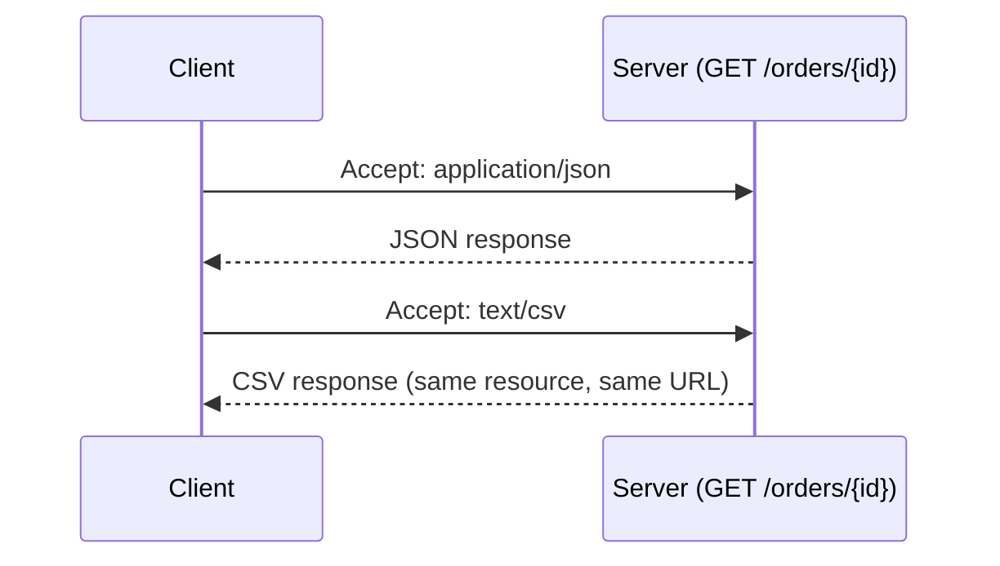

# Chapter 5: Serialization and Validation

## Two kinds of validation, and why conflating them causes bugs

**Schema validation** answers "is this data structurally well-formed?" (is `age` an integer, is `email` a string matching an email pattern). **Business-rule validation** answers "is this data valid given the current state of the system?" (is this email already registered, does this account have enough balance for this withdrawal). Pydantic handles the first extremely well and should not be stretched to handle the second — business rules belong in the service layer, where they have access to the database and can be tested independently of the HTTP layer.

```python
from pydantic import BaseModel, EmailStr, field_validator

class SignupRequest(BaseModel):
    email: EmailStr
    age: int

    @field_validator("age")
    @classmethod
    def age_must_be_reasonable(cls, v):
        # OK: structural sanity check
        if not (0 < v < 150):
            raise ValueError("age out of plausible range")
        return v

# NOT in the Pydantic model — this needs DB access and belongs in the service layer:
async def check_email_not_taken(email: str, db) -> bool:
    existing = await db.users.find_one({"email": email})
    return existing is None
```

| | Schema validation | Business-rule validation |
|---|---|---|
| Answers | Is this data structurally well-formed? | Is this data valid given the current state of the system? |
| Example | Is `age` an integer, does `email` match a pattern | Is this email already registered, is there enough balance |
| Where it belongs | Pydantic model | Service layer, with access to the database |

## Pydantic v2's performance model

Pydantic v2's validation core is written in Rust (`pydantic-core`), which is why the v1-to-v2 migration was worth the churn for high-throughput APIs — validation that used to show up meaningfully in profiler flame graphs under load became close to free. The practical implication: don't reach for hand-rolled `if`/`raise` validation "for performance" instead of Pydantic models; you're very unlikely to beat it, and you lose the automatic OpenAPI schema generation FastAPI derives from the model.

## Content negotiation

REST's `Accept` and `Content-Type` headers exist so a single resource can be represented multiple ways. Most internal APIs get away with assuming `application/json` everywhere and skip real content negotiation, which is fine until a client needs `application/xml` for a legacy integration or `text/csv` for a bulk export. FastAPI supports this via custom response classes keyed off the `Accept` header rather than baking format into the URL (`/orders.csv` — an anti-pattern that conflates resource identity with representation).

```python
from fastapi import Request
from fastapi.responses import JSONResponse, PlainTextResponse
import csv, io

@app.get("/orders/{order_id}")
async def get_order(order_id: str, request: Request):
    order = await fetch_order(order_id)
    if request.headers.get("accept") == "text/csv":
        buf = io.StringIO()
        writer = csv.writer(buf)
        writer.writerow(order.keys())
        writer.writerow(order.values())
        return PlainTextResponse(buf.getvalue(), media_type="text/csv")
    return JSONResponse(order)
```



## Serialization boundaries and over-fetching

The classic REST over-fetching problem shows up here: a single `OrderOut` model serializes the same shape whether the caller is a mobile app that needs three fields for a list view or an admin dashboard that needs forty. Two common mitigations: sparse fieldsets (`?fields=id,status,total`) parsed and applied against the Pydantic model's `.model_dump(include=...)`, or splitting into purpose-built response models (`OrderSummaryOut`, `OrderDetailOut`) per endpoint. Reaching for GraphQL specifically to solve this one problem, without the accompanying scaling concerns in Chapter 9, is a common overcorrection — sparse fieldsets solve 80% of the over-fetching pain in REST APIs with 5% of GraphQL's operational complexity.

| Mitigation | How it works | Tradeoff |
|---|---|---|
| Sparse fieldsets (`?fields=id,status,total`) | Client requests specific fields via query param, applied via `.model_dump(include=...)` | Simple, but the caller must know field names upfront |
| Purpose-built response models (`OrderSummaryOut`, `OrderDetailOut`) | Separate Pydantic model per endpoint shape | More explicit, more models to maintain |

```python
@app.get("/orders/{order_id}")
async def get_order(order_id: str, fields: str | None = None):
    order = await fetch_order(order_id)
    full = OrderOut.model_validate(order)
    if fields:
        requested = set(fields.split(","))
        return full.model_dump(include=requested)
    return full
```

## Failure modes

- **Business rules baked into Pydantic validators**: a `field_validator` that queries the database, silently coupling schema validation to I/O latency and making the model impossible to unit test without a live DB.
- **Silent coercion surprises**: Pydantic's lenient mode coercing `"123"` to `123` for an `int` field, masking a client-side bug that should have been rejected as a `422`.
- **Response model drift**: hand-serialized dicts bypassing `response_model` entirely in a "quick fix," reintroducing the field-leakage risk from Chapter 4.

## What's next

Chapter 6 covers versioning strategy — how to evolve a REST API's contract over years of production use without breaking every client that's ever integrated with it.

---

## Exercises

Exercises for this chapter live in [05a-serialization-validation-exercises.md](05a-serialization-validation-exercises.md). Solutions are available separately in [resources/solutions/](../resources/solutions/).
