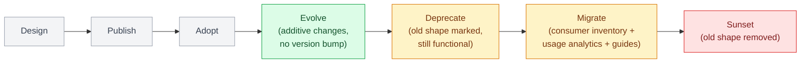
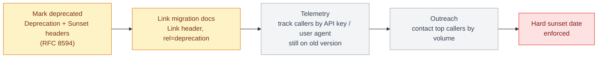

# Chapter 6: Versioning REST APIs

## The core tension

A REST API's contract will change. The question is never "will we version" but "how do we let the contract evolve without breaking clients we may not even know exist" — third-party integrators, mobile apps stuck on old versions because users haven't updated, internal services owned by other teams on their own release cadence.

## Versioning is one stage of an API's lifecycle

It's easy to read a chapter titled "Versioning" and come away thinking version numbers are the whole problem. They're one mechanism inside a longer lifecycle every production API actually goes through, and treating versioning in isolation is how teams end up with a clean `/v2` and no plan for what happens to `/v1`'s remaining callers.

```
Design → Publish → Adopt → Evolve → Deprecate → Migrate → Sunset
```

- **Design** — the contract you're committing to publicly; Chapters 3 and 5 are what you bring to this stage.
- **Publish** — the API becomes something external code depends on; from this point, every change is a compatibility decision, not just a code change.
- **Adopt** — consumers integrate. You often don't know who all of them are yet, which is exactly why the next stages need instrumentation, not assumptions.
- **Evolve** — additive, backward-compatible changes ship continuously (see the change-category table below) without needing a new version.
- **Deprecate** — a breaking change is unavoidable; the old shape is marked for removal but still fully functional.
- **Migrate** — consumers move to the new shape, on a timeline the API owner actively drives rather than waits on.
- **Sunset** — the old shape stops working, on a date that was communicated well in advance.

The rest of this chapter is organized around the mechanics of **Evolve** and **Deprecate → Migrate → Sunset**, since that's where most of the engineering and organizational work actually lives. Making it succeed requires four things beyond the HTTP headers:

- **Consumer inventory** — know who's calling the old version (by API key, OAuth client ID, or user agent) before you can plan around them. You cannot deprecate what you cannot see.
- **Usage analytics** — not just "is anyone calling `/v1`" but which fields and endpoints within it, so migration guidance can be specific ("you only use these three fields — here's the equivalent in `/v2`") instead of "read the whole new spec."
- **Migration guides** — a concrete mapping from old shape to new shape, not just a changelog entry; the `Link` header pattern below is how a client discovers it programmatically.
- **Communication strategy and old-client support windows** — outreach to top callers by volume, a published support window long enough for the slowest realistic consumer (an infrequently-updated mobile app, a third-party integrator's own release cycle) to migrate, and a hard date that's actually enforced once it arrives — see "Deprecation without enforcement" below.



## Three versioning strategies

**URI versioning** (`/v1/orders`, `/v2/orders`) is the most common because it's the most visible and cacheable — CDNs and browsers key on the URL, so this is compatible with HTTP caching with zero extra configuration. Its downside is that it implies the entire API version lockstep, when in practice most changes only affect one resource.

**Header versioning** (`Accept: application/vnd.example.v2+json` or a custom `X-API-Version` header) keeps URLs stable and allows per-resource version granularity, but breaks naive HTTP caching (most CDNs don't vary cache keys on arbitrary headers by default) and is harder to test by pasting a URL into a browser — a real cost for internal developer experience.

**No versioning, additive-only changes**: never remove or repurpose a field, only add new optional fields, and treat any breaking change as a new resource rather than a new version of an existing one. This works well for APIs with a small, coordinated set of consumers, and scales poorly once you have external integrators you can't schedule migrations with.

| Concern | URI versioning (`/v1/orders`) | Header versioning (`Accept: ...v2+json`) | No versioning, additive-only |
|---|---|---|---|
| Visibility | Most visible | Hidden in headers | No version signal |
| HTTP caching | Works with zero extra configuration | Breaks naive caching — most CDNs don't vary cache keys on arbitrary headers | Works — URL stable |
| Granularity | Whole-API version lockstep | Per-resource granularity | N/A |
| Dev experience | Easy to test (paste URL in a browser) | Harder to test | Easy |
| Scales to external integrators you can't schedule migrations with | Yes | Yes | Poorly |

Most production systems land on URI versioning at the major-version level (`/v1`, `/v2`) combined with additive-only changes within a version — this gets the caching and discoverability benefits of URI versioning while minimizing how often a major bump is actually needed.

## Deprecation is a project, not a flag

Marking an endpoint deprecated in a changelog nobody reads doesn't move client traffic. A deprecation needs: a `Sunset` HTTP header (RFC 8594) so automated tooling can detect it, a `Deprecation` header pointing at migration docs, telemetry on which clients (by API key or user agent) are still calling the old version, and a hard sunset date communicated well in advance with actual outreach to the top callers by volume.



```python
from fastapi import FastAPI, Response
from datetime import datetime, timezone

app = FastAPI()

@app.get("/v1/orders/{order_id}", deprecated=True)
async def get_order_v1(order_id: str, response: Response):
    response.headers["Deprecation"] = "true"
    response.headers["Sunset"] = "Wed, 01 Apr 2026 00:00:00 GMT"
    response.headers["Link"] = '</docs/migration/v1-to-v2>; rel="deprecation"'
    return await fetch_order_v1_shape(order_id)
```

## Backward-compatible change categories

Safe to ship without a version bump: adding a new optional field, adding a new endpoint, adding a new enum value *if clients are contractually required to handle unknown values gracefully* (a big "if" — most clients don't, in practice, which is why even this is risky without an explicit contract).

Requires a version bump or a new endpoint: removing or renaming a field, changing a field's type, changing validation to reject previously-accepted input, changing the meaning of an existing field, changing default behavior (e.g., pagination page size).

| Change | Requires a version bump? |
|---|---|
| Adding a new optional field | No |
| Adding a new endpoint | No |
| Adding a new enum value (only if clients are contractually required to handle unknown values gracefully) | No — but risky in practice |
| Removing or renaming a field | Yes |
| Changing a field's type | Yes |
| Changing validation to reject previously-accepted input | Yes |
| Changing the meaning of an existing field | Yes |
| Changing default behavior (e.g. pagination page size) | Yes |

## Consumer-driven contract testing

For internal APIs with a known set of consumers, tools like Pact let each consuming service publish the exact subset of the contract it depends on; the provider's CI then verifies against every published consumer contract before deploy. This catches "nobody uses that field, right?" breakage before it ships rather than after a downstream service starts erroring in production — the single most effective technique for versioning discipline on internal APIs where you can require consumers to participate.

## Failure modes

- **Silent breaking changes**: a field renamed for "clarity" during a refactor, shipped without a version bump, breaking every client parsing the old field name.
- **Deprecation without enforcement**: an endpoint marked deprecated for three years with no sunset date, because nobody owns forcing the migration, becoming permanent technical debt.
- **Version proliferation**: `/v1` through `/v7` all still live because major-version bumps were used for changes that should have been additive, multiplying the maintenance surface.

## What's next

Part III shifts to GraphQL — starting with the schema-first mental model that replaces REST's resource-per-URL thinking with a single queryable graph.

---

## Exercises

Exercises for this chapter live in [06a-versioning-rest-apis-exercises.md](06a-versioning-rest-apis-exercises.md). Solutions are available separately in [resources/solutions/](../resources/solutions/).
