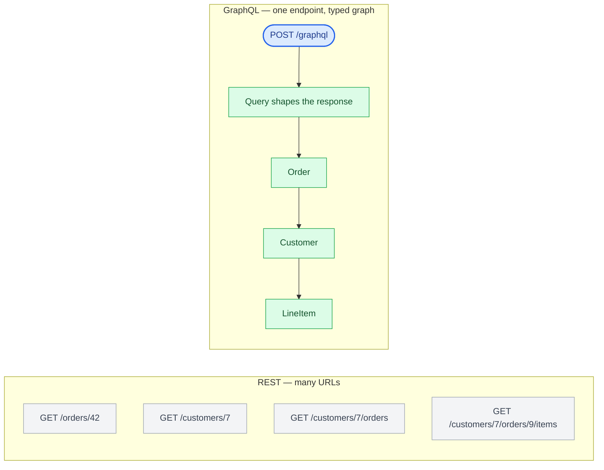
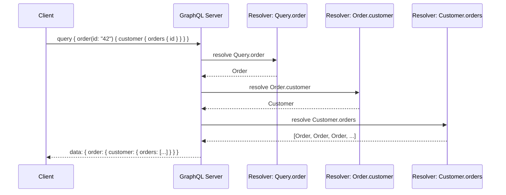

# Chapter 7: GraphQL Schema Design and Execution Model

## A single endpoint, a typed graph

GraphQL replaces REST's many-URLs model with, conventionally, one endpoint (`/graphql`) and a strongly typed schema describing every object, field, and relationship the client can query — a single endpoint is the common convention, not something the spec requires. The client sends a query describing exactly the shape of data it wants, and the server returns a response matching that shape. This directly solves REST's over-fetching/under-fetching problem, at the cost of moving a lot of complexity from API design time into resolver runtime behavior.

That "returns exactly that shape" framing is a useful simplification for a first pass, but the actual response envelope is `{ "data": ..., "errors": [...] }`, and Chapter 8 covers why: any field can fail independently, a failed non-nullable field nulls out its nearest nullable parent (error propagation "bubbles up" the tree rather than failing the whole response), and the client has to read `errors` alongside `data` even on a `200 OK`. The schema's nullability annotations (`String` vs `String!`) are what determine how far a single field failure propagates — treat them as part of the contract, not a type-safety nicety.



## The schema is the contract

```graphql
type Order {
  id: ID!
  status: OrderStatus!
  customer: Customer!
  lineItems: [LineItem!]!
  total: Money!
}

type Customer {
  id: ID!
  name: String!
  orders: [Order!]!
}

type Query {
  order(id: ID!): Order
  customer(id: ID!): Customer
}

type Mutation {
  cancelOrder(id: ID!): Order!
}
```

Note the bidirectional relationship: `Order.customer` and `Customer.orders` both exist. This is normal in GraphQL and is exactly the kind of relationship that creates the N+1 problem covered in Chapter 9 — a client querying a list of customers and each customer's orders will, naively, trigger one database query per customer unless resolvers are batched.

## The rest of the type system: interfaces, unions, input types, custom scalars

The `Order`/`Customer` example above only uses object types and the five scalars GraphQL ships with (`ID`, `String`, `Int`, `Float`, `Boolean`). A schema that goes beyond simple CRUD shapes typically needs four more constructs:

```graphql
scalar DateTime

interface Node {
  id: ID!
}

type Order implements Node {
  id: ID!
  status: OrderStatus!
  createdAt: DateTime!
}

type Customer implements Node {
  id: ID!
  name: String!
}

union SearchResult = Order | Customer

input LineItemInput {
  sku: String!
  quantity: Int!
}

input CreateOrderInput {
  customerId: ID!
  lineItems: [LineItemInput!]!
}

type Mutation {
  createOrder(input: CreateOrderInput!): Order!
}
```

**Interfaces** (`Node`) declare a field set that multiple types share, so a client can query the shared fields on any type implementing it without knowing the concrete type in advance — use one when the possible types genuinely have overlapping shape. **Unions** (`SearchResult`) cover the opposite case: a field that can return one of several types with no shared fields at all, forcing the client to use an inline fragment (`... on Order { status }`) to select type-specific data, since there's nothing common to ask for otherwise. **Input types** (`CreateOrderInput`) are how mutation arguments stay maintainable as they grow past two or three scalars — bundling related arguments into a single named, reusable input object instead of an ever-longer flat argument list on the mutation field itself. **Custom scalars** (`DateTime`) extend the five built-ins with a type that has its own serialization rule (an ISO-8601 string on the wire, a `datetime` object in resolver code), supplied by the server framework rather than the GraphQL spec itself.

Clients use **fragments** to avoid repeating the same field selection across multiple queries:

```graphql
fragment OrderFields on Order {
  id
  status
  createdAt
}

query GetOrder {
  order(id: "42") { ...OrderFields }
}
```

## Queries, mutations, and subscriptions

**Queries** read data and are conceptually side-effect-free (though nothing stops a resolver from having side effects — that discipline is convention, not enforcement). **Mutations** perform writes and, by convention, return the post-mutation state of the affected object so the client doesn't need a follow-up query. **Subscriptions** provide a long-lived connection (typically over WebSockets) for real-time updates — the closest GraphQL analog to gRPC server streaming, and the least mature part of the ecosystem in terms of production tooling.

| Operation | Purpose | Effect | Connection |
|---|---|---|---|
| Query | Read data | Conceptually side-effect-free (convention, not enforced) | Single request/response |
| Mutation | Perform writes | Returns post-mutation state, by convention | Single request/response |
| Subscription | Real-time updates | Long-lived stream | Typically WebSockets; least mature tooling |

```graphql
query GetOrderDetail {
  order(id: "42") {
    id
    status
    lineItems {
      sku
      quantity
    }
  }
}

mutation CancelOrder {
  cancelOrder(id: "42") {
    id
    status
  }
}
```

## Resolvers: the actual implementation

Every field in the schema maps to a resolver function. Scalar fields on a directly-fetched object often need no explicit resolver (the framework reads the attribute by name), but relationship fields (`Order.customer`) require a resolver that knows how to fetch the related data — and this is where performance characteristics diverge sharply from REST, because each resolver executes independently and the framework doesn't automatically batch or dedupe the underlying data access.



## Why "just add a field" isn't free

In REST, adding a field to a response is close to free — you add it to the serializer, done. In GraphQL, adding a field to the schema means writing a resolver, and if that resolver introduces a new relationship traversal, it can silently introduce a new database round-trip per item in every list that includes it. Schema design in GraphQL requires the same query-cost discipline a DBA would apply to a SQL schema — because in effect, the schema *is* a query interface, and clients can (and will) compose queries you didn't anticipate at design time.

## The schema as a product contract

Once a GraphQL API has real external consumers, the schema stops being an implementation detail and becomes something teams have to govern the way Chapter 6 governs a REST contract — the mechanics differ, but the discipline is the same.

**Schema ownership.** In a single-team graph, one person or team can approve every change. Once multiple teams contribute types (the normal state by the time Federation in Chapter 9 becomes relevant), someone needs to own the schema as a whole — reviewing cross-cutting naming, nullability, and deprecation decisions — or the graph accretes inconsistent conventions field by field.

**Field deprecation** is GraphQL's equivalent of a REST field staying in the response after clients stop using it — except the schema can say so explicitly:

```graphql
type Order {
  id: ID!
  status: OrderStatus!
  legacyStatusCode: Int! @deprecated(reason: "Use `status` instead. Removal planned for 2026-Q3.")
}
```

`@deprecated` shows up in introspection and in tools like GraphiQL, so clients querying a deprecated field see the warning at development time — but nothing stops the query from executing, and nothing tells you which clients still rely on it. That still requires the same usage telemetry a REST deprecation needs (Chapter 6) — deprecating a field is a signal, not an enforcement mechanism, until you actually track who's still selecting it and remove it on a communicated date.

**Nullability is a compatibility decision, not just a type annotation.** Tightening a field from nullable to non-nullable (`String` → `String!`) is a breaking change: a client that handled `null` may not handle the new guarantee incorrectly, but more importantly, the reverse — loosening `String!` to `String` — is *also* breaking, because a client that assumed the field could never be null (and so didn't check) can now crash on unchecked access. Both directions of a nullability change need the same scrutiny as a REST field-type change.

**Enums** have their own evolution trap: adding a new enum value is a breaking change for any client written under the (very common, very reasonable-looking) assumption that a switch over an enum is exhaustive — a mobile client that hard-crashes on an unrecognized `OrderStatus` value it wasn't built to handle is the GraphQL analog of the "risky in practice" additive enum case in Chapter 6's REST versioning table. Interfaces and unions carry the same risk one level up: adding a new type to a union, or a new type implementing an interface, breaks any client-side exhaustive-match logic over the old set of possibilities.

**Input evolution** follows REST's own rule for request bodies: adding an optional input field is safe, adding a *required* one breaks every existing caller that doesn't send it, and removing or repurposing an input field is breaking regardless of whether it's required.

| Change | Breaking? |
|---|---|
| Add an optional field or argument | No |
| Add a value to an enum | Yes, in practice — clients doing exhaustive matching can break |
| Add a type to a union or interface | Yes, in practice — same reason |
| Tighten nullable → non-nullable | Yes |
| Loosen non-nullable → nullable | Yes |
| Add a required input field | Yes |
| Remove or rename any field | Yes |
| Mark a field `@deprecated` | No — but track usage before ever removing it |

Chapter 19 covers the tooling side of enforcing these rules (schema diffing in CI); the point here is that a GraphQL schema needs the same change-category discipline as a REST contract, not less of it just because the type system looks stricter.

## Introspection: a double-edged capability

GraphQL schemas are introspectable by default — a client can query the schema itself (`__schema`, `__type`) to discover every type and field. This is what powers tools like GraphiQL and Apollo Studio's schema explorer, and it's genuinely valuable for developer experience. It's also a common oversight in production: introspection left enabled on a public-facing endpoint hands an attacker a complete map of your data model, including fields you never intended to expose broadly. Most teams disable introspection in production for public APIs and leave it enabled only in staging/internal environments.

## Failure modes

- **Unbounded relationship depth**: a client query nesting `order.customer.orders.customer.orders...` — the schema permits it, and without depth limiting (Chapter 9), the server will execute it.
- **Resolver-level N+1**: covered in depth in Chapter 9, but it starts here — every relationship field is a potential per-item database call if not explicitly batched.
- **Introspection left on in production**: exposing the full schema (and by extension, your data model) to any client that asks.

## What's next

Chapter 8 gets into building GraphQL APIs in Python with Strawberry and Graphene, and how resolver architecture actually gets implemented against a real data layer.

---

## Exercises

Exercises for this chapter live in [07a-graphql-fundamentals-exercises.md](07a-graphql-fundamentals-exercises.md). Solutions are available separately in [resources/solutions/](../resources/solutions/).
