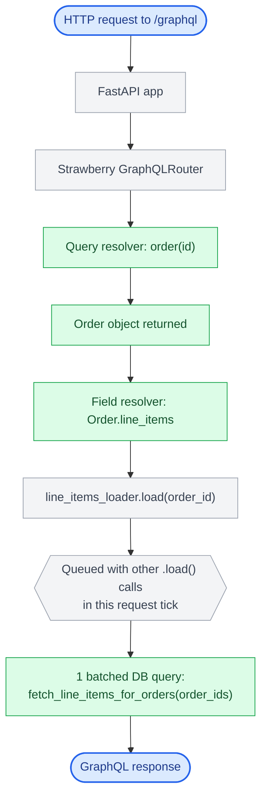
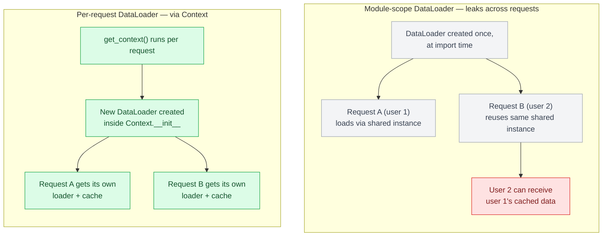

# Chapter 8: Building GraphQL APIs in Python

## Framework landscape

**Strawberry** is the modern default for new Python GraphQL APIs — it's async-native, uses Python type hints and dataclasses directly as schema definitions (similar in spirit to how Pydantic drives FastAPI), and integrates cleanly with FastAPI. **Graphene** predates Strawberry and remains common in existing codebases (particularly Django-integrated ones via `graphene-django`), using a more class-based, less type-hint-driven API. **Ariadne** takes a schema-first approach — you write the `.graphql` SDL by hand and bind resolvers to it separately, which some teams prefer for keeping the schema as a reviewable artifact independent of Python code structure.

This chapter uses Strawberry, reflecting its current adoption trajectory for greenfield services.

| Framework | Approach | Best fit |
|---|---|---|
| Strawberry | Async-native, Python type hints/dataclasses as schema | Greenfield services, FastAPI integration |
| Graphene | Class-based, less type-hint-driven | Existing codebases, especially Django (`graphene-django`) |
| Ariadne | Schema-first — hand-written SDL, resolvers bound separately | Teams wanting the schema as an independently reviewable artifact |

## Defining the schema

```python
import strawberry
from typing import Optional

@strawberry.type
class LineItem:
    sku: str
    quantity: int

@strawberry.type
class Order:
    id: strawberry.ID
    status: str

    @strawberry.field
    async def line_items(self) -> list[LineItem]:
        return await line_items_loader.load(self.id)

@strawberry.type
class Query:
    @strawberry.field
    async def order(self, id: strawberry.ID) -> Optional[Order]:
        record = await fetch_order(id)
        return Order(id=record["id"], status=record["status"]) if record else None

schema = strawberry.Schema(query=Query)
```

## Mutations with input types

Chapter 7's `CreateOrderInput` GraphQL input type maps directly onto a Strawberry input class — `@strawberry.input` works the same way `@strawberry.type` does for output types, just for the shape of an incoming argument:

```python
@strawberry.input
class LineItemInput:
    sku: str
    quantity: int

@strawberry.input
class CreateOrderInput:
    customer_id: strawberry.ID
    line_items: list[LineItemInput]

@strawberry.type
class Mutation:
    @strawberry.mutation
    async def create_order(self, input: CreateOrderInput) -> Order:
        record = await create_order_record(input.customer_id, input.line_items)
        return Order(id=record["id"], status=record["status"])

schema = strawberry.Schema(query=Query, mutation=Mutation)
```

This is the same maintainability argument as a REST request body model (Chapter 5): once a mutation needs more than one or two scalar arguments, bundling them into a named input type keeps the mutation's signature stable as fields are added, rather than growing an ever-longer flat parameter list.

## Mounting on FastAPI

```python
from fastapi import FastAPI
from strawberry.fastapi import GraphQLRouter

graphql_app = GraphQLRouter(schema)

app = FastAPI()
app.include_router(graphql_app, prefix="/graphql")
```

This gives you a GraphQL endpoint living inside the same FastAPI app that might also serve REST endpoints and webhooks — a common pattern for platforms exposing multiple protocols (see Chapter 21's case study).

## The DataLoader pattern, introduced here and detailed in Chapter 9

The naive `line_items` resolver above, called once per `Order` in a list query, triggers one database call per order. `strawberry.dataloader.DataLoader` batches these calls within a single GraphQL request tick:

```python
from strawberry.dataloader import DataLoader

async def batch_load_line_items(order_ids: list[str]) -> list[list[LineItem]]:
    rows = await db.fetch_line_items_for_orders(order_ids)  # one query, all orders
    by_order = group_by_order_id(rows)
    return [by_order.get(oid, []) for oid in order_ids]

line_items_loader = DataLoader(load_fn=batch_load_line_items)
```

This is not optional infrastructure to add "if it becomes a problem" — any resolver on a list-context field that hits the database should go through a DataLoader from day one. Retrofitting it after a query pattern is already in production means diagnosing and fixing an N+1 under live traffic, which Chapter 9 covers in detail.



## Context and per-request state

GraphQL resolvers need access to request-scoped state (the authenticated user, a DB connection, request-scoped DataLoader instances — DataLoaders must be created fresh per request, not shared globally, or their batching cache will leak data across requests). Strawberry passes this via a context object:

```python
from strawberry.fastapi import GraphQLRouter, BaseContext

class Context(BaseContext):
    def __init__(self, user, db):
        self.user = user
        self.db = db
        self.line_items_loader = DataLoader(load_fn=batch_load_line_items)

async def get_context(request) -> Context:
    user = await authenticate(request)
    return Context(user=user, db=await get_db_connection())

graphql_app = GraphQLRouter(schema, context_getter=get_context)
```



## Error handling in a graph

Unlike REST, a GraphQL response can be partially successful — some fields resolve, others error — and the response still returns `200 OK` with an `errors` array alongside whatever `data` did resolve. Clients must be built to handle partial data explicitly; this is a genuine paradigm shift from REST's all-or-nothing status-code model and a common source of client-side bugs when teams port REST-era error handling assumptions directly into a GraphQL client.

```json
{
  "data": { "order": { "id": "42", "status": "SHIPPED", "lineItems": null } },
  "errors": [
    { "message": "Failed to load line items", "path": ["order", "lineItems"] }
  ]
}
```

| Aspect | REST | GraphQL |
|---|---|---|
| Status code on partial failure | Reflects the failure (4xx/5xx) | `200 OK`, even when some fields failed |
| Partial success | Not supported — all-or-nothing | Supported — some fields resolve, others return `null` with an entry in `errors` |
| Client responsibility | Branch on status code | Must inspect the `errors` array alongside `data`, even on `200 OK` |

## Failure modes

- **DataLoader created at module scope**: a single shared DataLoader instance across requests leaks cached data between users and under concurrent load can return one user's data to another.
- **Resolvers issuing raw queries without batching**: the most common cause of GraphQL production incidents, covered fully in Chapter 9.
- **Client code assuming REST-style all-or-nothing responses**: not checking the `errors` array and rendering a UI with silently missing fields as if they were legitimately empty.

## What's next

Chapter 9 is entirely about what happens once a GraphQL API has real traffic and real query diversity — N+1 in depth, query complexity limiting, and federation for splitting a graph across services.

---

## Exercises

Exercises for this chapter live in [08a-building-graphql-apis-python-exercises.md](08a-building-graphql-apis-python-exercises.md). Solutions are available separately in [resources/solutions/](../resources/solutions/).
