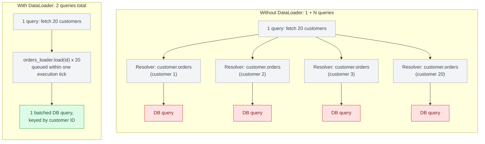
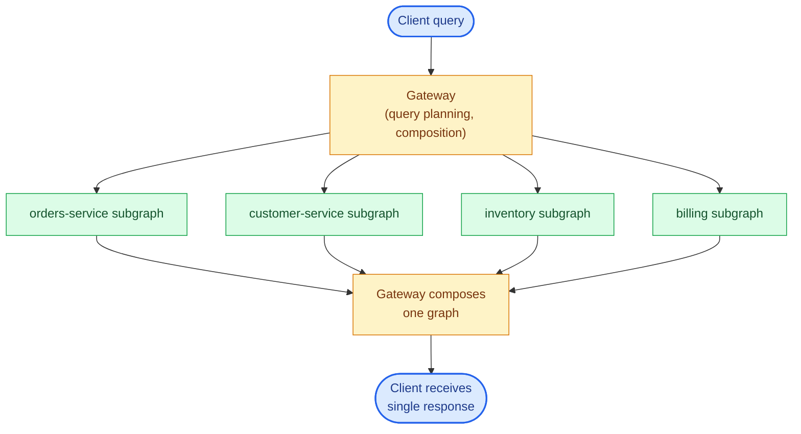

# Chapter 9: GraphQL at Scale

## The N+1 problem, precisely

Given a query for 20 customers and each customer's orders, a naive resolver structure executes 1 query for the customers, then 20 additional queries — one per customer — for their orders. This is the N+1 problem, and it is not a bug in any particular resolver; it's the default behavior of independent, per-field resolver execution. It scales linearly with result set size, which means it's invisible in development (where you test with 3 records) and catastrophic in production (where a customer list page might render 200 rows).

DataLoader (Chapter 8) solves this by batching all `order` lookups requested within a single GraphQL execution tick into one query, keyed by customer ID, using the same key-deduplication approach as Facebook's original `DataLoader` JS implementation that GraphQL's ecosystem borrowed the pattern from.

```python
# Without batching: 1 + N queries
async def orders(self) -> list[Order]:
    return await db.fetch_orders(customer_id=self.id)  # runs once per customer

# With batching: 2 queries total, regardless of N
async def orders(self) -> list[Order]:
    return await orders_loader.load(self.id)
```



## Catching N+1 before it reaches production

DataLoader fixes N+1 once you know a resolver needs it — the harder problem is that an unbatched resolver looks identical to a batched one in development, where a test fixture has 3 customers instead of 200,000. Three techniques catch the regression before a user does:

**Assert query counts in tests, not just correctness.** Wrap the DB session or ORM engine with a counter and assert on it directly, so a resolver that quietly loses its DataLoader wiring fails CI instead of showing up as a production latency cliff:

```python
async def test_customer_orders_are_batched(query_counter):
    await schema.execute(CUSTOMERS_WITH_ORDERS_QUERY)
    assert query_counter.count <= 2  # 1 for customers, 1 batched load for orders
```

**Trace at the resolver level.** An OpenTelemetry span (or the tracing extension most GraphQL frameworks ship) per resolver invocation turns N+1 into something visible in a trace waterfall: twenty near-identical child spans for `Customer.orders` under one request is the same fan-out signature you'd recognize in any other service, and it shows up without anyone having to notice a slow page first.

**Track resolver call counts per operation in APM.** Because every GraphQL request hits the same HTTP endpoint, generic route-level APM is blind to this — the metric that matters is per-*operation-name* resolver call count and latency (what Apollo Studio's trace view, or an equivalent field-level extension, surfaces), so a specific query's fan-out width is visible as a trend over time, not just as a single trace.

## Query complexity and depth limiting

Because GraphQL exposes a graph, nothing stops a client (malicious or just poorly written) from writing a query that traverses `customer → orders → customer → orders` many levels deep, or requesting every scalar field on every type in a single query. Two standard defenses:

**Depth limiting** rejects queries beyond a fixed nesting depth, regardless of cost:

```python
from strawberry.extensions import QueryDepthLimiter

schema = strawberry.Schema(
    query=Query,
    extensions=[QueryDepthLimiter(max_depth=8)],
)
```

**Query complexity/cost analysis** assigns a numeric cost to each field (list fields typically cost more than scalar fields, often multiplied by an estimated result size) and rejects queries whose total exceeds a budget. This is more precise than depth limiting but requires maintaining per-field cost annotations as the schema grows — a real ongoing maintenance cost, not a set-and-forget defense.

Either defense rejects the query before a single resolver runs, and the client sees that rejection in GraphQL's standard error shape — no partial `data`, because nothing was ever executed:

```json
{
  "data": null,
  "errors": [
    { "message": "Query exceeds maximum depth of 8", "extensions": { "code": "QUERY_TOO_DEEP" } }
  ]
}
```

Both should be treated as production requirements for any GraphQL API accepting client-authored queries (i.e., anything beyond a fully trusted internal BFF), not optional hardening.


## Persisted queries

For client apps you control (mobile, first-party web), **persisted queries** let the server store the set of approved query documents (keyed by hash) ahead of time; the client sends only the hash, not the full query text, at request time. This eliminates arbitrary query injection entirely for that client population, cuts request payload size, and lets the server reject any query hash it doesn't recognize — effectively converting GraphQL's open query surface back into something closer to REST's fixed-endpoint model, for the subset of traffic where that trade-off makes sense.

## Subscriptions and real-time at scale

Chapter 7 introduces subscriptions as GraphQL's real-time primitive; at production scale, they fail differently than queries and mutations do, because a subscription isn't a request-response cycle that finishes — it's a long-lived connection the server has to hold open and actively push to, for every subscribed client, indefinitely.

**Connection state is the new resource to manage.** A resolver server that's stateless between requests for queries and mutations suddenly has to track, per open WebSocket, which subscriptions are active and what filter arguments each one was created with — state that has to survive as long as the connection does, and be cleaned up correctly on disconnect or it leaks. This is the same operational shape as a gRPC server-streaming RPC (Chapter 12): a slow or disconnected subscriber that isn't detected promptly holds resources open for no one.

**Fan-out needs a broker, not an in-process pub/sub.** A naive implementation publishes an event directly to any in-process subscriber list — which works for a single server process and breaks the moment you run more than one, since a mutation handled by server A has no way to notify a subscriber connected to server B. Production subscription servers sit behind a broker (Redis pub/sub, Kafka, or a managed service like Apollo's) that every server instance publishes to and subscribes from, so an event triggered anywhere reaches every matching subscriber regardless of which instance they're connected to.

**Horizontal scaling is a connection-count problem, not a request-throughput problem.** Query and mutation traffic scales the way REST traffic does — more requests, spread across more stateless instances. Subscription traffic scales by *concurrent open connections*, which behaves more like a chat server's scaling problem than an API's: a single instance can only hold so many WebSockets open before hitting file-descriptor or memory limits, independent of how much actual message volume is flowing through them. Capacity planning for a subscription-heavy graph has to budget for peak concurrent connections, not peak requests-per-second.

**Backpressure applies per-subscriber, not per-request.** If one subscriber's client is slow to consume (a flaky mobile connection) while a hundred others are healthy, the server has to avoid letting that one slow consumer's buffer growth affect the others — the same per-consumer isolation Chapter 16's bulkhead pattern applies to downstream dependencies, applied here to downstream *consumers* of a stream.

## Federation: splitting the graph across services

Once a GraphQL schema spans multiple teams' domains (orders, inventory, customer profile, billing), a single monolithic resolver service becomes an organizational bottleneck. **Federation** (via Apollo Federation or the newer GraphQL Fusion spec) lets each team own a subgraph — a schema fragment plus its resolvers — and a gateway composes them into one graph at query time, routing each field to the subgraph that owns it.

```graphql
# orders-service subgraph
type Order @key(fields: "id") {
  id: ID!
  status: String!
}

# customer-service subgraph, extending Order from a different service
extend type Order @key(fields: "id") {
  id: ID! @external
  customer: Customer!
}
```

Federation trades resolver simplicity for genuine distributed-systems complexity: a single client query can now fan out across multiple services, and the gateway needs its own query planning, error aggregation, and — critically — its own N+1 awareness at the cross-service level, since a naive federated resolver can turn one client query into a request storm across your entire service mesh.

Cross-service N+1 needs a fix at two independent layers, and fixing only one leaves the problem half-solved:

**Gateway-level:** federation resolves fields owned by another subgraph through a built-in batch mechanism — the `_entities` query. When the gateway needs `Order.customer` for 20 orders, correctly implemented entity resolution sends `customer-service` one `_entities` call carrying all 20 keys, not 20 separate round-trips. This is federation's own analog to DataLoader, operating at the gateway rather than the resolver.

**Subgraph-level:** that batched `_entities` call still has to be resolved by the owning subgraph, and if its reference resolver fetches one entity at a time inside the batch, the N+1 has simply moved down a level rather than disappeared:

```python
@strawberry.federation.type(keys=["id"])
class Customer:
    id: strawberry.ID

    @classmethod
    async def resolve_reference(cls, id: strawberry.ID) -> "Customer":
        return await customer_loader.load(id)  # batches within the _entities call
```

Batching at the gateway without batching inside the subgraph turns N network round-trips into one, but that one call still triggers N database queries once it lands. Batching inside the subgraph without gateway-level entity batching fixes the database load but still pays N times the network and serialization overhead federation added in the first place. Both layers need their own DataLoader-equivalent for cross-service N+1 to actually go away.



## Caching in a query-shaped world

REST's URL-keyed HTTP caching doesn't map cleanly onto GraphQL, since every query can request a different shape from the same endpoint. Production GraphQL caching typically happens at the field/object level (normalized client-side caches like Apollo Client's cache, keyed by `__typename` + `id`) rather than at the HTTP response level. Server-side, persisted queries combined with response caching keyed on the query hash + variables is the closest analog to REST's URL-based caching.

## Failure modes

- **N+1 shipped to production undetected**: works fine in development/staging with small datasets, degrades catastrophically once list sizes hit real-world scale.
- **No cost limiting on a public-facing schema**: a single deeply nested or broadly-fanned-out query taking down a resolver service, functioning as an accidental (or deliberate) denial-of-service vector.
- **Federation without cross-service N+1 awareness**: a federated query fanning out to a dozen backend services per client request, each one individually fine in isolation but collectively saturating the mesh.
- **In-process pub/sub behind subscriptions**: a subscription server that only notifies its own in-process subscriber list, so a mutation handled by one instance silently never reaches subscribers connected to any other instance once traffic is load-balanced across more than one server.

## What's next

Part IV moves to gRPC — a fundamentally different set of trade-offs, optimized for service-to-service communication rather than client-facing flexibility.

---

## Exercises

Exercises for this chapter live in [09a-graphql-at-scale-exercises.md](09a-graphql-at-scale-exercises.md). Solutions are available separately in [resources/solutions/](../resources/solutions/).
