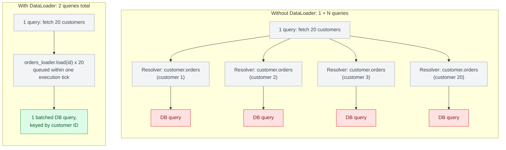
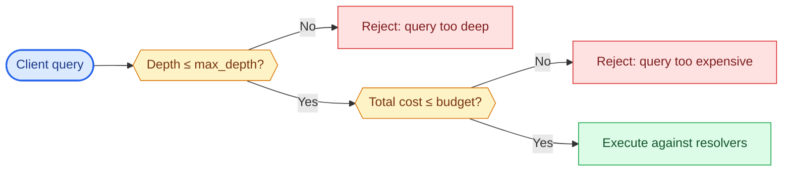

# Chapter 9: GraphQL at Scale

## The N+1 problem, precisely

Given a query for 20 customers and each customer's orders, a naive resolver structure executes 1 query for the customers, then 20 additional queries — one per customer — for their orders. This is the N+1 problem, and it is not a bug in any particular resolver; it's the default behavior of independent, per-field resolver execution. It scales linearly with result set size, which means it's invisible in development (where you test with 3 records) and catastrophic in production (where a customer list page might render 200 rows).

DataLoader (Chapter 8) solves this by batching all `order` lookups requested within a single GraphQL execution tick into one query, keyed by customer ID, using the same key-deduplication approach as Facebook's original `DataLoader` JS implementation that GraphQL's ecosystem borrowed the pattern from.

```python
# Without batching: 1 + N queries
async def orders(self) -> list[Order]:
    return await db.fetch_orders(customer_id=self.id)  # runs once per customer

# With batching: 2 queries total, regardless of N
async def orders(self) -> list[Order]:
    return await orders_loader.load(self.id)
```



## Query complexity and depth limiting

Because GraphQL exposes a graph, nothing stops a client (malicious or just poorly written) from writing a query that traverses `customer → orders → customer → orders` many levels deep, or requesting every scalar field on every type in a single query. Two standard defenses:

**Depth limiting** rejects queries beyond a fixed nesting depth, regardless of cost:

```python
from strawberry.extensions import QueryDepthLimiter

schema = strawberry.Schema(
    query=Query,
    extensions=[QueryDepthLimiter(max_depth=8)],
)
```

**Query complexity/cost analysis** assigns a numeric cost to each field (list fields typically cost more than scalar fields, often multiplied by an estimated result size) and rejects queries whose total exceeds a budget. This is more precise than depth limiting but requires maintaining per-field cost annotations as the schema grows — a real ongoing maintenance cost, not a set-and-forget defense.

Both should be treated as production requirements for any GraphQL API accepting client-authored queries (i.e., anything beyond a fully trusted internal BFF), not optional hardening.



## Persisted queries

For client apps you control (mobile, first-party web), **persisted queries** let the server store the set of approved query documents (keyed by hash) ahead of time; the client sends only the hash, not the full query text, at request time. This eliminates arbitrary query injection entirely for that client population, cuts request payload size, and lets the server reject any query hash it doesn't recognize — effectively converting GraphQL's open query surface back into something closer to REST's fixed-endpoint model, for the subset of traffic where that trade-off makes sense.

## Federation: splitting the graph across services

Once a GraphQL schema spans multiple teams' domains (orders, inventory, customer profile, billing), a single monolithic resolver service becomes an organizational bottleneck. **Federation** (via Apollo Federation or the newer GraphQL Fusion spec) lets each team own a subgraph — a schema fragment plus its resolvers — and a gateway composes them into one graph at query time, routing each field to the subgraph that owns it.

```graphql
# orders-service subgraph
type Order @key(fields: "id") {
  id: ID!
  status: String!
}

# customer-service subgraph, extending Order from a different service
extend type Order @key(fields: "id") {
  id: ID! @external
  customer: Customer!
}
```

Federation trades resolver simplicity for genuine distributed-systems complexity: a single client query can now fan out across multiple services, and the gateway needs its own query planning, error aggregation, and — critically — its own N+1 awareness at the cross-service level, since a naive federated resolver can turn one client query into a request storm across your entire service mesh.


## Caching in a query-shaped world

REST's URL-keyed HTTP caching doesn't map cleanly onto GraphQL, since every query can request a different shape from the same endpoint. Production GraphQL caching typically happens at the field/object level (normalized client-side caches like Apollo Client's cache, keyed by `__typename` + `id`) rather than at the HTTP response level. Server-side, persisted queries combined with response caching keyed on the query hash + variables is the closest analog to REST's URL-based caching.

## Failure modes

- **N+1 shipped to production undetected**: works fine in development/staging with small datasets, degrades catastrophically once list sizes hit real-world scale.
- **No cost limiting on a public-facing schema**: a single deeply nested or broadly-fanned-out query taking down a resolver service, functioning as an accidental (or deliberate) denial-of-service vector.
- **Federation without cross-service N+1 awareness**: a federated query fanning out to a dozen backend services per client request, each one individually fine in isolation but collectively saturating the mesh.

## What's next

Part IV moves to gRPC — a fundamentally different set of trade-offs, optimized for service-to-service communication rather than client-facing flexibility.

---

## Exercises

Exercises for this chapter live in [09a-graphql-at-scale-exercises.md](09a-graphql-at-scale-exercises.md). Solutions are available separately in [resources/solutions/](../resources/solutions/).
