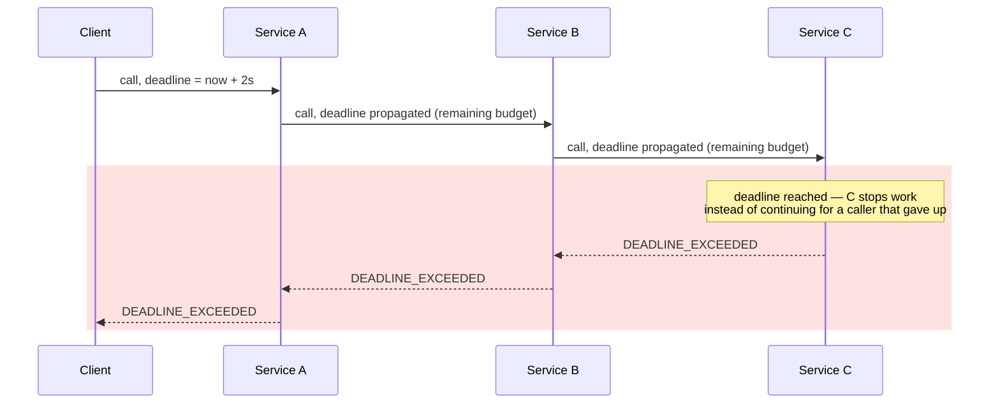

# Chapter 10: gRPC Contracts and Protocol Buffers

## Contract-first, binary, and built on HTTP/2

gRPC inverts the REST/GraphQL relationship to the contract: instead of a loose HTTP convention or a queryable schema, you define the service contract explicitly in a `.proto` file, and code generation produces client and server stubs in whatever languages you need. The wire format is Protocol Buffers — a compact binary encoding — carried over HTTP/2, giving gRPC multiplexing, header compression, and native bidirectional streaming for free from the transport layer covered in Chapter 2.

## Protocol Buffers: the contract

```protobuf
syntax = "proto3";

package orders.v1;

service OrderService {
  rpc GetOrder(GetOrderRequest) returns (Order);
  rpc StreamOrderUpdates(StreamOrderUpdatesRequest) returns (stream Order);
  rpc CreateOrder(CreateOrderRequest) returns (Order);
}

message GetOrderRequest {
  string order_id = 1;
}

message Order {
  string id = 1;
  string status = 2;
  repeated LineItem line_items = 3;
}

message LineItem {
  string sku = 1;
  int32 quantity = 2;
}
```

The numbers (`= 1`, `= 2`) are **field tags**, not default values — they're what actually gets encoded on the wire instead of field names, which is the core reason Protobuf messages are so much smaller than the equivalent JSON. This also means field tags are permanent once shipped: reusing a tag number for a different field in a later version is a wire-format-breaking change, covered in Chapter 19.

## Beyond flat fields: enums, nested messages, `oneof`, and well-known types

Real schemas need more than strings and integers:

```protobuf
import "google/protobuf/timestamp.proto";

enum OrderStatus {
  ORDER_STATUS_UNSPECIFIED = 0;  // proto3 requires a zero value for every enum
  PENDING = 1;
  SHIPPED = 2;
  CANCELLED = 3;
}

message Order {
  string id = 1;
  OrderStatus status = 2;
  repeated LineItem line_items = 3;
  google.protobuf.Timestamp created_at = 4;
  map<string, string> metadata = 5;

  oneof payment_method {
    string credit_card_token = 6;
    string bank_account_token = 7;
  }
}
```

**Enums** replace a loosely-typed string field with a fixed, compile-time-checked set of values — but proto3 requires every enum to define a zero value (`ORDER_STATUS_UNSPECIFIED` here), because a field that's never explicitly set decodes to that zero value rather than to `null`; a language with a real "absent" concept can mask this distinction, but it's still there on the wire. **`oneof`** groups fields that are mutually exclusive — only one of `credit_card_token` or `bank_account_token` is ever set on a given message, and setting one clears the other, which is the wire-level equivalent of a tagged union. **`map<K, V>`** encodes key-value data without hand-rolling a `repeated` message of key/value pairs. **Well-known types** like `google.protobuf.Timestamp` (and `Duration`) are the standard way to represent dates and durations — every generated language binding gets a native representation for them, instead of every service inventing its own string or epoch-integer convention that the next service has to guess at.

## Protobuf compatibility rules

Because every client and server generates its stubs from the `.proto` file independently, and because upgrades roll out gradually across a fleet, a schema change has to work when an old binary reads a message written by a new one and vice versa. Protobuf's wire format is designed around a small set of rules that make that possible — Chapter 19 covers the CI tooling that enforces them across an entire platform; here's what the rules actually are.

**Safe changes:**
- Add a new field, with a new, never-before-used field number.
- Add a new value to an enum (with the same caveat as GraphQL enums in Chapter 7: a consumer doing an exhaustive switch over the old value set can still break in practice, even though the wire format itself tolerates it).
- Add a new RPC method to a service.

**Unsafe changes:**
- **Reuse a field number** from a removed field — the single most dangerous mistake, because a peer still running the old `.proto` will decode the new field's bytes as the old field's type, silently corrupting data rather than failing loudly.
- **Change a field's type** to something wire-incompatible (Protobuf defines which types share a wire format — e.g. `int32`/`uint32`/`bool` are compatible with each other, but `int32` and `string` are not; changing within a compatible group is safe, across groups is not).
- **Change a field's semantic meaning** without changing its number or type — nothing on the wire stops you, and nothing detects it either; a field silently reinterpreted from "quantity in units" to "quantity in cases" is a correctness bug no compatibility checker can catch, which is why field semantics need the same change discipline as their types.

**Reserved fields** close the field-number-reuse hole at the source: once a field is removed, mark its number (and, ideally, its name) `reserved` so the compiler itself rejects any future attempt to reuse it, rather than relying on every future author remembering the retired field manually.

```protobuf
message Order {
  reserved 4, 7;
  reserved "legacy_discount_code";

  string id = 1;
  OrderStatus status = 2;
  repeated LineItem line_items = 3;
  // field 4 used to be `discount_code` — retired, never reuse
}
```

**Unknown fields.** A consumer running an older `.proto` that receives a message with fields it doesn't recognize doesn't error — it preserves the unknown bytes and ignores them (and, critically, round-trips them unchanged if it forwards the message on, which matters for proxies and gateways that pass messages through without fully deserializing them). This is what makes "add a field" safe in the first direction: old code tolerates data it doesn't understand yet.

**Backward vs. forward compatibility** are two different guarantees and it's worth keeping them straight: *backward compatible* means new code can read old data (an old message, decoded by a new `.proto` — missing fields just take their default); *forward compatible* means old code can read new data (a new message, decoded by an old `.proto` — extra fields become unknown fields and are ignored). A rolling deploy needs both simultaneously, since for the duration of the rollout old and new binaries are both live and both talking to each other in either direction.

## Code generation

```bash
python -m grpc_tools.protoc \
  -I protos \
  --python_out=generated \
  --grpc_python_out=generated \
  protos/orders.proto
```

This generates `orders_pb2.py` (message classes) and `orders_pb2_grpc.py` (client stub and server servicer base class). Every language on both ends of the wire generates from the same `.proto` file, which is what gives gRPC stronger contract tooling than REST's loosely-typed JSON or even GraphQL's runtime schema validation. In a statically typed language consuming the same generated code, a field type mismatch is a compile error; in Python specifically, the generated types improve IDE autocomplete and static-analysis coverage and catch plenty of mistakes before runtime, but a mismatch that slips past those checks still surfaces as a runtime exception — Python has no build step to catch it at.

## The four RPC types

**Unary**: one request, one response — the gRPC equivalent of a REST call.

**Server streaming**: one request, a stream of responses — e.g., `StreamOrderUpdates` pushing status changes as they happen, without the client polling.

**Client streaming**: a stream of requests, one response — e.g., a client uploading a stream of telemetry events, with the server acknowledging once at the end.

**Bidirectional streaming**: both sides stream independently over the same connection — used for things like a chat service or a live collaborative editing backend, where either side can send at any time.

| RPC type | Client sends | Server sends | Example |
|---|---|---|---|
| Unary | One request | One response | Equivalent of a REST call |
| Server streaming | One request | Stream of responses | `StreamOrderUpdates` pushing status changes as they happen |
| Client streaming | Stream of requests | One response | Uploading a stream of telemetry events, acknowledged once at the end |
| Bidirectional streaming | Stream of requests | Stream of responses | A chat service or a live collaborative editing backend |

```protobuf
service TelemetryService {
  rpc Report(stream Metric) returns (Ack);              // client streaming
  rpc Subscribe(SubscribeRequest) returns (stream Event); // server streaming
  rpc Sync(stream SyncMessage) returns (stream SyncMessage); // bidirectional
}
```

Streaming is where gRPC has no real REST or GraphQL-subscription equivalent in terms of protocol-level support — REST has no native streaming primitive (chunked transfer encoding and SSE are workarounds), and GraphQL subscriptions are a much higher-overhead abstraction layered on top of WebSockets for a narrower set of use cases.

## Deadlines, not timeouts

gRPC calls carry a **deadline** — an absolute point in time by which the call must complete — propagated automatically to every downstream call made while handling the original request. This is a meaningfully different model from a client-side timeout: if service A calls B calls C, and A sets a 2-second deadline, that deadline context propagates to B and C's calls too, so C doesn't keep working on a request that A has already given up on. Getting this propagation wired correctly across your service mesh is one of the highest-leverage reliability investments in a gRPC-based architecture — and one of the most commonly skipped, because it doesn't show up as broken until you're already deep into a cascading-latency incident.



## Status codes: a fixed enum, not HTTP status reuse

gRPC defines its own status code enum (`OK`, `CANCELLED`, `INVALID_ARGUMENT`, `DEADLINE_EXCEEDED`, `NOT_FOUND`, `ALREADY_EXISTS`, `RESOURCE_EXHAUSTED`, `UNAVAILABLE`, and others) rather than reusing HTTP status codes, even though it rides on HTTP/2. This is deliberate — gRPC's status model needs to express RPC-specific outcomes (like `DEADLINE_EXCEEDED` versus `CANCELLED`, a distinction HTTP has no native concept of) that don't map cleanly onto a REST-oriented status code set.

| Aspect | REST | gRPC |
|---|---|---|
| Status source | HTTP status codes (200, 404, 500, etc.) | Fixed, RPC-specific status enum |
| Rides on HTTP/2 | N/A | Yes, but does not reuse HTTP status codes |
| Cancelled vs. timed out | No native distinction | `CANCELLED` and `DEADLINE_EXCEEDED` are separate codes |
| Codes named in this chapter | — | `OK`, `CANCELLED`, `INVALID_ARGUMENT`, `DEADLINE_EXCEEDED`, `NOT_FOUND`, `ALREADY_EXISTS`, `RESOURCE_EXHAUSTED`, `UNAVAILABLE` |

## Failure modes

- **Field tag reuse across schema versions**: silently corrupting data on the wire for any client still running the old proto definition — covered fully in Chapter 19.
- **Deadlines not propagated across service hops**: a downstream service continuing expensive work for a request the original caller already gave up on, wasting capacity during exactly the load spikes when it matters most.
- **Treating streaming RPCs like unary calls under load**: not handling backpressure on a server-streaming RPC, allowing a slow consumer to cause unbounded memory growth on the server side — covered in Chapter 12.

## What's next

Chapter 11 covers building gRPC services in Python with `grpcio` — servicer implementation, interceptors, and async support via `grpc.aio`.

---

## Exercises

Exercises for this chapter live in [10a-grpc-fundamentals-exercises.md](10a-grpc-fundamentals-exercises.md). Solutions are available separately in [resources/solutions/](../resources/solutions/).
