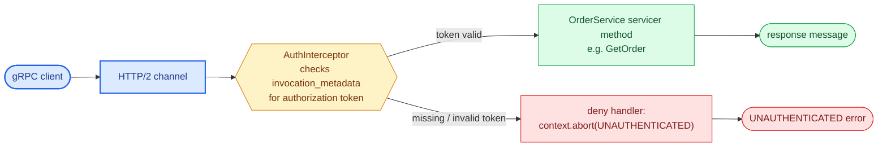
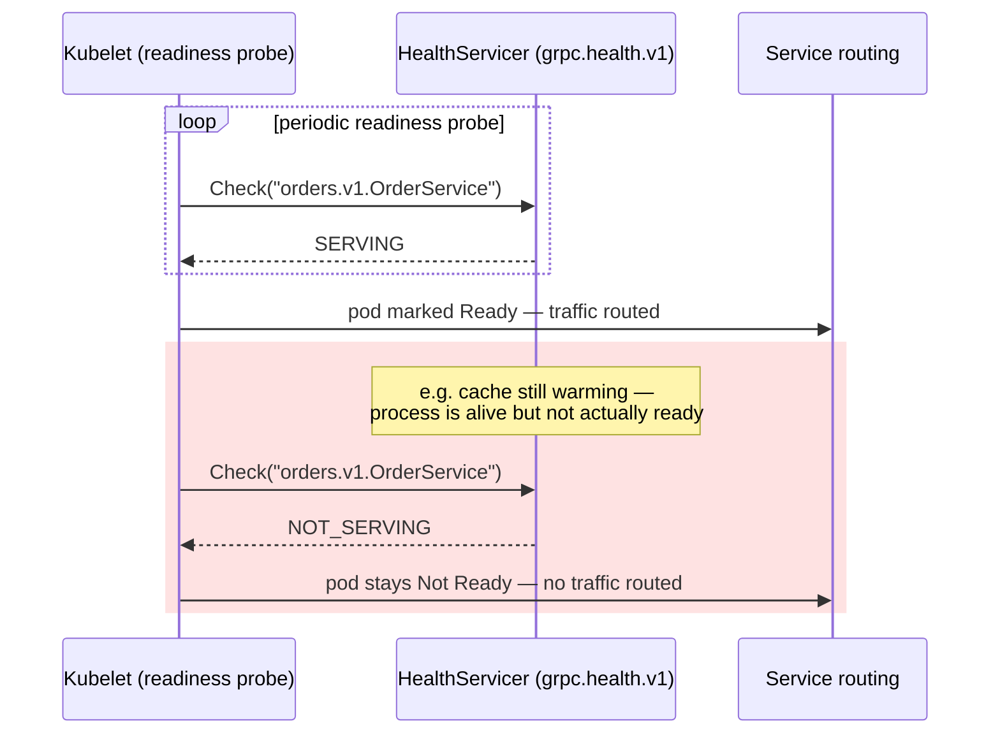

# Chapter 11: Building gRPC Services in Python

## Servicer implementation

Generated code from Chapter 10 produces a servicer base class you implement:

```python
import grpc
from generated import orders_pb2, orders_pb2_grpc

class OrderService(orders_pb2_grpc.OrderServiceServicer):
    async def GetOrder(self, request, context):
        record = await fetch_order(request.order_id)
        if record is None:
            await context.abort(grpc.StatusCode.NOT_FOUND, "order not found")
        return orders_pb2.Order(
            id=record["id"],
            status=record["status"],
            line_items=[
                orders_pb2.LineItem(sku=li["sku"], quantity=li["quantity"])
                for li in record["line_items"]
            ],
        )
```

Note `context.abort` rather than raising a Python exception directly — this is how you set a gRPC status code and detail message on the response. An unhandled Python exception propagating out of a servicer method gets caught by the gRPC runtime and surfaced to the client as an opaque `UNKNOWN` status, which is exactly the kind of debugging dead-end you want to avoid by being deliberate about error mapping.

## Implementing client-streaming and bidirectional servicers

`GetOrder` above is unary — one request in, one response out. The other RPC types from Chapter 10 change the servicer method's signature, not just its behavior:

```python
class TelemetryService(telemetry_pb2_grpc.TelemetryServiceServicer):
    # Client streaming: the servicer receives an async iterator instead of
    # a single request, and returns one response once the client's stream ends
    async def Report(self, request_iterator, context):
        count = 0
        async for metric in request_iterator:
            await store_metric(metric)
            count += 1
        return telemetry_pb2.Ack(metrics_received=count)

    # Bidirectional streaming: the servicer both consumes an async iterator
    # and yields responses — the two directions run independently
    async def Sync(self, request_iterator, context):
        async for message in request_iterator:
            reply = await process_sync_message(message)
            yield reply
```

A client-streaming method decides for itself when the client's stream is "done" (when `async for` exhausts the iterator) and only then returns its single response — conceptually similar to a REST bulk-upload endpoint, except gRPC frames each item independently on the wire instead of the client assembling one large request body. A bidirectional method's two directions aren't coupled: nothing requires the servicer to read one request before yielding one response, which is what makes this RPC shape suited to chat or live-collaboration protocols where either side can speak first. Server-streaming implementation, along with backpressure and cancellation handling (`context.write`, `context.cancelled()`), is covered in Chapter 12.

## Async server setup with `grpc.aio`

```python
import asyncio
import grpc
from generated import orders_pb2_grpc

async def serve():
    server = grpc.aio.server()
    orders_pb2_grpc.add_OrderServiceServicer_to_server(OrderService(), server)
    server.add_insecure_port("[::]:50051")
    await server.start()
    await server.wait_for_termination()

if __name__ == "__main__":
    asyncio.run(serve())
```

`grpc.aio` is the async-native server implementation and is the correct default for new services in 2026 — the older synchronous `grpc.server` with a thread pool executor still exists and is common in legacy codebases, but forces a thread-per-concurrent-call model that doesn't scale as cleanly as native asyncio for I/O-bound service handlers.

| | `grpc.aio` (async) | `grpc.server` + thread pool (sync) |
|---|---|---|
| Concurrency model | Native asyncio | Thread-per-concurrent-call via executor |
| Recommended for | New services, 2026 default | Legacy codebases |
| Scaling for I/O-bound handlers | Scales cleanly | Doesn't scale as cleanly |

## Interceptors: cross-cutting logic without repeating yourself

Interceptors are gRPC's equivalent of REST middleware — they wrap every call to inject logging, auth checks, or metrics without touching individual servicer methods:

```python
import grpc
from grpc import aio

class AuthInterceptor(aio.ServerInterceptor):
    async def intercept_service(self, continuation, handler_call_details):
        metadata = dict(handler_call_details.invocation_metadata)
        token = metadata.get("authorization")
        if not token or not await is_valid_token(token):
            async def deny(request, context):
                await context.abort(grpc.StatusCode.UNAUTHENTICATED, "invalid token")
            return grpc.unary_unary_rpc_method_handler(deny)
        return await continuation(handler_call_details)

server = grpc.aio.server(interceptors=[AuthInterceptor()])
```

This is the correct place for authentication, request logging, and metrics emission — logic that needs to run for every RPC regardless of which service method is being called, mirroring how you'd use FastAPI middleware or Django middleware in the REST world.



## Client-side stubs and channel management

```python
import grpc
from generated import orders_pb2, orders_pb2_grpc

async def get_order(order_id: str):
    async with grpc.aio.insecure_channel("orders-service.internal:50051") as channel:
        stub = orders_pb2_grpc.OrderServiceStub(channel)
        response = await stub.GetOrder(
            orders_pb2.GetOrderRequest(order_id=order_id),
            timeout=2.0,  # deadline, in seconds, from now
        )
        return response
```

As covered in Chapter 2, channels are expensive to set up and cheap to reuse — the pattern above (opening a channel per call inside an `async with`) is fine for a script or a low-volume caller, but a service making frequent calls to another service should hold one long-lived channel (often as a module-level singleton or via a connection-pooling library) and reuse it across many stub calls, not recreate it per request.

## Health checking and reflection

Production gRPC services should implement the standard **health checking protocol** (`grpc.health.v1`) so load balancers and orchestrators (Kubernetes readiness probes, in particular) can determine liveness without a service-specific integration:

```python
from grpc_health.v1 import health, health_pb2_grpc

health_servicer = health.HealthServicer()
health_pb2_grpc.add_HealthServicer_to_server(health_servicer, server)
health_servicer.set("orders.v1.OrderService", health_pb2.HealthCheckResponse.SERVING)
```

**Server reflection** (`grpc_reflection`) allows tools like `grpcurl` to introspect a running service's schema without needing the `.proto` file on hand — invaluable for debugging in an environment with dozens of internal services, but like GraphQL introspection, worth disabling on externally-exposed gRPC endpoints.



## Failure modes

- **Unhandled exceptions surfacing as opaque `UNKNOWN` status**: servicer methods that don't map domain errors to gRPC status codes explicitly, forcing callers to parse error message strings instead of branching on status codes.
- **Channel-per-call in a hot path**: recreating a gRPC channel for every call instead of reusing a long-lived one, reintroducing the TLS/connection-setup overhead Chapter 2 covers.
- **Missing health checks**: a Kubernetes deployment routing traffic to pods that are up but not actually ready to serve (e.g., still warming a cache), because readiness was inferred from process liveness instead of an actual health check.

## What's next

Chapter 12 goes deeper into gRPC's performance characteristics — streaming backpressure, flow control, and the specific ways gRPC's efficiency gains can be lost through careless implementation.

---

## Exercises

Exercises for this chapter live in [11a-building-grpc-services-python-exercises.md](11a-building-grpc-services-python-exercises.md). Solutions are available separately in [resources/solutions/](../resources/solutions/).
