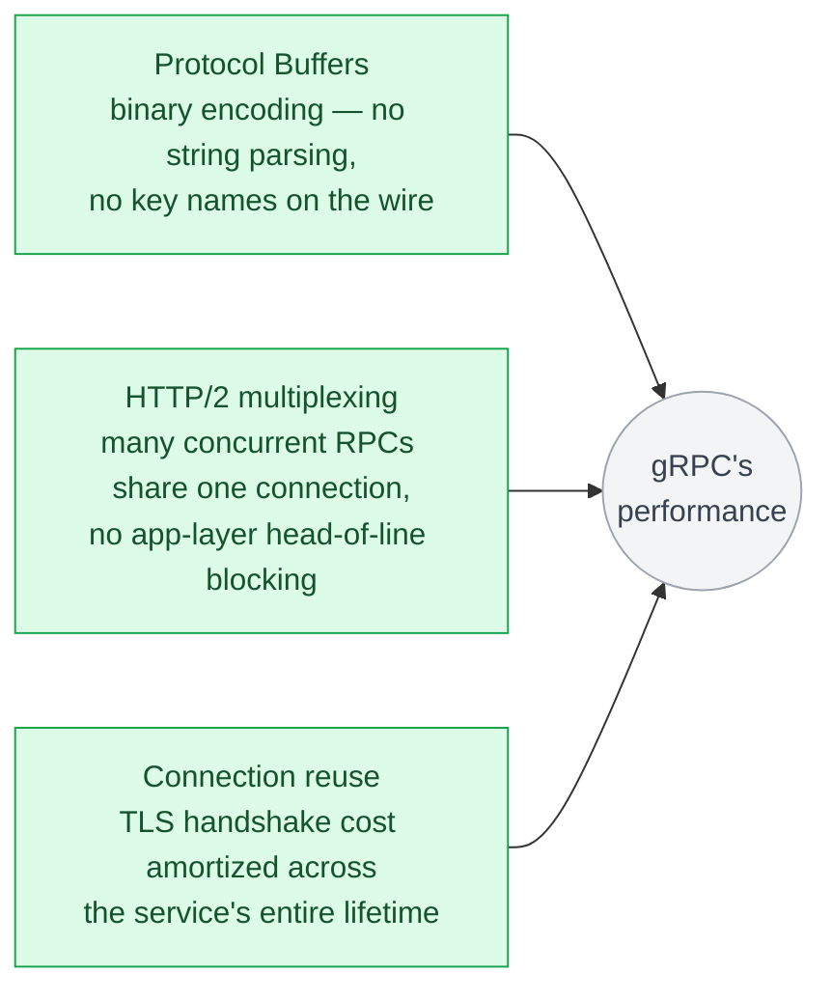
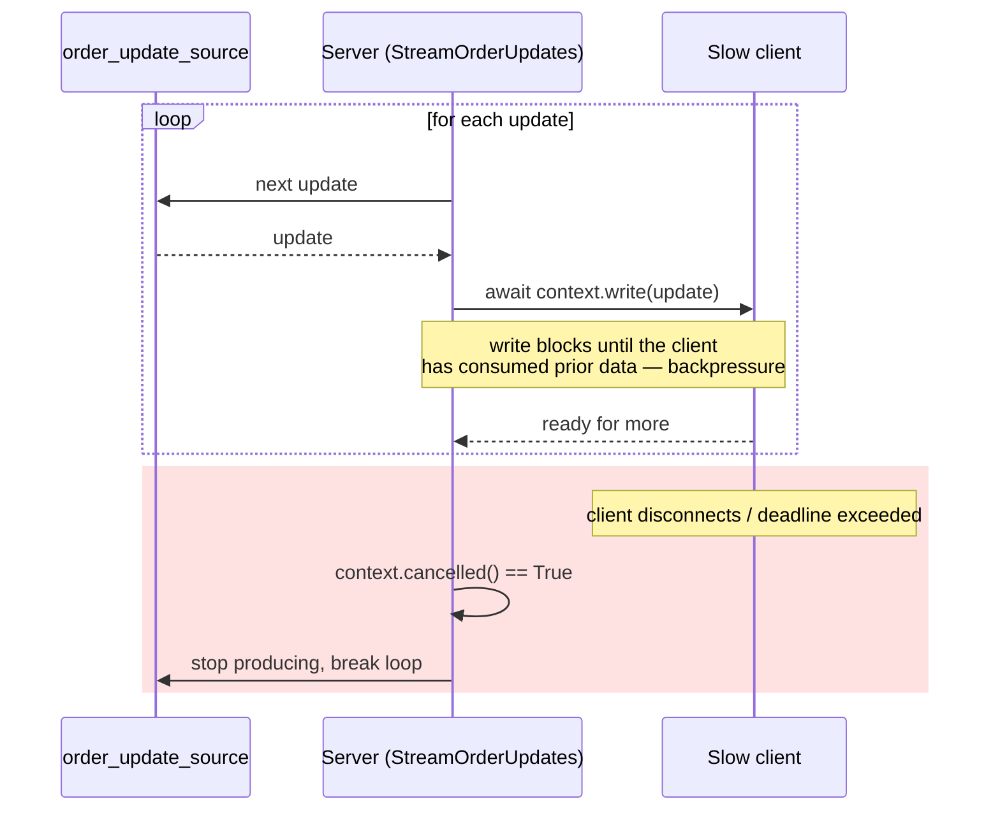
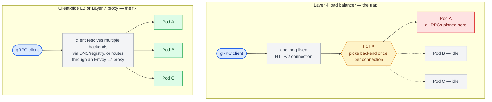

# Chapter 12: gRPC Performance and Streaming

## Where gRPC's performance actually comes from

Three factors compound: Protocol Buffers' binary encoding is smaller and faster to (de)serialize than JSON (no string parsing, no key names on the wire); HTTP/2 multiplexing lets many concurrent RPCs share one connection without head-of-line blocking at the application layer; and connection reuse (Chapter 2) amortizes TLS handshake cost across the service's entire lifetime rather than per-request. None of these are gRPC-exclusive in principle — you could serve Protobuf over HTTP/1.1, or JSON over HTTP/2 — but gRPC is the framework that bundles all three defaults together, which is why the performance difference against REST-over-HTTP/1.1-JSON is typically large in practice, and much smaller against a REST API that's already adopted HTTP/2 and a binary format.



## Deadline propagation under load

Chapter 10 introduces deadlines as gRPC's replacement for client-side timeouts; under streaming and high concurrency specifically, propagation is what keeps a slow downstream from turning into a resource leak rather than just a slow response. A unary call that misses its deadline stops one wasted unit of work. A *streaming* call that isn't deadline-aware can hold a connection, a DB cursor, and a slot in a thread or task pool open indefinitely for a client that has already given up — and because streaming calls are long-lived by design, this failure mode compounds under load in a way a fast unary timeout never does. The same `context.cancelled()` check that handles client disconnects (below) also fires when a deadline expires, so a correctly written streaming handler gets deadline enforcement for free once it's checking cancellation on every iteration — one more reason "check `context.cancelled()` every loop" is a hard requirement, not a nicety.

## Streaming backpressure

In server streaming, the server can produce responses faster than the client consumes them — a telemetry producer emitting 10,000 events/sec into a consumer that can only process 1,000/sec is the concrete version of this problem. Without backpressure, that gap becomes unbounded buffering: the server keeps queuing events the client isn't ready for, memory grows without bound, and the failure shows up as an OOM kill far from wherever the actual mismatch originated. `grpc.aio`'s streaming write calls are awaitable and will naturally apply backpressure if you `await` each write and don't buffer ahead of it — the `await` on `context.write()` below doesn't return until the client has consumed what was already sent, which is what keeps the producer from outrunning the consumer in the first place:

```python
async def StreamOrderUpdates(self, request, context):
    async for update in order_update_source(request.order_id):
        await context.write(update)  # awaits until the client is ready for more
        if context.cancelled():
            break
```

The critical detail is `if context.cancelled(): break` — if the client disconnects or hits its deadline mid-stream, the server needs to notice and stop producing work, or it keeps consuming resources (DB connections, CPU) for a stream nobody is reading. This is a very common resource leak in poorly-implemented streaming servicers: the loop keeps running because nothing checks `context.cancelled()`.



## Flow control at the HTTP/2 layer

HTTP/2 has built-in flow control windows per stream and per connection — a receiver advertises how much unacknowledged data it's willing to buffer, and the sender must respect that window. `grpcio`'s defaults are usually fine, but high-throughput streaming services (telemetry ingestion, live market data feeds) sometimes need to tune `grpc.http2.max_frame_size` and related channel options, because the default window sizes were chosen for general-purpose use, not for a service pushing megabytes per second down a single stream.

## Load balancing gRPC traffic correctly

As covered in Chapter 2, a Layer 4 load balancer pins an entire long-lived HTTP/2 connection (and therefore every RPC multiplexed over it) to one backend, which for a small number of long-lived connections between services can badly skew load. Two standard fixes: **client-side load balancing**, where the gRPC client resolves multiple backend addresses (via DNS or a service registry) and distributes individual RPCs itself; or **a Layer 7 proxy** (Envoy is the most common choice) that understands HTTP/2 streams and distributes at the RPC level rather than the connection level. For Kubernetes deployments specifically, headless services combined with client-side round-robin, or a service mesh sidecar, are the two dominant patterns — plain `ClusterIP` load balancing at the connection level is a known trap for gRPC that teams migrating from REST reliably hit once.



## Compression

gRPC supports per-message compression (`gzip` is built in; others are pluggable) negotiated via metadata. This trades CPU for bandwidth — worthwhile for large payloads over constrained networks (mobile clients calling a gRPC-Web gateway), largely wasted overhead for small, low-latency internal service calls where the CPU cost of compression exceeds the bytes saved.

```python
channel = grpc.aio.insecure_channel(
    "orders-service.internal:50051",
    compression=grpc.Compression.Gzip,
)
```

## Benchmarking honestly

A common mistake in gRPC-vs-REST performance comparisons is benchmarking gRPC's binary protocol against a REST API that hasn't been given the same treatment (still on HTTP/1.1, still JSON, cold connections per request). A fair comparison holds the transport layer constant where possible, or explicitly states which layer's contribution you're measuring — protocol encoding, transport multiplexing, or connection reuse — because conflating all three into a single "gRPC is N times faster" number tends to overstate what protocol choice alone buys you, versus what's actually attributable to HTTP/2 adoption and connection management discipline.

## Failure modes

- **Streaming servicers that ignore cancellation**: continuing to do work (and hold resources) for streams the client has already abandoned.
- **Layer 4 load balancing on long-lived gRPC connections**: traffic concentrating on a subset of backend pods, invisible until a capacity incident during a traffic spike.
- **Compression applied indiscriminately**: CPU overhead on small, high-frequency internal calls that never needed it, quietly eating into a service's latency budget.

## What's next

Part V steps back from any single protocol to the concerns that apply across all three: authentication, gateways, rate limiting, error handling, observability, testing, and schema evolution.

---

## Exercises

Exercises for this chapter live in [12a-grpc-performance-streaming-exercises.md](12a-grpc-performance-streaming-exercises.md). Solutions are available separately in [resources/solutions/](../resources/solutions/).
