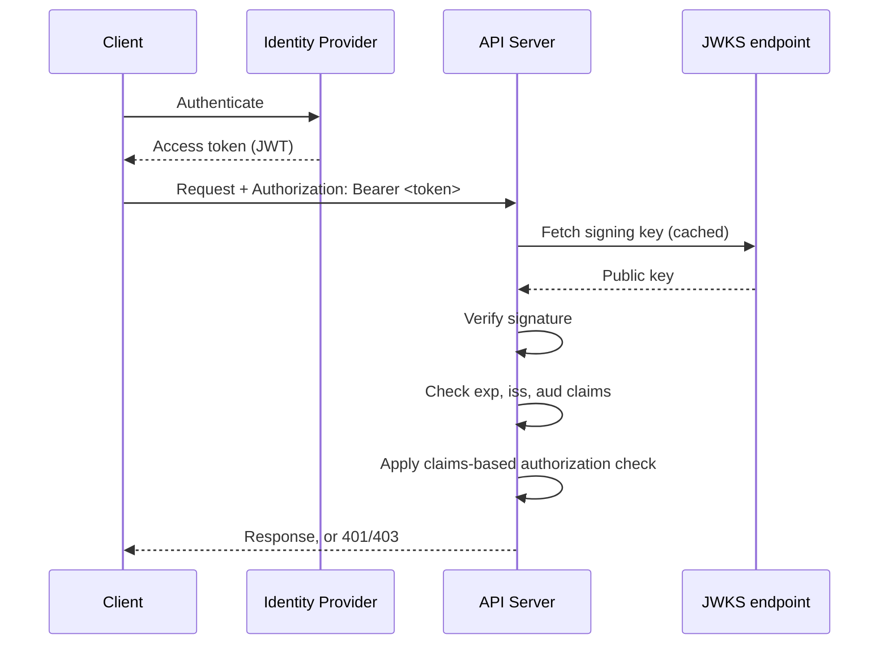
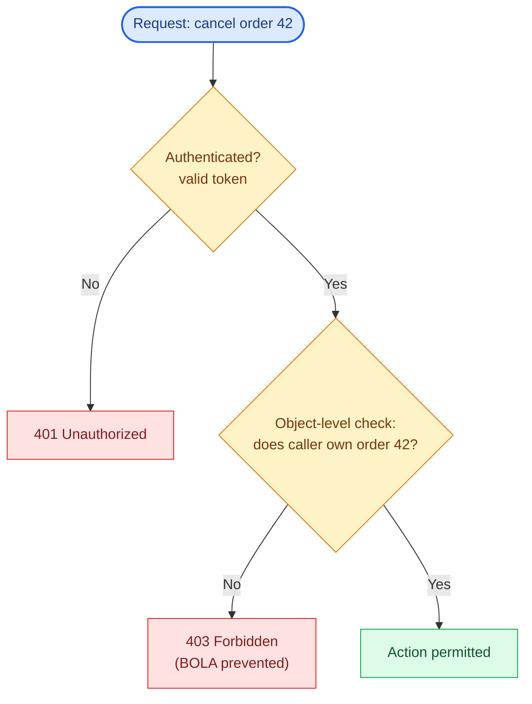

# Chapter 13: Authentication and Authorization

## Authentication vs authorization, kept distinct

Authentication answers "who is this caller?" Authorization answers "is this caller allowed to do this specific thing?" Conflating them — e.g., treating "has a valid token" as equivalent to "is allowed to cancel this order" — is a recurring source of privilege-escalation bugs. Every endpoint, resolver, and RPC method needs both checks, and they should be implemented as separable layers, not interleaved ad hoc in business logic.

## OAuth2 and OpenID Connect

OAuth2 is an authorization delegation framework (a client gets a token scoped to act on a resource owner's behalf); OpenID Connect (OIDC) layers identity on top of it (the ID token asserts who the user is). For API architecture purposes, the practical pattern across all three protocols is the same: a client obtains an access token (typically a JWT) from an identity provider (Auth0, Okta, AWS Cognito, or a self-hosted provider like Keycloak), and includes it on every subsequent call.

```python
# REST: Authorization header
headers = {"Authorization": f"Bearer {access_token}"}

# GraphQL: same header, since it rides on HTTP
headers = {"Authorization": f"Bearer {access_token}"}

# gRPC: metadata, the RPC equivalent of headers
metadata = [("authorization", f"Bearer {access_token}")]
```

## API keys: simpler auth for third-party and machine callers

OAuth2/OIDC issues short-lived tokens tied to a specific end user's identity, obtained through an interactive login flow. A third-party seller integrating with a webhook or batch REST endpoint (Chapter 22's case study) usually isn't acting on behalf of any specific end user at all, and forcing a server-to-server integration through a full authorization-code flow is unnecessary friction for both sides. An **API key** — a long-lived, opaque credential issued directly to the integrating account — is the standard alternative for exactly this population: no login flow, no refresh cycle, just a static credential included on every request.

```python
import hashlib, secrets

def issue_api_key(seller_id: str) -> str:
    raw_key = f"sk_{secrets.token_urlsafe(32)}"
    key_hash = hashlib.sha256(raw_key.encode()).hexdigest()
    store_key_hash(seller_id=seller_id, key_hash=key_hash)  # never store the raw key
    return raw_key  # shown to the seller exactly once, at issuance

async def authenticate_api_key(request) -> str:
    raw_key = request.headers.get("X-API-Key")
    if not raw_key:
        raise HTTPException(401, "missing API key")
    seller_id = await lookup_key_hash(hashlib.sha256(raw_key.encode()).hexdigest())
    if seller_id is None:
        raise HTTPException(401, "invalid API key")
    return seller_id
```

Two disciplines matter more than they look: store only a hash of the key, never the raw value, so a database leak doesn't hand out working credentials directly (the same principle as password storage); and treat rotation as a first-class feature — issuing a new key with an overlapping grace period on the old one — rather than a single permanent credential a seller can never safely change without a coordinated cutover. This is the mechanism behind the per-seller rate limiting in Chapter 15 and the third-party authentication layer in Chapter 22, deliberately kept simpler and separate from the OIDC/JWT flow used for first-party clients.

## JWT validation, done correctly

A JWT's claims should never be trusted until the signature is verified against the issuer's public key, and the token's `exp`, `iss`, and `aud` claims must be explicitly checked — a common vulnerability is validating the signature but skipping expiry or audience checks, allowing a token issued for a different service to be replayed against this one.

```python
import jwt
from jwt import PyJWKClient

jwks_client = PyJWKClient("https://auth.example.com/.well-known/jwks.json")

def verify_token(token: str) -> dict:
    signing_key = jwks_client.get_signing_key_from_jwt(token)
    return jwt.decode(
        token,
        signing_key.key,
        algorithms=["RS256"],
        audience="orders-api",
        issuer="https://auth.example.com/",
    )
```

Fetch and cache the JWKS (JSON Web Key Set) rather than hardcoding public keys — identity providers rotate signing keys periodically, and a hardcoded key becomes an outage the moment rotation happens.



## mTLS for service-to-service auth

For internal gRPC traffic, mutual TLS (both client and server present certificates, both are verified) is the standard approach — it authenticates the *service*, not a per-user token, which is the right model for service-to-service calls where "which service is calling" matters more than "which end user initiated this." Service meshes (Istio, Linkerd) typically automate mTLS certificate issuance and rotation across a cluster, which is why adopting a mesh is common specifically to get this for free rather than building custom cert management per service.

## Authorization models

**RBAC** (role-based access control) checks whether the caller's assigned role permits an action — simple to reason about, but coarse-grained and prone to role sprawl as requirements get more specific ("editors, except for financial fields" ends up needing a new role).

**ABAC** (attribute-based access control) evaluates a policy against attributes of the caller, the resource, and the context (time of day, request origin) — more flexible, more expressive, and correspondingly harder to audit and reason about at a glance.

**ReBAC** (relationship-based access control, popularized by Google's Zanzibar paper) models authorization as relationships in a graph ("user X is an editor of document Y because X is a member of team Z which owns Y") — well suited to systems with deeply nested ownership and sharing models, at the cost of needing a dedicated authorization service (open-source implementations include OpenFGA and SpiceDB).

| Model | Decision basis | Granularity | Tradeoff |
|---|---|---|---|
| RBAC | Caller's assigned role | Coarse-grained | Simple to reason about, but prone to role sprawl as requirements get specific |
| ABAC | Attributes of caller, resource, and context | Fine-grained | Flexible and expressive, harder to audit and reason about at a glance |
| ReBAC | Relationships in a graph between caller and resource | Fine-grained, ownership-aware | Well suited to nested ownership/sharing, but needs a dedicated authorization service (OpenFGA, SpiceDB) |

## Authorization enforcement point, per protocol

REST: typically a dependency/middleware layer checking the resource and method against the caller's permissions before the handler runs. GraphQL: authorization needs to happen *per field*, not just per query, since a single query can touch many types with different access rules — field-level authorization directives (`@auth(requires: ADMIN)`) are the common pattern. gRPC: interceptors (Chapter 11) are the natural enforcement point, running before the servicer method executes.

```graphql
type Order {
  id: ID!
  status: OrderStatus!
  internalNotes: String @auth(requires: ADMIN)
}
```

## The API threat model: authentication solves less than it looks like

Authentication at the gateway (Chapter 14) tells you who's calling. It does not tell you what they're allowed to touch, and most real API vulnerabilities live in that gap — a request from a perfectly authenticated, legitimate user, asking for something that user shouldn't get. A useful mental model for what to actually defend against, beyond "check the token":

- **BOLA / IDOR** (Broken Object Level Authorization / Insecure Direct Object Reference) — `GET /orders/42` returns order 42 to any authenticated caller, not just its owner. Consistently OWASP's #1 API risk, and the direct motivation for the object-level check in this chapter's diagram below.
- **Broken function-level authorization** — an authenticated regular user calling an admin-only endpoint (`DELETE /users/7`) that checks authentication but never checks role, because the route exists and nothing rejects the call.
- **Mass assignment** — an update endpoint that deserializes the entire request body onto a model, so a client can set fields it was never meant to control (`{"role": "admin"}` slipped into a profile-update payload) because nothing allowlists which fields a given caller may write, only which fields exist.
- **Excessive data exposure** — an endpoint returning a full internal object and relying on the client to discard fields it shouldn't have seen, rather than the server only ever serializing an explicit response shape (Chapter 4's `response_model` allowlist exists specifically to close this).
- **Replay attacks** — a captured, valid request (or a valid webhook delivery, or a valid signed URL) resent later to repeat its effect; the timestamp-in-signature technique in Chapter 20's webhook section is the standard defense.
- **SSRF** (Server-Side Request Forgery) — an API that fetches a client-supplied URL on the server's behalf (a webhook registration URL, an image-fetch-by-URL feature) becoming a way to make the server issue requests to internal infrastructure the client couldn't otherwise reach.
- **Credential abuse** — leaked or brute-forced API keys and tokens used directly; this is what makes key rotation and hashed-at-rest storage (this chapter's API key section) load-bearing rather than optional hygiene.
- **Webhook signature verification gaps** — accepting an inbound webhook without verifying its HMAC signature, letting anyone who finds the endpoint URL forge events (Chapter 20 covers signing on the sending side; the receiver has to actually check it).
- **GraphQL query abuse** — a query engineered to be expensive rather than malicious in the traditional sense (Chapter 9's depth/cost limiting), or one that uses field-level access to reach data a query-level check didn't anticipate (this chapter's field-level authorization gap, below).

The throughline: authentication is a precondition for authorization, not a substitute for it. A gateway that terminates authentication centrally (Chapter 14) has correctly solved "is this a legitimate caller" — every item on this list is a way "yes, but should *this* caller do *this specific thing*" still gets skipped downstream.

## Failure modes



A check that stops at "is this user authenticated" and skips "does this user own this specific object" leaves the second gate open — that's the gap the failure modes below describe.

- **Storing raw API keys**: keeping the plaintext key instead of a hash, so a database leak hands out working credentials directly rather than useless hashes.
- **Trusting an unverified JWT claim**: decoding a token without verifying its signature (a surprisingly common mistake when a library's "decode" function doesn't verify by default) and trusting the claims inside.
- **Object-level authorization gaps**: checking "is this user authenticated" but not "does this user own this specific order" — the single most common real-world API vulnerability class (OWASP calls this Broken Object Level Authorization, consistently the #1 API security risk in their API Security Top 10).
- **Field-level authorization skipped in GraphQL**: a query-level auth check that doesn't account for a field deep in the response exposing data the caller shouldn't see.

## What's next

Chapter 14 covers API gateways and service mesh — where authentication, rate limiting, and routing concerns get centralized (or don't) across a multi-protocol architecture.

## Exercises

Exercises for this chapter live in [13a-authentication-authorization-exercises.md](13a-authentication-authorization-exercises.md). Solutions are available separately in [resources/solutions/](../resources/solutions/).
