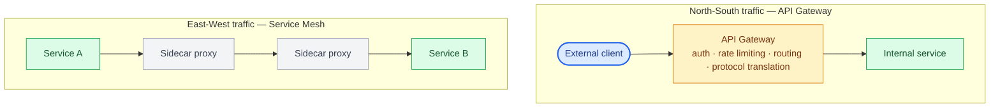
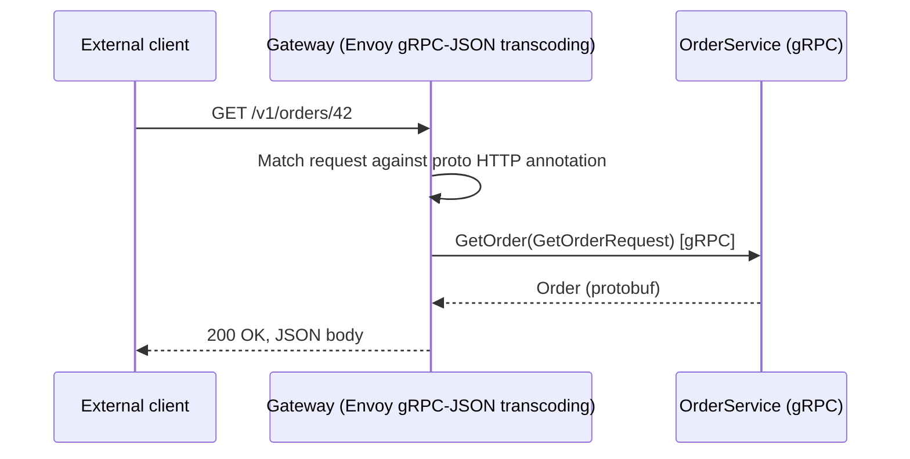
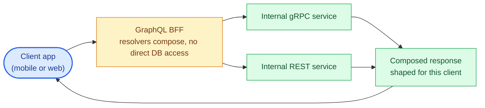

# Chapter 14: API Gateways and Service Mesh

## Two different problems that look similar

An **API gateway** sits at the edge of your system, between external clients and your internal services — it handles auth, rate limiting, request routing, and protocol translation for north-south traffic (client-to-service). A **service mesh** sits between your internal services — it handles service discovery, mTLS, retries, and traffic shaping for east-west traffic (service-to-service). Teams sometimes reach for a mesh to solve an edge problem or a gateway to solve an internal routing problem; the mismatch usually shows up as either missing capabilities or unnecessary operational overhead.



## What a gateway centralizes

- **Protocol translation**: exposing a REST or GraphQL interface externally while internal services communicate over gRPC — a very common pattern, since gRPC's binary format and HTTP/2 requirement make it a poor fit for direct browser or third-party consumption.
- **Authentication termination**: validating tokens once at the edge rather than in every downstream service (though defense-in-depth argues for re-validating at least the token's presence downstream too).
- **Rate limiting and quota enforcement**: covered in depth in Chapter 15, but the gateway is the natural enforcement point for per-client quotas.
- **Request/response transformation**: adapting a legacy client's expected payload shape without changing the underlying service.

## gRPC-to-REST/JSON translation

`grpc-gateway`-style reverse proxies (in the Python ecosystem, this is often handled by Envoy's gRPC-JSON transcoding filter rather than a Python-native tool) let internal gRPC services be exposed as REST/JSON externally, driven by annotations in the `.proto` file:

```protobuf
import "google/api/annotations.proto";

service OrderService {
  rpc GetOrder(GetOrderRequest) returns (Order) {
    option (google.api.http) = {
      get: "/v1/orders/{order_id}"
    };
  }
}
```

This lets a team build internal services gRPC-first (getting the type safety and performance benefits) while still serving REST-consuming external clients, without maintaining two separate implementations of the same business logic.



## GraphQL as a gateway pattern (BFF)

A **Backend for Frontend (BFF)** GraphQL layer is a common gateway variant: the GraphQL server itself has few or no resolvers backed directly by a database — instead, each resolver calls out to internal gRPC or REST services, and the GraphQL layer's job is purely to compose those calls into the shape a specific client (mobile app, web app) needs. This is architecturally distinct from federation (Chapter 9), where multiple teams each own a piece of the graph — a BFF is typically owned by the client team it serves and treated as disposable, client-specific glue rather than a shared platform artifact.



## Service mesh capabilities

A service mesh (Istio, Linkerd, Consul Connect) typically injects a sidecar proxy (usually Envoy) alongside every service instance, intercepting all inbound and outbound traffic transparently. This gives you, without changing application code: automatic mTLS between services (Chapter 13), consistent retry and timeout policy enforcement, circuit breaking (Chapter 16), and distributed tracing propagation (Chapter 17) — all configured centrally rather than reimplemented per service in every language your organization uses.

The cost is real: a sidecar adds latency (typically low single-digit milliseconds, but nonzero) and meaningful operational complexity — mesh upgrades, sidecar resource overhead multiplied across every pod, and a new class of "why did this request fail" debugging that spans the mesh's control plane, not just your application code.

## When to skip both

A small number of services (single digits) with a stable, known set of internal callers often doesn't need a mesh — plain load-balanced service discovery (Kubernetes Services, or client-side discovery via Consul) plus disciplined per-client libraries for retries and timeouts covers the same ground with far less operational surface. Reach for a mesh when the number of services and the diversity of languages/teams involved makes "just implement retries consistently everywhere" an organizational coordination problem rather than a technical one.

| Concern | Service discovery + client library | Service mesh |
|---|---|---|
| Number of services | Single digits | Larger, growing fleet |
| Caller stability | Stable, known set of internal callers | Diverse teams and languages involved |
| Retry/timeout consistency | Disciplined per-client libraries | Enforced centrally, not reimplemented per service/language |
| Operational cost | Low — no sidecars or control plane | Real — sidecar latency plus mesh operational complexity |

## Failure modes

- **Gateway as an undocumented single point of failure**: all north-south traffic through one gateway cluster with no capacity headroom or independent failure domain from the services behind it.
- **BFF resolvers becoming a second source of business logic**: a BFF that starts embedding actual business rules instead of pure composition, creating two places (the BFF and the underlying service) that can disagree about behavior.
- **Adopting a mesh before it's needed**: taking on sidecar operational overhead and a new failure mode surface for a handful of services that could be solved with a shared client library.

## What's next

Chapter 15 covers rate limiting and throttling — the mechanics of protecting a service from its own callers, and how the right algorithm differs across REST, GraphQL, and gRPC's different request shapes.

## Exercises

Exercises for this chapter live in [14a-api-gateway-service-mesh-exercises.md](14a-api-gateway-service-mesh-exercises.md). Solutions are available separately in [resources/solutions/](../resources/solutions/).
