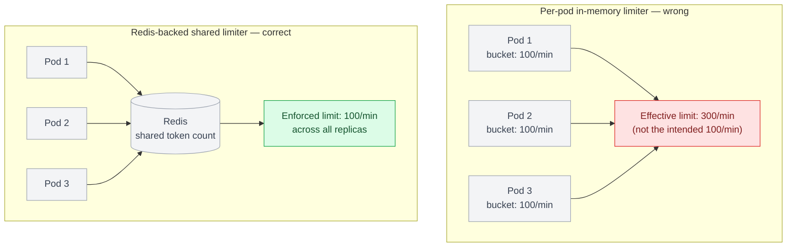
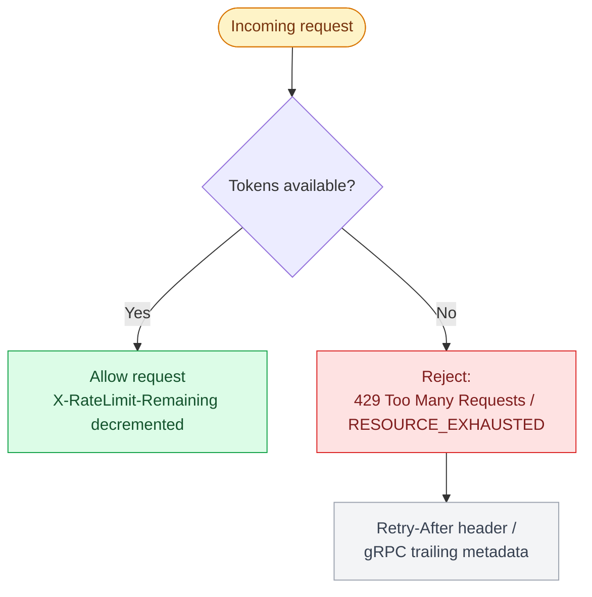

# Chapter 15: Rate Limiting and Throttling

## Why "requests per second" isn't the right unit for every protocol

REST's request-per-URL model maps naturally onto a fixed-window or token-bucket limiter counting HTTP requests. GraphQL breaks this assumption: a single request can be cheap (`{ order(id: "42") { status } }`) or extremely expensive (a deeply nested query touching thousands of underlying records), so counting requests alone under-protects against expensive queries and over-throttles clients making many cheap ones. gRPC adds a third wrinkle: a single long-lived streaming RPC can carry an unbounded number of logical messages over time, so "requests per second" doesn't even describe the traffic shape.

## Token bucket, the default choice

A token bucket holds a capacity of tokens, refilling at a fixed rate; each request consumes one or more tokens, and requests are rejected when the bucket is empty. It naturally allows short bursts (up to the bucket's capacity) while enforcing a steady-state rate — usually the right default for REST and gRPC unary calls.

```python
import time

class TokenBucket:
    def __init__(self, capacity: int, refill_rate: float):
        self.capacity = capacity
        self.tokens = capacity
        self.refill_rate = refill_rate  # tokens per second
        self.last_refill = time.monotonic()

    def allow(self, cost: int = 1) -> bool:
        now = time.monotonic()
        elapsed = now - self.last_refill
        self.tokens = min(self.capacity, self.tokens + elapsed * self.refill_rate)
        self.last_refill = now
        if self.tokens >= cost:
            self.tokens -= cost
            return True
        return False
```

In production, this state lives in Redis (via `INCR` + `EXPIRE`, or a Lua script for atomicity) rather than in-process, since a service running multiple replicas needs a shared view of each client's consumption — an in-process limiter per pod effectively multiplies the real limit by the pod count.



## Sliding window for smoother enforcement

Fixed windows (e.g., "100 requests per minute, resetting on the minute") allow a burst of 200 requests clustered right at a window boundary (100 at 0:59, 100 at 1:00). A sliding window log or sliding window counter smooths this by weighting the previous window's count proportionally, avoiding the boundary-burst problem at the cost of slightly more bookkeeping.

| Algorithm | Behavior | Burst handling | Cost |
|---|---|---|---|
| Token bucket | Capacity refills at a fixed rate; each request consumes tokens | Allows short bursts up to capacity, then enforces a steady-state rate | Default for REST and gRPC unary calls |
| Fixed window | Fixed count per window (e.g. 100/min), resets on the boundary | Allows a burst clustered at the window boundary (e.g. 100 at 0:59, 100 at 1:00) | Simple, but boundary-burst prone |
| Sliding window | Weights the previous window's count proportionally | Smooths out the boundary-burst problem | Slightly more bookkeeping |
| Leaky bucket | Requests queue and are drained at a strictly constant output rate | None — bursts are smoothed into a steady drip rather than let through | Better suited to shaping traffic into a fixed-capacity downstream than to client-facing API limits |

A **leaky bucket** inverts the token bucket's framing: instead of a pool of permits that a burst can spend all at once, requests enter a fixed-size queue and leave — get processed — at a constant rate no matter how bursty their arrival was. That's a genuinely different guarantee: token bucket answers "how much can a client send right now," leaky bucket answers "how fast can anything downstream ever actually be hit," which is why it shows up more in traffic-shaping contexts (protecting a fixed-capacity worker pool or a downstream system with a hard throughput ceiling) than in client-facing rate limiting, where token bucket's burst tolerance is usually the behavior you actually want to offer callers.

## Rate limiting GraphQL by cost, not by request count

Given the complexity analysis from Chapter 9, the natural evolution is to rate-limit by *cumulative query cost* rather than request count — a client's budget is consumed in proportion to the complexity score of each query, not a flat 1 token per call. This directly ties rate limiting and query cost analysis together: the same cost function protecting against a single catastrophic query also governs a client's overall throughput budget.

## Rate limiting gRPC streams

For unary RPCs, token-bucket-per-call works as with REST. For streaming RPCs, the more meaningful limit is often on **concurrent open streams per client** and **messages per second within a stream**, rather than "calls per second" — since a single `StreamOrderUpdates` call might stay open for hours. An interceptor (Chapter 11) is the natural enforcement point:

```python
class RateLimitInterceptor(grpc.aio.ServerInterceptor):
    async def intercept_service(self, continuation, handler_call_details):
        client_id = extract_client_id(handler_call_details)
        if not await rate_limiter.allow(client_id):
            async def deny(request, context):
                await context.abort(grpc.StatusCode.RESOURCE_EXHAUSTED, "rate limit exceeded")
            return grpc.unary_unary_rpc_method_handler(deny)
        return await continuation(handler_call_details)
```

Note the status code: gRPC's `RESOURCE_EXHAUSTED` is the correct signal for rate limiting, analogous to REST's `429 Too Many Requests` — using a generic error code instead makes it impossible for well-behaved clients to distinguish "back off and retry" from "this request is permanently invalid."

## Communicating limits to clients

Whichever protocol, clients need to know their current budget to behave well — REST conventionally uses `X-RateLimit-Limit`, `X-RateLimit-Remaining`, and `X-RateLimit-Reset` headers (also usable for GraphQL, since it rides on HTTP); gRPC communicates equivalent information via trailing metadata. Returning a bare `429` or `RESOURCE_EXHAUSTED` with no indication of when to retry pushes clients toward either aggressive immediate retries (making the overload worse) or overly conservative backoff (hurting legitimate throughput) — a `Retry-After` header or its gRPC metadata equivalent removes the guesswork.



## Failure modes

- **Per-pod in-memory limiters**: a service running 10 replicas enforcing "100 req/min" ends up allowing 1,000 req/min in aggregate, discovered only once traffic actually approaches that scale.
- **Request-count limiting on GraphQL**: a client staying well under a per-request quota while sending expensive queries that saturate the database — the limiter is technically working and the service is still degraded.
- **No retry guidance on rate-limit responses**: clients implementing naive retry loops against a `429`/`RESOURCE_EXHAUSTED` with no backoff signal, turning a rate limit into a self-inflicted traffic amplification incident.

## What's next

Chapter 16 covers error handling and resilience patterns — retries, circuit breakers, and timeouts — that determine what happens after a rate limit or any other failure is hit.

## Exercises

Exercises for this chapter live in [15a-rate-limiting-throttling-exercises.md](15a-rate-limiting-throttling-exercises.md). Solutions are available separately in [resources/solutions/](../resources/solutions/).
