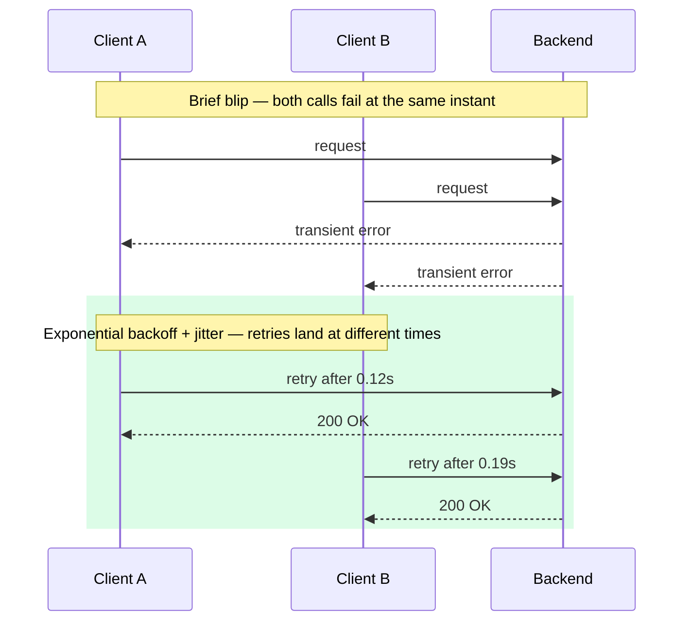
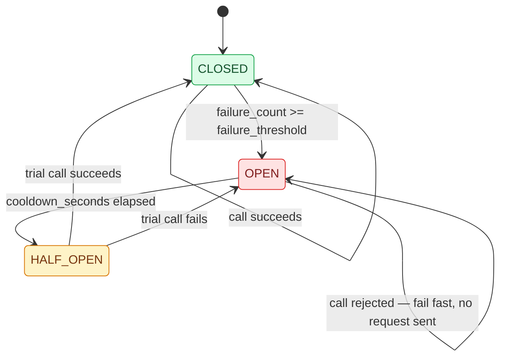
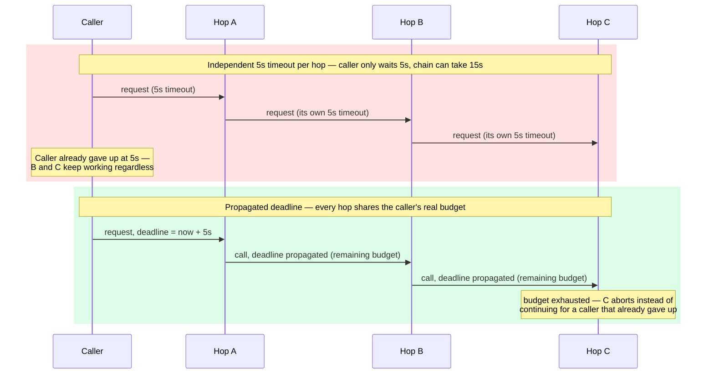

# Chapter 16: Error Handling and Resilience

## Errors as part of the API contract, not an afterthought

An error response shape is as much a contract as the success shape — clients need to programmatically distinguish "retry this" from "don't retry, fix your request" from "this will never succeed, stop trying." A consistent error envelope, applied uniformly across every endpoint, is what makes that possible.

```python
# A consistent REST error shape
{
  "error": {
    "code": "ORDER_NOT_FOUND",
    "message": "No order exists with id 42",
    "retryable": false
  }
}
```

Machine-readable `code` values (not just human-readable `message` strings) matter because client code branches on codes, not on message text that might change wording without warning and silently break string-matching error handling.

## Retries: only for the right failure classes

Retrying is safe for idempotent operations (Chapter 3) and transient failures (network blip, brief backend unavailability); it's actively harmful for non-idempotent operations without an idempotency key, and pointless for permanent failures (`404`, `422`, `INVALID_ARGUMENT`) that will fail identically on every attempt.

```python
import asyncio
import random

async def call_with_retry(fn, max_attempts=3, base_delay=0.1):
    for attempt in range(max_attempts):
        try:
            return await fn()
        except TransientError:
            if attempt == max_attempts - 1:
                raise
            # exponential backoff with jitter — avoids synchronized retry storms
            delay = base_delay * (2 ** attempt) + random.uniform(0, base_delay)
            await asyncio.sleep(delay)
```

The jitter matters more than it looks: without it, many clients that all failed at the same moment (e.g., during a brief backend blip) retry in lockstep, turning a transient issue into a self-inflicted thundering herd exactly when the backend is recovering.



## Circuit breakers

A circuit breaker tracks failure rate to a downstream dependency and, once it crosses a threshold, stops sending requests entirely for a cooldown period — failing fast instead of piling up slow, doomed calls against a struggling dependency. This protects both the caller (no more wasted time waiting on calls likely to fail) and the callee (no more load against a system already struggling to recover).

```python
from enum import Enum
import time

class CircuitState(Enum):
    CLOSED = "closed"      # normal operation
    OPEN = "open"           # failing fast
    HALF_OPEN = "half_open" # testing recovery

class CircuitBreaker:
    def __init__(self, failure_threshold=5, cooldown_seconds=30):
        self.failure_threshold = failure_threshold
        self.cooldown_seconds = cooldown_seconds
        self.failure_count = 0
        self.state = CircuitState.CLOSED
        self.opened_at = None

    async def call(self, fn):
        if self.state == CircuitState.OPEN:
            if time.monotonic() - self.opened_at > self.cooldown_seconds:
                self.state = CircuitState.HALF_OPEN
            else:
                raise CircuitOpenError("circuit is open, failing fast")
        try:
            result = await fn()
            self.failure_count = 0
            self.state = CircuitState.CLOSED
            return result
        except Exception:
            self.failure_count += 1
            if self.failure_count >= self.failure_threshold:
                self.state = CircuitState.OPEN
                self.opened_at = time.monotonic()
            raise
```



## Bulkheads: isolating failure domains

A circuit breaker stops calling a failing dependency once it's already causing damage. A **bulkhead** limits how much of your own capacity any single dependency can consume in the first place, so one slow or failing downstream can't exhaust resources — threads, connection-pool slots, memory — that healthy requests to *other* dependencies also need. The name comes from a ship's bulkheads: a hull breach in one compartment doesn't sink the whole ship because the compartments are sealed from each other.

```python
import asyncio

# Separate semaphores per downstream dependency — a slow "recommendations"
# call can only ever hold its own 10 slots, never starve "inventory" calls
recommendations_bulkhead = asyncio.Semaphore(10)
inventory_bulkhead = asyncio.Semaphore(50)

async def call_recommendations(order_id: str):
    async with recommendations_bulkhead:
        return await recommendations_client.get(order_id)
```

Without this, a single shared thread pool or connection pool means a slow dependency can consume every available slot waiting on it, leaving none for calls to healthy dependencies — the same cascading shape a circuit breaker protects against, but driven by resource exhaustion rather than by a string of failed calls. In practice the two patterns are deployed together: the bulkhead caps how much damage a slow dependency can do while its circuit breaker is still counting failures toward the trip threshold.

## Timeouts at every layer

A request without an explicit timeout will, eventually, hang for as long as the underlying transport allows — often far longer than acceptable to a user or an upstream caller. Every outbound call (HTTP client, DB driver, gRPC channel) needs an explicit timeout, and as covered in Chapter 10, gRPC's deadline propagation is the more correct model where available — a fixed per-call timeout that doesn't account for how much time has already elapsed in the overall request chain tends to either be too generous (leaves no budget for retries) or too strict (fails healthy requests near a hop boundary).



## Graceful degradation

Not every failure needs to become a user-facing error. If a "recommended products" service is down but the "get order" service is healthy, a well-designed order-detail endpoint should return the order with an empty recommendations section rather than failing the entire response — a distinction that requires explicitly designing which parts of a response are essential versus best-effort, rather than treating every downstream call as equally critical by default.

## Failure modes

- **Retrying non-idempotent operations**: retrying a payment-charge call without an idempotency key (Chapter 3), resulting in duplicate charges during exactly the network conditions that make retries tempting.
- **No circuit breaker on a critical dependency**: a slow downstream service causing every caller to pile up threads/connections waiting on it, exhausting the caller's own resources and turning one service's slowness into a cascading outage.
- **No bulkhead between dependencies**: a single shared connection pool or thread pool lets one slow downstream exhaust resources that healthy calls to other dependencies also need, turning an isolated slowdown into a total outage.
- **Timeouts set without deadline propagation**: each hop in a call chain independently timing out at, say, 5 seconds, so a 3-hop chain can take 15 seconds total even though the original caller only waited 5 — a mismatch between what the caller expects and what the system actually does.

## What's next

Chapter 17 covers observability — how you actually detect these failure modes in production before a customer reports them.

## Exercises

Exercises for this chapter live in [16a-error-handling-resilience-exercises.md](16a-error-handling-resilience-exercises.md). Solutions are available separately in [resources/solutions/](../resources/solutions/).
