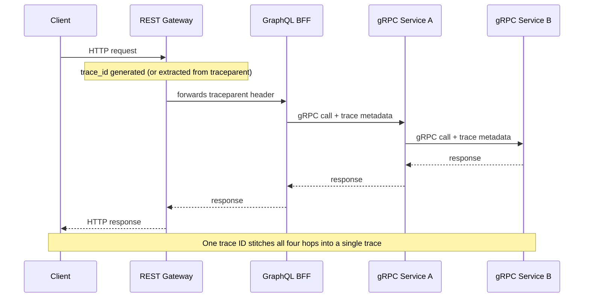

# Chapter 17: Observability

## Three pillars, one correlation key

Structured logs, metrics, and distributed traces each answer a different question — logs answer "what exactly happened," metrics answer "how much/how often, over time," traces answer "where did the time go across this request's full path." They become dramatically more useful together than separately, and the thing that ties them together is a **correlation ID** (often the trace ID itself) propagated through every log line, every span, and every metric label for a given request.

| Pillar | Question it answers | Where the correlation ID appears |
|---|---|---|
| Logs | What exactly happened | Every log line |
| Metrics | How much/how often, over time | Every metric label |
| Traces | Where did the time go across the request's full path | The trace ID itself |

## Structured logging

Unstructured log lines (`f"Order {order_id} failed"`) are nearly impossible to query at scale. Structured logging (JSON lines, or a structured logging library) makes every field independently queryable in whatever log aggregation system you use (ELK, Loki, Datadog):

```python
import structlog

logger = structlog.get_logger()

async def get_order(order_id: str, trace_id: str):
    logger.info("order_lookup_started", order_id=order_id, trace_id=trace_id)
    try:
        order = await fetch_order(order_id)
    except OrderNotFound:
        logger.warning("order_not_found", order_id=order_id, trace_id=trace_id)
        raise
    return order
```

What actually lands in the log aggregator is one JSON object per call, every keyword argument as its own independently queryable field — this is the concrete difference from `f"Order {order_id} failed"`, which produces a string a log aggregator can only full-text search, not filter or aggregate on:

```json
{"event": "order_lookup_started", "order_id": "42", "trace_id": "a1b2c3", "timestamp": "2026-01-15T10:22:01Z", "level": "info"}
{"event": "order_not_found", "order_id": "42", "trace_id": "a1b2c3", "timestamp": "2026-01-15T10:22:01Z", "level": "warning"}
```

A query like "every `order_not_found` in the last hour, grouped by `order_id`" is a direct field filter against this shape; against an unstructured `f"Order {order_id} failed"` string, the same question requires parsing the message text back apart first.

## Distributed tracing with OpenTelemetry

OpenTelemetry has become the standard instrumentation layer across REST, GraphQL, and gRPC — a single SDK emits spans regardless of which protocol a given call uses, and trace context propagates automatically across HTTP headers (`traceparent`) or gRPC metadata via auto-instrumentation.

```python
from opentelemetry import trace
from opentelemetry.instrumentation.grpc import GrpcInstrumentorServer
from opentelemetry.instrumentation.fastapi import FastAPIInstrumentor

GrpcInstrumentorServer().instrument()
FastAPIInstrumentor.instrument_app(app)

tracer = trace.get_tracer(__name__)

async def get_order(order_id: str):
    with tracer.start_as_current_span("fetch_order") as span:
        span.set_attribute("order.id", order_id)
        return await db.fetch_order(order_id)
```

For a request that crosses a REST gateway, a GraphQL BFF, and two gRPC services, OpenTelemetry's context propagation is what lets you see the entire path as a single trace in your tracing backend (Jaeger, Tempo, Honeycomb) rather than four disconnected sets of logs you have to manually correlate by timestamp — which, without a shared trace ID, is close to impossible to do reliably under real production traffic.



## Protocol-specific instrumentation gaps

REST's request/response model maps cleanly onto a single span per call. GraphQL needs finer granularity — a single query can invoke dozens of resolvers, and without per-resolver spans (most GraphQL server libraries support this via extensions/middleware hooks), you can see that a query was slow but not which field's resolver caused it. gRPC streaming RPCs need spans that span the entire stream lifetime, not just the initial call setup, or you lose visibility into per-message latency within a long-lived stream — a common gap in naive auto-instrumentation that only wraps the RPC's opening handshake.

## Metrics that matter

The RED method (Rate, Errors, Duration) is a reasonable default for any API endpoint or RPC method: how many requests per second, what fraction error, and the latency distribution (specifically percentiles — p50, p95, p99 — not just averages, since averages hide the tail latency that actually drives user-facing complaints).

```python
from prometheus_client import Counter, Histogram

request_count = Counter("api_requests_total", "Total requests", ["method", "status"])
request_latency = Histogram("api_request_duration_seconds", "Request latency", ["method"])

@app.middleware("http")
async def metrics_middleware(request, call_next):
    with request_latency.labels(method=request.url.path).time():
        response = await call_next(request)
    request_count.labels(method=request.url.path, status=response.status_code).inc()
    return response
```

## Alerting on symptoms, not causes

Alert on what users actually experience (elevated p99 latency, elevated error rate, saturated queue depth) rather than on internal implementation details (a specific function's call count) — symptom-based alerts stay meaningful as the implementation changes, cause-based alerts need constant upkeep and tend to either go stale or generate noise unrelated to real user impact.

| Alerting basis | What it shows | Risk |
|---|---|---|
| Average latency | Overall central tendency | A p99 regression affecting 1% of users can leave the average nearly unchanged |
| Percentiles (p50/p95/p99) | The tail of the latency distribution | Surfaces the tail latency that actually drives user-facing complaints |

## SLIs, SLOs, and error budgets

Percentile metrics tell you what's happening; an **SLI** (Service Level Indicator) turns one into a specific, tracked measurement — "the fraction of `GetOrder` calls completing under 300ms." An **SLO** (Service Level Objective) is a target for that indicator over a rolling window — "99.9% of `GetOrder` calls succeed under 300ms, trailing 30 days." The gap between 100% and the SLO is the **error budget**: the amount of unreliability the team has explicitly agreed is acceptable before it becomes a problem worth interrupting other work for.

| Term | Definition | Example |
|---|---|---|
| SLI | A specific, measured indicator | Fraction of `GetOrder` calls completing under 300ms |
| SLO | A target for that SLI over a rolling window | 99.9% of calls succeed under 300ms, trailing 30 days |
| Error budget | The allowed gap between 100% and the SLO | 0.1% of calls, trailing 30 days, allowed to miss the target |

This reframes reliability work from an open-ended "make it more reliable" mandate into a concrete, spendable resource: a risky deploy or a planned migration burns budget deliberately, and once the budget for the period is exhausted, the team's default shifts toward stability work over new features until it recovers. The practical alerting consequence is that pages should key off *error budget burn rate*, not the SLI in isolation — a slow steady leak over weeks and a sharp spike over minutes both eventually exhaust the same budget, but only the second one should wake anyone up at 3am; alerting on the raw SLI alone can't distinguish the two.

A real API SLO is rarely a single number — it's a small set of them covering different failure shapes, since a service can satisfy one while badly violating another:

```
Availability:  99.95%, trailing 30 days
p95 latency:   < 300ms
p99 latency:   < 1s
5xx rate:      < 0.1%
```

Availability alone can look healthy while p99 quietly regresses for a slow subset of requests; a low 5xx rate can coexist with a latency SLO breach if the service is degrading rather than erroring outright. Track all four (or whichever combination matches the service's actual failure modes) rather than picking the one that's easiest to report on.

## Trace propagation across the full stack

The four-hop trace above (REST gateway → GraphQL BFF → two gRPC services) stops at the service boundary, but the request's actual latency doesn't — a query that's slow "in the database" is invisible in a trace that only instruments the API layers. Most database client libraries and drivers have OpenTelemetry instrumentation (`opentelemetry-instrumentation-asyncpg`, `-psycopg2`, and equivalents for other drivers) that emits a span per query, attributed to whichever service span called it — so the same trace that shows REST → GraphQL → gRPC → gRPC can extend one hop further to show *which specific query*, on which service, accounted for the time. Without DB-level spans, "gRPC Service B took 400ms" is where the trace stops being useful right at the point an incident investigation needs it most — closing that last hop is what makes a trace a complete picture of "where did the time go" rather than a picture that ends at the last layer someone bothered to instrument.

## Failure modes

- **No shared correlation ID across protocol boundaries**: a request that touches REST, GraphQL, and gRPC layers leaving three separate, unlinked trails of logs that have to be manually stitched together during an incident.
- **GraphQL traces with only query-level granularity**: knowing a query took 800ms but not which of its twelve resolvers accounts for 750ms of that.
- **Alerting on averages instead of percentiles**: a p99 latency regression affecting 1% of users going unnoticed because the average latency barely moved.

## What's next

Chapter 18 covers testing strategies — how you verify correctness and catch regressions across all three protocols before they reach the observability stack in production.

## Exercises

Exercises for this chapter live in [17a-observability-exercises.md](17a-observability-exercises.md). Solutions are available separately in [resources/solutions/](../resources/solutions/).
