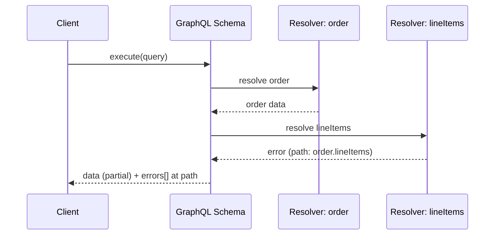
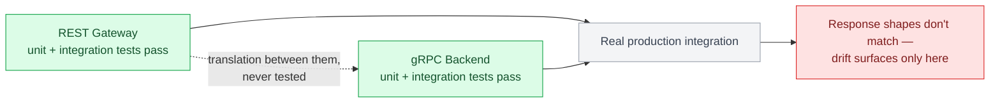

# Chapter 18: Testing Strategies

## The test pyramid, per protocol

Unit tests (business logic, isolated from the network layer), integration tests (the actual handler/resolver/servicer wired to a real or test-double dependency), and end-to-end tests (a real client hitting a real running instance) apply to all three protocols — but the integration layer looks meaningfully different for each, and getting that layer right is where most of the practical testing value lives.

| Layer | Definition (applies to all three protocols) | Where protocols diverge |
|---|---|---|
| Unit | Business logic, isolated from the network layer | Same approach across REST, GraphQL, and gRPC |
| Integration | The actual handler/resolver/servicer wired to a real or test-double dependency | Looks meaningfully different per protocol — this is where most of the practical testing value lives |
| End-to-end | A real client hitting a real running instance | gRPC additionally benefits from a real `grpc.aio.server()` and client stub to catch wire-level serialization and interceptor-ordering bugs |

## Testing REST APIs

FastAPI's `TestClient` (built on `httpx`) lets you exercise the full request/response cycle, including validation, without a real running server:

```python
from fastapi.testclient import TestClient

client = TestClient(app)

def test_get_order_not_found_returns_404():
    response = client.get("/orders/nonexistent")
    assert response.status_code == 404
    assert response.json()["error"]["code"] == "ORDER_NOT_FOUND"

def test_create_order_validates_line_items():
    response = client.post("/orders", json={"customer_id": "cus_1", "line_items": []})
    assert response.status_code == 422
```

Dependency overrides (Chapter 4) are what make these tests fast and hermetic — no real database, no real network call, just the handler logic and validation running against a fake.

## Testing GraphQL APIs

Strawberry's schema can be executed directly against a query string, without an HTTP layer at all, which is usually the right level for resolver logic tests:

```python
import pytest

@pytest.mark.asyncio
async def test_order_query_returns_line_items():
    query = """
        query {
            order(id: "42") {
                id
                lineItems { sku quantity }
            }
        }
    """
    result = await schema.execute(query, context_value=fake_context())
    assert result.errors is None
    assert result.data["order"]["lineItems"][0]["sku"] == "WIDGET-1"
```

Because GraphQL responses can be partially successful (Chapter 8), a meaningful chunk of GraphQL-specific test cases should specifically target partial-failure scenarios — asserting that `result.errors` contains the expected error at the expected `path` while unrelated fields in `result.data` still resolved correctly, since that's exactly the behavior client code has to handle correctly in production.



## Testing gRPC services

`grpc.aio`'s in-process channel-free testing pattern lets you call a servicer method directly, bypassing the network entirely for fast unit tests:

```python
import pytest
from generated import orders_pb2

@pytest.mark.asyncio
async def test_get_order_not_found_raises_grpc_status():
    service = OrderService()
    fake_context = FakeServicerContext()
    request = orders_pb2.GetOrderRequest(order_id="nonexistent")

    await service.GetOrder(request, fake_context)

    assert fake_context.code == grpc.StatusCode.NOT_FOUND
```

For genuine integration tests exercising the real gRPC wire protocol (worth having, since serialization bugs and interceptor ordering issues won't show up in a pure in-process test), spin up a real `grpc.aio.server()` bound to an ephemeral port within the test process and connect a real client stub to it.

## Contract testing across protocol boundaries

For a system where a REST gateway calls a gRPC backend which is queried through a GraphQL BFF (Chapter 21's case study architecture), the most valuable and most commonly neglected test category is the one verifying the translation *between* layers is correct — that the gateway's REST response shape actually matches what the gRPC backend returned, not just that each layer works in isolation. Pact-style consumer-driven contracts (Chapter 6) generalize across protocols for exactly this purpose.



## Load testing per protocol

REST and GraphQL load testing tools (Locust, k6) work over HTTP directly. gRPC load testing needs HTTP/2-aware tooling (`ghz` is the most common purpose-built gRPC load tester) since generic HTTP/1.1 load generators won't exercise multiplexing behavior or reveal the load-balancing pitfalls from Chapter 12. Load testing a GraphQL API specifically needs a representative mix of query shapes (some cheap, some deliberately expensive) rather than a single repeated query, or you'll validate the happy path while missing exactly the N+1 and complexity issues Chapter 9 covers.

## Failure modes

- **Testing each protocol layer in isolation only**: every layer passes its own tests while the translation between them silently drifts, caught only when a real client hits a real production integration.
- **GraphQL tests that never assert on partial failure**: a test suite that only checks the happy path misses the entire class of bugs around client handling of the `errors` array.
- **Load tests using a single query/request shape**: a REST or GraphQL load test that "passes" cleanly while the production traffic mix (which includes expensive queries or large payloads) would have failed it.

## What's next

Chapter 19 covers schema evolution and backward compatibility — the rules that keep all this testing infrastructure meaningful as the contract itself changes over time.

## Exercises

Exercises for this chapter live in [18a-testing-strategies-exercises.md](18a-testing-strategies-exercises.md). Solutions are available separately in [resources/solutions/](../resources/solutions/).
