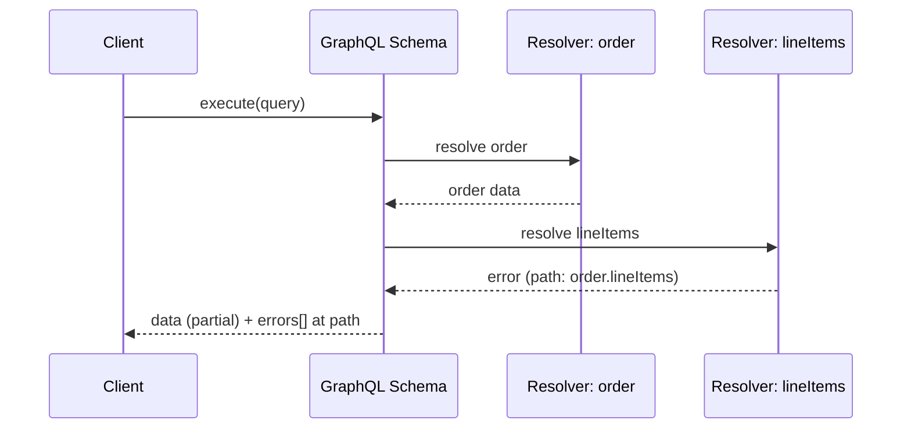
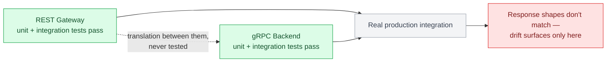

# Chapter 18: Testing Strategies

## Five stages, not three

The classic pyramid (unit, integration, end-to-end) is necessary but incomplete for an API specifically, because none of those three verify anything about the *consumers* on the other side of the contract. A complete pipeline has five stages:

```
Unit testing
     ↓
Integration testing
     ↓
Contract testing
     ↓
End-to-end testing
     ↓
Production verification
```

| Stage | What it verifies | Where protocols diverge |
|---|---|---|
| Unit | Business logic, isolated from the network layer | Same approach across REST, GraphQL, and gRPC |
| Integration | The actual handler/resolver/servicer wired to a real or test-double dependency | Looks meaningfully different per protocol — this is where most of the practical testing value lives |
| Contract | The provider still satisfies what real consumers depend on, independent of whether the provider's own tests pass | REST/OpenAPI, GraphQL schema diffing, and gRPC/Protobuf each check this differently — covered in full below |
| End-to-end | A real client hitting a real running instance | gRPC additionally benefits from a real `grpc.aio.server()` and client stub to catch wire-level serialization and interceptor-ordering bugs |
| Production verification | The deployed system, continuously, from outside | Synthetic monitoring (below) — the only stage that runs after every other stage has already passed |

Contract testing sits between integration and end-to-end deliberately: it's cheaper to run than a full end-to-end suite (no real running instance of every dependent service needed, just the contracts), and it catches an entire class of bug — a provider that still passes its own tests but no longer satisfies a consumer — that end-to-end tests only catch if that specific consumer happens to be part of the end-to-end suite, which for an unknown third-party consumer it structurally can't be.

## Testing REST APIs

FastAPI's `TestClient` (built on `httpx`) lets you exercise the full request/response cycle, including validation, without a real running server:

```python
from fastapi.testclient import TestClient

client = TestClient(app)

def test_get_order_not_found_returns_404():
    response = client.get("/orders/nonexistent")
    assert response.status_code == 404
    assert response.json()["error"]["code"] == "ORDER_NOT_FOUND"

def test_create_order_validates_line_items():
    response = client.post("/orders", json={"customer_id": "cus_1", "line_items": []})
    assert response.status_code == 422
```

Dependency overrides (Chapter 4) are what make these tests fast and hermetic — no real database, no real network call, just the handler logic and validation running against a fake.

## Testing GraphQL APIs

Strawberry's schema can be executed directly against a query string, without an HTTP layer at all, which is usually the right level for resolver logic tests:

```python
import pytest

@pytest.mark.asyncio
async def test_order_query_returns_line_items():
    query = """
        query {
            order(id: "42") {
                id
                lineItems { sku quantity }
            }
        }
    """
    result = await schema.execute(query, context_value=fake_context())
    assert result.errors is None
    assert result.data["order"]["lineItems"][0]["sku"] == "WIDGET-1"
```

Because GraphQL responses can be partially successful (Chapter 8), a meaningful chunk of GraphQL-specific test cases should specifically target partial-failure scenarios — asserting that `result.errors` contains the expected error at the expected `path` while unrelated fields in `result.data` still resolved correctly, since that's exactly the behavior client code has to handle correctly in production.



## Testing gRPC services

`grpc.aio`'s in-process channel-free testing pattern lets you call a servicer method directly, bypassing the network entirely for fast unit tests:

```python
import pytest
from generated import orders_pb2

@pytest.mark.asyncio
async def test_get_order_not_found_raises_grpc_status():
    service = OrderService()
    fake_context = FakeServicerContext()
    request = orders_pb2.GetOrderRequest(order_id="nonexistent")

    await service.GetOrder(request, fake_context)

    assert fake_context.code == grpc.StatusCode.NOT_FOUND
```

For genuine integration tests exercising the real gRPC wire protocol (worth having, since serialization bugs and interceptor ordering issues won't show up in a pure in-process test), spin up a real `grpc.aio.server()` bound to an ephemeral port within the test process and connect a real client stub to it.

## Mock servers: developing against a contract before the provider exists

Mocks and contract tests solve adjacent but different problems, and it's worth keeping them distinct: a **mock server** lets a *consumer* team build and test against a contract before the real provider is ready (or without standing up the real provider at all for every test run), while **contract testing** (next) verifies the *real provider* still honors that contract. Confusing the two is how a team ends up with a passing mock-backed test suite and a production integration that's never actually talked to the real service.

- **OpenAPI mock servers** (Prism, or FastAPI's own app serving canned responses behind the same schema) generate a working fake REST API directly from the OpenAPI document — a mobile team can build their networking layer against the mock before a single backend endpoint is implemented, as long as the mock and the eventual real implementation are both checked against the same schema.
- **GraphQL mock schemas** — Strawberry (and most GraphQL server libraries) can execute a schema with auto-generated or stubbed resolver data, letting a client team validate their queries compile and their UI renders against realistic shapes without a real backend or database behind any resolver.
- **gRPC mock servicers** — a hand-written or generated fake implementation of a service's servicer interface, run in-process (the same pattern this chapter's gRPC unit tests already use) or as a small standalone server bound to a local port, so a dependent service's own tests don't need the real upstream service running.

The failure mode unique to mocks is drift: a mock that was accurate when written silently diverges from the real provider's actual behavior over time, and nothing detects that divergence unless something *else* — contract testing, specifically — checks the mock's assumptions against reality on an ongoing basis.

## Contract testing: the stage the classic pyramid leaves out

Unit, integration, and end-to-end tests all verify a service against *itself* — its own logic, its own dependencies, its own running instance. None of them verify that a service still satisfies what its actual consumers depend on, which is a different question and needs a different test category, not just more of the other three. **Contract testing** closes that gap with a specific shape:

```
Consumer
   ↓  (records what it actually calls, and what it expects back)
Consumer contract
   ↓  (published, e.g. to a Pact Broker or a schema registry)
Provider verification
   (provider's CI replays every published contract against the real service,
    before deploying — fails the build if any consumer's expectations break)
```

The mechanism differs per protocol, but the shape is identical:

- **REST/OpenAPI** — a consumer's Pact test records the specific requests it makes and the response shape it depends on; the provider's CI replays every published consumer contract against a real running instance of the API and fails if any expectation isn't met (Chapter 6 introduces this from the versioning side; this is the same mechanism, run as a first-class test suite rather than a versioning afterthought).
- **GraphQL schema** — the "consumer contract" is implicit in the operations a client actually sends; tools that check a schema change against real production query logs (Chapter 19's schema diffing) are contract testing for GraphQL, verifying the provider still satisfies every query shape consumers are actually sending, not just that the schema is structurally valid.
- **gRPC/Protobuf** — the `.proto` file is itself the contract, so provider verification here is `buf breaking` (Chapter 19) checking a new schema against the previous one; the "consumer" side is every service holding a compiled stub against a given contract version, which is why field-tag compatibility (Chapter 10) is what makes this checkable at all without needing a Pact-style broker.

The most valuable and most commonly neglected place to apply this is at translation boundaries — a REST gateway calling a gRPC backend queried through a GraphQL BFF (Chapter 22's case study architecture) can have every individual layer pass its own unit and integration tests while the *translation between them* silently drifts, because nothing actually tests that the gateway's REST response shape still matches what the gRPC backend returns.



## Load testing per protocol

REST and GraphQL load testing tools (Locust, k6) work over HTTP directly. gRPC load testing needs HTTP/2-aware tooling (`ghz` is the most common purpose-built gRPC load tester) since generic HTTP/1.1 load generators won't exercise multiplexing behavior or reveal the load-balancing pitfalls from Chapter 12. Load testing a GraphQL API specifically needs a representative mix of query shapes (some cheap, some deliberately expensive) rather than a single repeated query, or you'll validate the happy path while missing exactly the N+1 and complexity issues Chapter 9 covers.

## Production verification: synthetic monitoring

Every stage above runs before a deploy. **Synthetic monitoring** — a scheduled job that makes real calls (REST requests, GraphQL queries, gRPC RPCs) against the live production API on a fixed interval and asserts on the response, exactly like an end-to-end test but running continuously against production rather than once in CI — is the stage that runs after. It exists because a deploy can pass every earlier stage and still fail in ways that only show up in the real production environment: a certificate that expires three weeks after a clean deploy, a downstream dependency's production configuration drifting from staging's, a regional failure that only affects one deployment zone, or — the case contract testing exists to prevent but can still miss for a consumer nobody registered a contract for — a subtle response-shape change nobody caught.

Treat synthetic checks as a small, curated set of the platform's most business-critical paths (create an order, authenticate, fetch a homepage feed) rather than an attempt to cover the whole API surface — their value is being an early, continuous signal correlated with what a real user actually experiences, and they feed directly into the SLIs and alerting Chapter 17 covers: a synthetic check failing is often the first signal an incident is starting, arriving before user-facing error rates climb enough to trip a symptom-based alert on their own.

## Failure modes

- **Testing each protocol layer in isolation only**: every layer passes its own tests while the translation between them silently drifts, caught only when a real client hits a real production integration.
- **GraphQL tests that never assert on partial failure**: a test suite that only checks the happy path misses the entire class of bugs around client handling of the `errors` array.
- **Load tests using a single query/request shape**: a REST or GraphQL load test that "passes" cleanly while the production traffic mix (which includes expensive queries or large payloads) would have failed it.
- **A mock that's drifted from the real provider**: a consumer's test suite staying green against a mock server that no longer matches the real implementation's actual behavior, with nothing — no contract test, no synthetic check — catching the divergence until a real integration fails.
- **No production verification**: every pre-deploy stage passing while a live-environment-only issue (an expired certificate, a regional outage, a drifted downstream config) goes undetected until a user reports it, because nothing was continuously checking the deployed system from outside.

## What's next

Chapter 19 covers schema evolution and backward compatibility — the rules that keep all this testing infrastructure meaningful as the contract itself changes over time.

## Exercises

Exercises for this chapter live in [18a-testing-strategies-exercises.md](18a-testing-strategies-exercises.md). Solutions are available separately in [resources/solutions/](../resources/solutions/).
