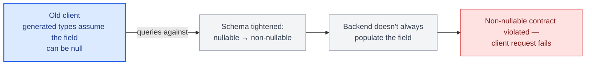
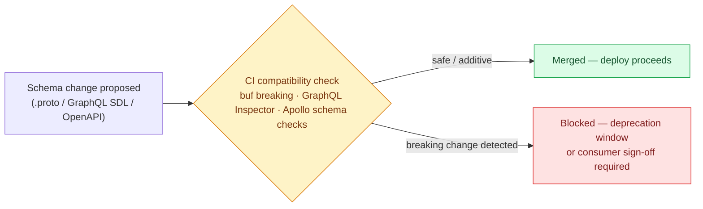

# Chapter 19: Schema Evolution and Backward Compatibility

## Every protocol has different compatibility rules, and getting them confused causes outages

REST's contract is loose (Chapter 6), so "breaking" is somewhat a matter of convention. GraphQL and Protobuf both have formal, tool-enforceable compatibility rules — but they're different rules, and applying REST's mental model ("just add a version") to either one leads to unnecessary version proliferation where an additive, non-breaking change would have worked, or worse, a genuinely breaking change shipped because someone assumed it was safe by analogy to a different protocol's rules.

## Protobuf compatibility rules

Protobuf's wire format is built around field tags (Chapter 10), which gives it precise, mechanically checkable compatibility rules:

**Safe**: adding a new field with a new tag number, adding a new value to an enum (if consumers are required to handle unrecognized enum values — proto3 defaults unrecognized enum values to the zero value, which is itself worth being deliberate about), removing a field and marking its tag `reserved` so it's never reused.

**Breaking**: reusing a tag number for a different field or type, changing a field's type incompatibly (e.g., `int32` to `string` — some numeric type changes are wire-compatible, most aren't), renaming a field (safe for the wire format itself, since tags — not names — are what's encoded, but breaking for any code, including generated JSON mappings via `grpc-gateway`, that depends on the field name).

```protobuf
message Order {
  string id = 1;
  string status = 2;
  reserved 3;              // previously "customer_email", removed — never reuse tag 3
  reserved "customer_email";
  int32 line_item_count = 4;
}
```



```mermaid
flowchart TB
    subgraph Before["Without reservation"]
        B1["tag 3: customer_email (removed)"]
        B2["New field added,<br/>tag 3 reused for line_item_count"]
        B3["Old client decodes tag 3<br/>expecting a string email"]
        B4["Old client misreads the new<br/>int32 data as the old field's type"]
        B1 --> B2 --> B3 --> B4
    end

    subgraph After["With reservation"]
        A1["tag 3: customer_email (removed)"]
        A2["reserved 3; reserved 'customer_email';"]
        A3["New field added with tag 4 instead"]
        A4["Old client never sees tag 3 reused"]
        A1 --> A2 --> A3 --> A4
    end

    classDef error fill:#fee2e2,stroke:#dc2626,color:#7f1d1d
    classDef success fill:#dcfce7,stroke:#16a34a,color:#14532d
    class B1,B2,B3,B4 error
    class A1,A2,A3,A4 success
```

Tools like `buf breaking` should run in CI against every `.proto` change, checking the new schema against the previous committed version — this is the kind of check that's cheap to automate and expensive to skip, since a breaking wire-format change caught in code review by a human reading a diff is much less reliable than a tool that mechanically checks every field tag.

## GraphQL schema evolution rules

**Safe**: adding a new type, adding a new nullable field, adding a new argument with a default value, adding a new enum value (with the same "consumers must handle unknown values gracefully" caveat as Protobuf — and just as often not actually true in practice for existing clients).

**Breaking**: removing a field or type, changing a field from nullable to non-nullable (tightens the contract — existing clients not sending that field, or backends not always populating it, now fail), changing a field's type, removing an argument, adding a *required* (non-default) argument to an existing field.



The `@deprecated` directive lets a field be marked for removal without breaking existing clients immediately:

```graphql
type Order {
  id: ID!
  status: OrderStatus!
  legacyStatusCode: Int @deprecated(reason: "Use `status` instead. Removing 2026-Q4.")
}
```

Schema diffing tools (GraphQL Inspector, Apollo's schema checks) can run in CI against real production query logs to verify a proposed schema change doesn't break any query pattern actually being sent by real clients — a meaningfully stronger check than a purely structural compatibility rule, since it catches the difference between "technically breaking" and "breaking for a field nobody actually queries anymore."

## REST and OpenAPI compatibility rules

REST's contract is looser than Protobuf's or GraphQL's (Chapter 6) — there's no compiler and no schema executor rejecting a bad request by default — but the same safe/breaking split still applies, and it becomes mechanically checkable the moment the contract is documented as an OpenAPI schema rather than left as convention.

**Safe**: adding a new optional request field, adding a new response field, adding a new endpoint, adding a new optional query parameter.

**Breaking**: removing or renaming a field, changing a field's type, making a previously-optional field required, changing a success status code, changing default pagination or sort behavior clients may already depend on.

```yaml
# openapi-diff / Optic-style CI check against the previously committed spec
- rule: no-breaking-changes
  compares: openapi.yaml @ HEAD vs openapi.yaml @ main
  fails-build-if: a field is removed, a type changes, or a field becomes required
```

Tools like `openapi-diff` or Optic run this check in CI the same way `buf breaking` does for Protobuf — the mechanism differs because REST's contract is a YAML/JSON document rather than a compiled artifact, but the goal (catch a breaking change before a consumer does) is identical across all three protocols, which is the point the next section makes explicit.

## The core discipline across all three protocols

Additive changes are close to free; anything that removes, renames, retypes, or tightens an existing element of the contract needs a deliberate deprecation window, consumer notification, and — ideally — telemetry proving the old element is no longer in active use before it's actually removed. The mechanics differ (URI version bump for REST, `@deprecated` for GraphQL, `reserved` tags for Protobuf) but the underlying discipline is identical: never surprise a client that was relying on the contract as it stood when they integrated.



## Schema registries

For organizations with many services and many consuming teams, a schema registry (Buf Schema Registry for Protobuf, Apollo GraphOS's schema registry for GraphQL/federation, or an OpenAPI registry for REST) becomes the source of truth that CI checks against, rather than relying on each team manually tracking what's safe. This is worth introducing once the number of schema producers and consumers exceeds what a single team can track by convention alone — usually well before it feels urgent, since the cost of a breaking change scales with how many consumers have already integrated by the time it's caught.

## Failure modes

- **Protobuf tag reuse after field removal**: a tag number reused for a new field without marking the old one `reserved`, causing old clients to misinterpret the new field's data as the old field's type.
- **GraphQL nullable-to-non-nullable tightening**: a field made non-nullable because "it's always populated now," breaking any client whose generated types or runtime checks assumed it could be null.
- **No CI-enforced compatibility checking**: relying on code review alone to catch breaking schema changes, which reliably misses them once the schema is large enough that no single reviewer holds the whole consumer landscape in their head.

## What's next

Part VI covers asynchronous and event-driven APIs — Chapter 20 — where the same evolution discipline applies to event payloads and the delivery model itself becomes an architectural choice. Part VII then closes the book: Chapter 21 gives the full decision framework for choosing (or combining) protocols and communication models, and Chapter 22 walks through a complete production case study running all of them together.

## Exercises

Exercises for this chapter live in [19a-schema-evolution-compatibility-exercises.md](19a-schema-evolution-compatibility-exercises.md). Solutions are available separately in [resources/solutions/](../resources/solutions/).
