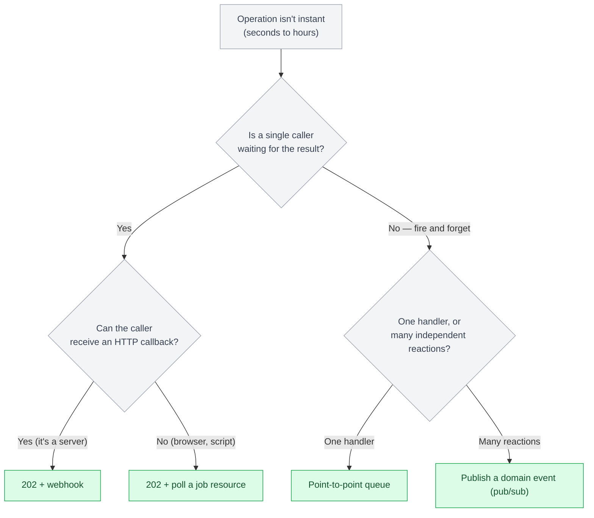
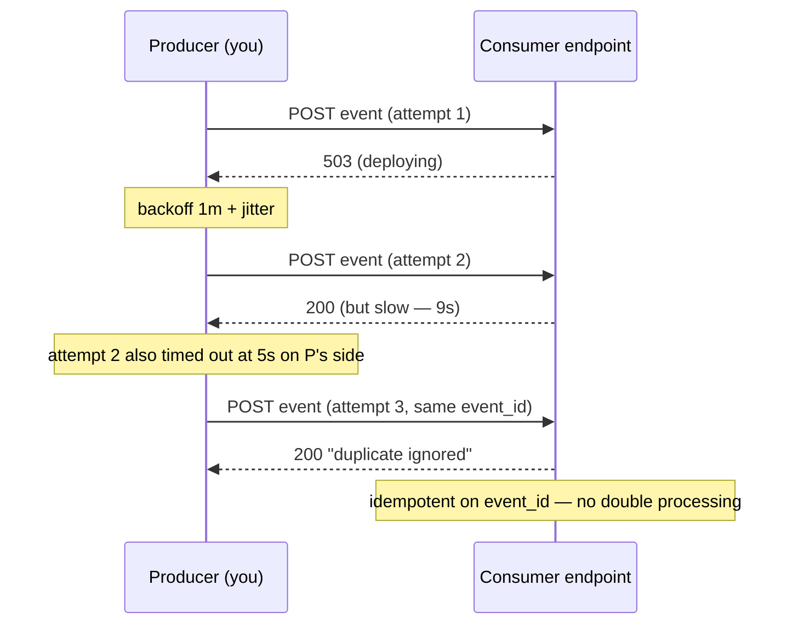
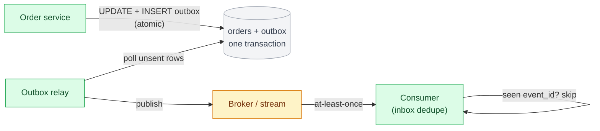

# Chapter 20: Asynchronous and Event-Driven APIs

## The axis the first five parts deliberately left out

Parts II through IV cover three synchronous request/response styles: the client sends a request, blocks, and gets a response on the same connection. That model breaks down in two situations that show up in almost every real platform. First, the work takes longer than a client should hold a connection for — a video transcode, a bulk import, a credit check that calls three external bureaus. Second, something happens that *other* systems need to know about, and the system where it happened shouldn't have to know who they are — an order was placed, a payment settled, a user was deleted.

Both are API design problems, and the answer to both is to stop modeling the interaction as one synchronous call. This chapter covers the options and the failure modes they bring, which are different from — and generally nastier than — the ones in the synchronous chapters.

## The decision: what to do with an operation that isn't instant

An operation that takes 30 seconds has six defensible shapes. Choosing among them is the architecture decision; the protocol is downstream of it.

| Shape | Client experience | When it fits |
|---|---|---|
| Block on a synchronous call | One request, held open 30s | Never at 30s — connection timeouts, retries, and load balancers make this fragile past a few seconds |
| `202 Accepted` + polling | `POST` returns a job URL; client polls `GET /jobs/{id}` | Client can poll, you don't want to manage callback delivery, latency-to-result of seconds-to-minutes is acceptable |
| `202 Accepted` + webhook | `POST` returns a job id; you `POST` the result to the client's URL when done | Client is a server that can receive HTTP, result may take minutes-to-hours, you're willing to operate delivery |
| Publish an event | Caller gets a fast ack; interested systems react independently | Multiple consumers, or you don't know all consumers, and no single caller is waiting for "the answer" |
| Expose a job API | First-class `Job` resource with status, progress, result, cancel | The long operation is itself a domain concept users manage (exports, migrations, batch runs) |
| Message queue (point-to-point) | Caller enqueues work, a worker pool drains it | Work must not be lost, throughput is spiky, one logical consumer should normally own processing of each item at a time |



## `202 Accepted` and the job resource

The most REST-native asynchronous pattern: the mutation doesn't return the result, it returns a resource representing the *work*.

```python
from fastapi import FastAPI, BackgroundTasks
from fastapi.responses import JSONResponse
import uuid

app = FastAPI()
jobs: dict[str, dict] = {}  # replace with Redis/DB in production

@app.post("/exports", status_code=202)
async def start_export(spec: dict, background: BackgroundTasks):
    job_id = str(uuid.uuid4())
    jobs[job_id] = {"status": "pending", "result_url": None}
    background.add_task(run_export, job_id, spec)
    return JSONResponse(
        status_code=202,
        content={"job_id": job_id, "status": "pending"},
        headers={"Location": f"/jobs/{job_id}"},
    )

@app.get("/jobs/{job_id}")
async def get_job(job_id: str):
    return jobs[job_id]  # {"status": "succeeded", "result_url": "/exports/abc.csv"}
```

The design rules that matter: return `202` (not `200` — the work isn't done), put the job URL in `Location`, make `GET /jobs/{id}` cheap and pollable with a sane `Retry-After`, and keep the job record around after completion long enough for a client that was offline to come back and read the outcome. The job resource should carry a terminal `status` the client can branch on (`succeeded` / `failed` / `cancelled`) and, on failure, a machine-readable error in the same envelope as the rest of your API (Chapter 16).

`BackgroundTasks` above is suitable for lightweight, process-local post-response work — it runs in the same process, after the response is sent, and disappears with that process. It is not a durable job execution mechanism: if the process crashes, gets redeployed, is killed by an autoscaler, or is simply restarted between accepting the job and finishing it, the task is gone with no record that it ever stopped, and the job resource is left showing `pending` forever with nothing left actually working on it. The job *state* living in Redis/DB, as the comment above notes, only solves half the problem — the work *execution* needs the same durability guarantee the state has, which `BackgroundTasks` doesn't provide. Production long-running work belongs on a durable queue with a separate worker pool, so the unit of work survives the web process's lifecycle entirely:

```
POST /exports
      ↓
Create job record (status: pending)
      ↓
Enqueue message (durable queue)
      ↓
202 + Location: /jobs/{id}
      ↓
Worker (separate process, drains the queue)
      ↓
Update job record (status: succeeded/failed)
```

The web process's only job becomes "create the record, enqueue the message, respond" — all fast, synchronous, and safe to retry — while a worker that can itself restart, redeploy, or scale independently owns actually doing the work and is the only thing that can mark a job complete.

## Webhooks are APIs too — with the direction reversed

A webhook is your server making an HTTP request to a URL the consumer registered. Everything you learned about being a good API *server* now applies to you as an API *client*, and everything about being a good client applies to the consumer receiving the call. Webhooks are frequently treated as a afterthought bolted onto a REST API; they deserve the same design rigor, because they fail in ways a synchronous endpoint never does.

**Signing.** The receiver has no TLS-client-cert relationship with you and can't use your normal auth. Sign the payload with an HMAC over the raw body plus a timestamp, using a per-subscription secret:

```python
import hashlib, hmac, time

def sign_payload(body: bytes, secret: str) -> dict[str, str]:
    ts = str(int(time.time()))
    mac = hmac.new(secret.encode(), f"{ts}.".encode() + body, hashlib.sha256)
    return {"Webhook-Timestamp": ts, "Webhook-Signature": mac.hexdigest()}
```

The receiver recomputes the HMAC and rejects the request if it doesn't match, or if the timestamp is old enough to be a replay (typically > 5 minutes). Signing the timestamp *inside* the MAC is what stops an attacker from replaying a captured-but-valid delivery.

```python
>>> sign_payload(b'{"event_id": "evt_1", "order_id": "42"}', secret="whsec_...")
{'Webhook-Timestamp': '1749996400', 'Webhook-Signature': 'a94a8fe5ccb19ba61c4c0873d391e987982fbbd3'}
```

Both headers travel with the delivery; the receiver reconstructs the same `f"{ts}."encode() + body` input using the timestamp it received and its own copy of the secret, and rejects the request if its own computed digest doesn't match `Webhook-Signature` exactly — the body was tampered with, or the sender doesn't actually hold the shared secret.

**Retries and delivery state.** The receiver's endpoint will be down sometimes. Retry on any non-2xx (or timeout) with exponential backoff and jitter (Chapter 16), for a bounded window — commonly something like 6–12 attempts over 24 hours. Track per-delivery state (`pending` / `succeeded` / `failed`) and expose it: a `GET /webhook-deliveries` endpoint and a manual "resend" control save an enormous amount of support load. After the retry budget is exhausted, move the delivery to a dead-letter store and — if an endpoint fails every delivery for long enough — disable the subscription and alert its owner rather than retrying forever.

**Ordering and duplicates are the consumer's problem, and you must say so.** At-least-once delivery means the consumer *will* occasionally get the same event twice (a retry raced a slow-but-successful first attempt), and events can arrive out of order (delivery N+1 succeeds on the first try while N is still being retried). Three fields do three different jobs here, and it's worth not collapsing them into one another: a unique **`event_id`** is what a consumer dedupes on; a per-aggregate **sequence number** (monotonically increasing per order, per user, whatever the aggregate is) is what a consumer reorders on; and **`occurred_at`** is a timestamp for observability and approximate temporal context, not a safe ordering key — clock skew between producer nodes, clock resolution, and genuinely concurrent events all mean two events can carry `occurred_at` values that don't reflect the order they need to be applied in. Put all three in every event, but only trust the sequence number for ordering decisions. Document this explicitly — a consumer who assumes exactly-once, in-order delivery, or who reorders on a wall-clock timestamp, has built a bug.

```python
# Receiver side: verify, dedupe, ack fast, process later.
# The check-then-act shown as a comment below is deliberately wrong —
# it's here to name the bug, not to model the fix.
@app.post("/webhooks/orders")
async def receive(request: Request):
    body = await request.body()
    if not signature_valid(body, request.headers):
        raise HTTPException(401)
    event = json.loads(body)

    # WRONG: check-then-act against an in-memory set is a race condition.
    # Two concurrent deliveries of the same event_id (a retry racing the
    # original attempt) can both miss the check, both enqueue, and both add
    # the key — the exact "claim atomically, don't check-then-act" mistake
    # Chapter 3 calls out for idempotency keys, applied here to webhooks.
    #
    # if event["event_id"] in processed_event_ids: return ...
    # enqueue_for_processing(event)
    # processed_event_ids.add(event["event_id"])

    # RIGHT: claim the event_id atomically — a UNIQUE constraint with
    # INSERT ... ON CONFLICT DO NOTHING, in the same transaction as
    # recording the work to be done (the inbox pattern, below).
    claimed = await db.execute(
        "INSERT INTO processed_events (event_id) VALUES ($1) ON CONFLICT DO NOTHING",
        event["event_id"],
    )
    if claimed.rowcount == 0:
        return {"status": "duplicate ignored"}   # already handled — 200, not an error
    enqueue_for_processing(event)                 # do the real work off the request path
    return {"status": "accepted"}                 # ack within a couple seconds
```

The receiver should do almost nothing synchronously: verify the signature, dedupe, hand off to internal processing, return `200`. Doing real work before acking means a slow database makes the sender think delivery failed, and now you get a retry *and* a half-finished first attempt. The dedupe step itself has to be an atomic claim — a `UNIQUE` constraint plus `ON CONFLICT DO NOTHING`, checked by `rowcount`, not a `check-then-add` against an in-memory (or even a Redis) set — for the same reason Chapter 3's idempotency-key discipline can't be "store the key after doing the work": two concurrent deliveries of the same event both racing past a non-atomic check is exactly how a receiver ends up double-processing the one case this whole mechanism exists to prevent.

**Versioning.** An event schema is a contract with the same evolution rules as Chapter 19: additive changes are safe, removing or retyping a field is breaking. Because you can't force webhook consumers to upgrade, pin a schema version per subscription (`?version=2024-10-01` at registration time) or include a `schema_version` in the envelope and transform old subscribers' payloads on the way out.



## Queues and event streams

Beyond HTTP callbacks, the two broad infrastructure shapes are **point-to-point queues** (SQS, RabbitMQ) where each message is delivered to exactly one consumer in a competing-consumers pool, and **log-based event streams** (Kafka, Kinesis, Pulsar) where events are retained and any number of consumer groups read the same partitioned log at their own offset.

The concepts an architect has to reason about are the same across both:

- **At-least-once delivery is the common default.** Some platforms and processing frameworks provide exactly-once *processing* semantics under specific, narrowly-scoped conditions (a single Kafka cluster with transactional producers and read-committed consumers, for instance) — but that guarantee covers the broker-to-consumer hop, not your end-to-end business effect. A broker delivering a message exactly once doesn't mean "charge the customer" happens exactly once if that handler also calls out to a payment API, writes to a second data store, or crashes between two side effects. Treat every consumer as needing to be idempotent unless you've specifically established, for that exact pipeline, that a stronger guarantee holds end-to-end — the safe default assumption is at-least-once, with idempotent processing and transactional offset commits doing the real work of making redelivery harmless.
- **Ordering is partition-scoped, not global.** Kafka orders messages within a partition, keyed by (usually) an aggregate id, so all events for order `42` are ordered relative to each other but not relative to order `43`. If you need a global order you've designed the keys wrong or you need a different tool.
- **Offsets are consumer state.** A consumer group commits its position in the log. Commit after processing, not before, or a crash loses messages; commit too coarsely and a crash reprocesses a large batch. This is the knob behind most "we lost events" and "we replayed a million events" incidents.
- **Poison messages need a dead-letter queue.** A message that always fails to process (bad schema, references a deleted entity) will block a partition or spin a queue forever. After N failed attempts, route it to a DLQ and alert — never drop it silently, never retry it forever.
- **Replay is a feature you design for.** Log-based streams let a new or fixed consumer reset its offset and reprocess history. That only works if consumers are idempotent and events carry enough context to be reprocessed out of their original time context.

## The dual-write problem and the transactional outbox

The single most common event-driven bug: a service updates its database *and* publishes an event as two separate operations.

```python
# BROKEN: two operations, no shared transaction
await db.execute("UPDATE orders SET status='paid' WHERE id=$1", order_id)
await broker.publish("order.paid", {"order_id": order_id})   # crash here → DB updated, no event
```

If the process dies between the two, or the publish fails, the database and the rest of the world permanently disagree. The fix is the **transactional outbox**: write the event into an `outbox` table *in the same database transaction* as the state change, then a separate relay process reads the outbox and publishes to the broker, marking rows as sent (or relying on the broker connector to do so, as with Debezium reading the WAL).

```python
async with db.transaction():
    await db.execute("UPDATE orders SET status='paid' WHERE id=$1", order_id)
    await db.execute(
        "INSERT INTO outbox (id, topic, payload) VALUES ($1, $2, $3)",
        uuid4(), "order.paid", json.dumps({"order_id": order_id, "event_id": str(uuid4())}),
    )
# a relay polls `outbox` and publishes; at-least-once, so consumers dedupe on event_id
```

The mirror image on the consuming side is the **inbox / idempotent consumer** pattern: record each processed `event_id` in the same transaction that applies its effect, so a redelivery is a no-op.



## Eventual consistency and sagas

Once a business operation spans services connected by events, you've given up cross-service transactions. A "place order" that reserves inventory, charges payment, and books shipping is now a **saga**: a sequence of local transactions, each publishing an event that triggers the next, with **compensating actions** to undo completed steps when a later one fails (release the inventory reservation, refund the charge).

Two coordination styles: **choreography**, where each service reacts to events and emits its own, with no central coordinator (simple to start, hard to see the whole flow later); and **orchestration**, where a coordinator service explicitly drives each step and handles compensation (a visible state machine, at the cost of a component that knows about every participant). As the number of steps and compensation paths grows, orchestration often becomes easier to reason about and operate.

The architectural cost to accept openly: there is a window where inventory is reserved but payment hasn't been charged, and clients (and your own UIs) must be designed for "pending" as a real, first-class state — not an error, not a loading spinner.

## Contracts: AsyncAPI and event schemas

REST has OpenAPI; event-driven APIs have **AsyncAPI**, which describes channels, message payloads, and bindings for a specific broker in a machine-readable document you can generate docs and code from. Whatever the format, the same discipline from Chapter 19 applies to event payloads: register schemas centrally, run compatibility checks in CI, evolve additively, and write consumers as **tolerant readers** that ignore unknown fields rather than rejecting them. An event is harder to fix than a REST response because by the time you notice the mistake it's already sitting in a dozen consumers' logs and a replayable topic.

## Observability across the async boundary

The tracing story from Chapter 17 has to survive the hop through a broker. Propagate the `traceparent` as a message header on publish and restore it as the span context on consume, so a trace spans "REST request → outbox → broker → consumer → downstream gRPC call" instead of breaking into disconnected fragments at every queue. Add the signals async systems specifically need: **consumer lag** (how far behind the head of the log each group is), DLQ depth and age, redelivery rate, and end-to-end latency measured from `occurred_at` to processing completion — not just broker-side metrics.

## Failure modes

- **Dual write with no outbox**: a service updates its database and publishes an event as two steps; a crash between them leaves the system permanently inconsistent with no error anywhere.
- **Non-idempotent consumer**: a consumer that assumes exactly-once delivery double-applies an effect (charges twice, sends two emails) the first time the broker redelivers, which it always eventually does.
- **Synchronous work in a webhook receiver**: doing the real processing before returning `200`, so a slow backend triggers sender retries and duplicate processing during exactly the load spike that slowed the backend.
- **Unbounded webhook retries**: retrying a permanently-dead consumer endpoint forever instead of dead-lettering and disabling the subscription, wasting delivery capacity and delaying healthy subscribers.
- **No DLQ for poison messages**: one un-processable message blocking a partition or infinitely recycling through a queue, silently halting all progress for that key range.
- **Reordering on `occurred_at` instead of a sequence number**: a consumer that applies events in delivery order, or that tries to fix that by sorting on the producer's wall-clock timestamp, corrupting state whenever a retry reorders the stream or clock skew between producers puts two `occurred_at` values out of true order — the per-aggregate sequence number above is the field actually safe to reorder on.
- **Event schema breaking change**: removing or retyping a field in an event already persisted in a replayable topic and consumed by teams you can't coordinate a synchronized deploy with.

## What's next

Part VII closes the book. Chapter 21 gives the full decision framework for choosing among (and combining) REST, GraphQL, gRPC, and the asynchronous patterns from this chapter; Chapter 22 walks through a production case study that runs all of them together.

---

## Exercises

Exercises for this chapter live in [20a-asynchronous-event-driven-apis-exercises.md](20a-asynchronous-event-driven-apis-exercises.md). Solutions are available separately in [resources/solutions/](../resources/solutions/).
