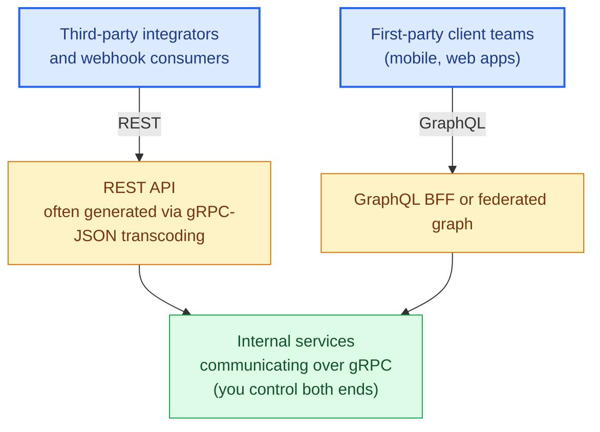

# Chapter 20: Choosing the Right Protocol

## Revisiting the framework from Chapter 1, with full context now

By this point you've seen the mechanics, the scaling failure modes, and the operational cost of each protocol in depth. The decision framework from Chapter 1 can now be made precise rather than aspirational.

## The core axes

**Who is the client, and how many client teams exist?** A public API with unknown, unbounded consumers needs REST's loose, cacheable, self-describing contract — you cannot coordinate a schema migration with clients you don't have a relationship with. A small number of first-party client teams (your own mobile and web apps) can tolerate GraphQL's tighter coupling to a shared schema, because you can actually coordinate changes with them. Internal service-to-service calls, where you own both ends, can take on gRPC's compile-time contract coupling without external coordination risk.

**What does the access pattern look like?** Simple, resource-shaped access (fetch this order, list these orders) doesn't need GraphQL's flexibility and pays its complexity cost for nothing. Client-driven, highly variable access patterns (a mobile app rendering different data per screen, needing to avoid over-fetching to save battery and bandwidth) is exactly what GraphQL was built for. High-frequency, low-latency, streaming-capable internal calls are gRPC's sweet spot.

**What's your team's tolerance for operational complexity?** REST is the lowest common denominator — every engineer, every tool, every debugging technique from the last 25 years works against it with no translation layer. GraphQL requires N+1 discipline, query cost analysis, and often a federation strategy once you scale past one team. gRPC requires comfort with Protocol Buffers, code generation pipelines, and (per Chapter 12) careful load-balancer configuration that plain REST doesn't demand.

**What's your caching story?** REST's URL-keyed caching is close to free at every layer (browser, CDN, reverse proxy). GraphQL needs deliberate normalized client-side caching or persisted-query-keyed server caching (Chapter 9) — nothing comes for free. gRPC is rarely cached in the HTTP sense at all; its performance model comes from avoiding round trips and payload size, not from caching responses.

## A quick-reference table

| Concern | REST | GraphQL | gRPC |
|---|---|---|---|
| Best client fit | Unknown/diverse, third-party | Known first-party client teams | Internal services you control |
| Over/under-fetching | Common problem | Solved by design | N/A (defined by proto contract) |
| Caching | Free at every layer | Requires deliberate design | Rarely applicable |
| Type safety | Weak (OpenAPI is a convention) | Strong (schema-enforced) | Strongest (compile-time) |
| Streaming | Workarounds only (SSE, chunked) | Subscriptions (heavier-weight) | Native, all four RPC shapes |
| Browser-native | Yes | Yes | No (needs grpc-web or a gateway) |
| Operational complexity | Lowest | Moderate-to-high at scale | Moderate (mesh/LB awareness needed) |

## Hybrid architectures are the norm, not the exception

Very few real production systems pick exactly one protocol for everything. The common, defensible pattern: gRPC between internal services (Part IV's performance and type-safety benefits apply directly where you control both ends), a GraphQL BFF or a federated graph in front of internal services for first-party client apps (Part III's flexibility benefits where you have a small number of coordinated client teams), and a REST API — often generated via gRPC-JSON transcoding (Chapter 14) rather than hand-maintained separately — for third-party integrators and webhook consumers who need REST's universal compatibility.

The mistake to avoid is not "using the wrong protocol" in isolation — it's applying one protocol's operating model to a context it wasn't designed for: exposing raw internal gRPC services directly to third-party integrators (forcing an unnecessary tooling burden on external consumers), or building a public GraphQL API without the cost-limiting and federation discipline Chapter 9 covers (an availability incident waiting to happen once external traffic diversity hits the schema).

## What's next

Chapter 21 closes the book with a complete case study: a production e-commerce platform architected exactly along these lines, walked through end to end — the decisions, the trade-offs accepted, and the incidents that shaped the current design.

## Exercises

Exercises for this chapter live in [20a-choosing-the-right-protocol-exercises.md](20a-choosing-the-right-protocol-exercises.md). Solutions are available separately in [resources/solutions/](../resources/solutions/).
