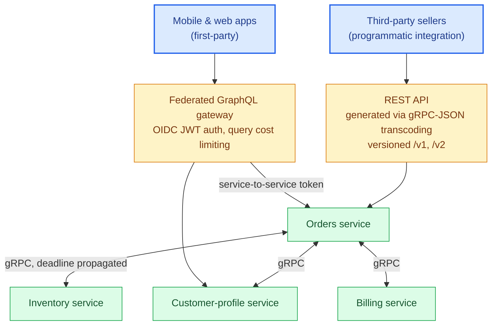
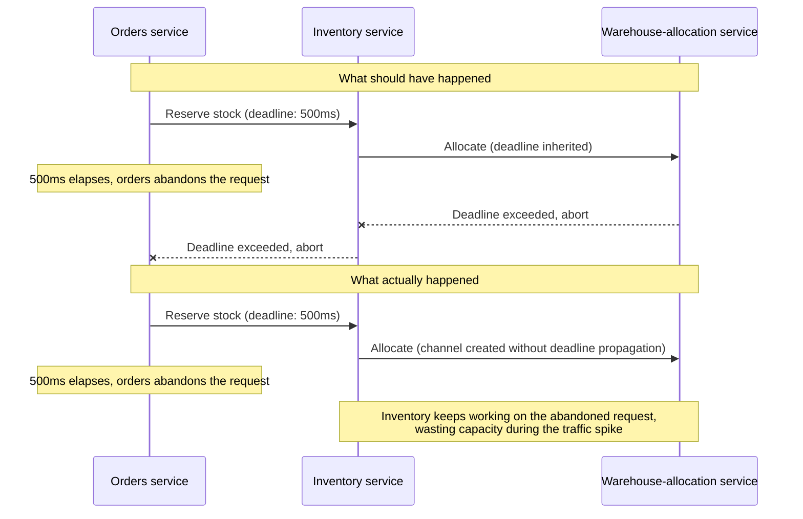

# Chapter 21: Production Case Study — A Polyglot API Platform

## The system

Consider a mid-sized e-commerce platform: an orders service, an inventory service, a customer-profile service, and a billing service, each owned by a different team, each written in Python, each needing to serve three very different consumer populations — the company's own mobile and web apps, third-party sellers integrating programmatically, and each other.

## Layer 1: gRPC between internal services

Orders, inventory, customer-profile, and billing communicate with each other exclusively over gRPC (Part IV). When the orders service creates an order, it makes a unary gRPC call to inventory to reserve stock, with a 500ms deadline (Chapter 10) that propagates to inventory's own downstream call to the warehouse-allocation service — so if the whole chain is taking too long, every hop finds out and can abort rather than continuing to do doomed work.

Each service exposes a gRPC health check (Chapter 11) that Kubernetes readiness probes key off directly. Load balancing between services uses headless Kubernetes Services with client-side round-robin (Chapter 12), avoiding the Layer-4-load-balancer connection-pinning trap. An Istio service mesh (Chapter 14) handles mTLS between all four services automatically, so none of the four teams had to build certificate rotation themselves.

## Layer 2: A federated GraphQL graph for first-party clients

The mobile and web teams consume a federated GraphQL graph (Chapter 9), where each backend service owns a subgraph reflecting its domain — the orders team owns `Order`, the customer-profile team owns `Customer` and extends `Order.customer`. A gateway composes the graph and is the only thing the client apps talk to directly.

Query cost limiting (Chapter 9) is enforced at the gateway, calibrated against real production query logs rather than a guessed budget. DataLoaders exist at each subgraph resolver boundary specifically to prevent the federated fan-out problem — a naive federated query listing 50 orders with customer data would otherwise trigger 50 individual cross-service gRPC calls from the gateway to customer-profile instead of one batched call.

Authentication (Chapter 13) happens once at the gateway via OIDC-issued JWTs; the gateway forwards a service-to-service token (not the original user JWT) to each subgraph, since the subgraphs authenticate the gateway as a trusted internal caller, not the end user directly — user-level authorization decisions (can this user see this order) are still enforced per-field at the subgraph level using claims embedded in the forwarded context, not skipped just because the gateway already checked "is this a valid session."

## Layer 3: REST for third-party sellers

Third-party sellers integrate via a REST API (Part II) that is not hand-maintained separately — it's generated via gRPC-JSON transcoding (Chapter 14) directly from the same `.proto` definitions the internal gRPC services use, annotated with HTTP mappings. This means the REST API and the internal gRPC contract cannot drift apart silently; a proto change automatically updates both.

This REST API is versioned at the URI level (`/v1`, `/v2` — Chapter 6), since third-party sellers are exactly the consumer population you cannot coordinate a synchronized migration with. Rate limiting (Chapter 15) here is stricter and quota-based per seller API key, enforced at the gateway using a Redis-backed token bucket shared across all API gateway replicas.

## What broke, and what the postmortems changed

An early version of the federated graph had DataLoaders scoped at the wrong lifetime — created once per gateway process instead of once per request — which silently leaked cached order data between users under concurrent load for several hours before detection (Chapter 8's exact warning). The fix was mechanical once diagnosed, but the detection gap led directly to the correlation-ID-based tracing investment in Chapter 17 being prioritized: without a shared trace ID across the gateway and subgraphs, the incident took far longer to root-cause than it should have.

A separate incident: the orders-to-inventory gRPC call had a deadline, but the inventory-to-warehouse call downstream did not inherit it correctly due to a channel created without deadline propagation wired through — inventory kept working on requests orders had already timed out and abandoned, wasting capacity during exactly the traffic spike that caused the original slowness. This is precisely the deadline-propagation failure mode flagged in Chapter 10, and fixing it became a checklist item in every new gRPC service's review, not just a one-off patch.

## The lesson generalized

None of these protocols failed because they were the wrong choice at a macro level — gRPC internally, GraphQL for first-party clients, and REST for third parties remains the right shape for this platform. Every incident traced back to a specific, well-documented failure mode from earlier in this book (DataLoader lifetime, deadline propagation) that wasn't caught before production traffic exposed it. The protocols themselves are mature and well-understood; the discipline required to operate them correctly at scale is where the actual engineering work — and the actual seniority — lives.

## Exercises

Exercises for this chapter live in [21a-production-case-study-exercises.md](21a-production-case-study-exercises.md). Solutions are available separately in [resources/solutions/](../resources/solutions/).
