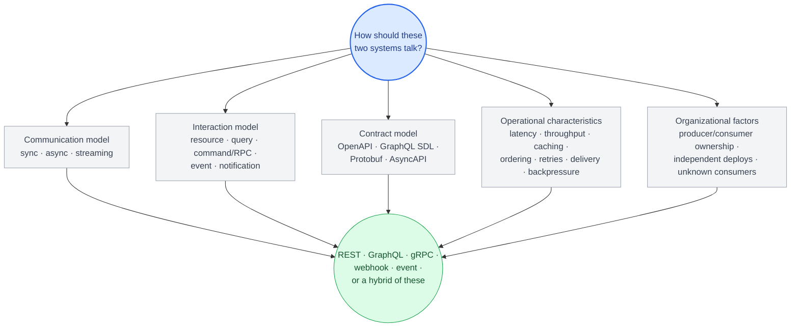
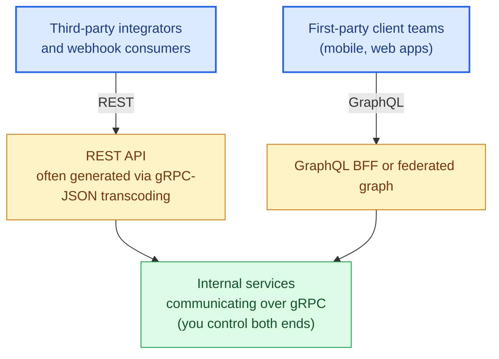

# Chapter 21: Choosing the Right Protocol

## Revisiting the framework from Chapter 1, with full context now

By this point you've seen the mechanics, the scaling failure modes, and the operational cost of each protocol in depth. The decision framework from Chapter 1 can now be made precise rather than aspirational.

## The first question is not "which protocol"

Before the REST/GraphQL/gRPC choice, settle the **communication model** (Chapter 1, Chapter 20). Is this a synchronous request where a caller waits for the answer, an asynchronous operation the caller shouldn't hold a connection for, or an event that other systems need to react to without the producer knowing who they are? Only the first is a protocol choice in the sense this chapter's axes address; the second points at `202` + a job resource or a webhook, and the third at a broker and an event contract. A large fraction of "we picked the wrong protocol" pain is actually "we modeled an asynchronous interaction as a synchronous one" — no amount of REST-vs-gRPC deliberation fixes a 30-second call that should never have been a blocking request.

## The core axes

Once the interaction is genuinely synchronous request/response, these are the axes:

**Who is the client, and how many client teams exist?** A public API with unknown, unbounded consumers needs REST's loose, cacheable, self-describing contract — you cannot coordinate a schema migration with clients you don't have a relationship with. A small number of first-party client teams (your own mobile and web apps) can tolerate GraphQL's tighter coupling to a shared schema, because you can actually coordinate changes with them. Internal service-to-service calls, where you own both ends, can take on gRPC's compile-time contract coupling without external coordination risk.

**What does the access pattern look like?** Simple, resource-shaped access (fetch this order, list these orders) doesn't need GraphQL's flexibility and pays its complexity cost for nothing. Client-driven, highly variable access patterns (a mobile app rendering different data per screen, needing to avoid over-fetching to save battery and bandwidth) is exactly what GraphQL was built for. High-frequency, low-latency, streaming-capable internal calls are gRPC's sweet spot.

**What's your team's tolerance for operational complexity?** REST is the lowest common denominator — every engineer, every tool, every debugging technique from the last 25 years works against it with no translation layer. GraphQL requires N+1 discipline, query cost analysis, and often a federation strategy once you scale past one team. gRPC requires comfort with Protocol Buffers, code generation pipelines, and (per Chapter 12) careful load-balancer configuration that plain REST doesn't demand.

**What's your caching story?** HTTP caching can be leveraged at multiple layers — browser, CDN, reverse proxy — when cache semantics and freshness requirements permit, and REST's URL-keyed model is what makes that leverage reachable: a stable URL gives every layer in the stack something to key a cache entry on, provided the response's `Cache-Control`, `Vary`, and authentication characteristics (Chapter 3) actually make it cacheable. GraphQL forfeits that URL-keying by design — a single endpoint returning a different shape per query body has no URL-level cache key at all — so it needs deliberate normalized client-side caching or persisted-query-keyed server caching (Chapter 9) to get any caching benefit back. gRPC is rarely cached in the HTTP sense at all; its performance model comes from avoiding round trips and payload size, not from caching responses.

## The full axis set, organized

The four questions above are really instances of five broader categories worth naming explicitly, because a real decision draws on all five and skipping one is usually how a "reasonable" choice turns out wrong in production:

**Communication model** — synchronous, asynchronous, or streaming (the question this chapter opens with, and Chapter 20's territory once the answer isn't synchronous).

**Interaction model** — what shape is the interaction, independent of protocol:
- *Resource* — fetch/replace/delete a thing (REST's native shape).
- *Query* — client-defined shape over a graph of data (GraphQL's native shape).
- *Command / RPC* — invoke a specific operation with a strict contract (gRPC's native shape).
- *Event* — something happened, zero or more systems react (Chapter 20).
- *Notification* — a one-way, best-effort signal, weaker than an event with a durable contract (a webhook that doesn't need replay or ordering guarantees).

**Contract model** — how the shape is specified and checked: OpenAPI (REST), GraphQL SDL, Protobuf (gRPC), or AsyncAPI/an event schema (Chapter 20). This determines what Chapter 19's compatibility tooling can actually check for you versus what stays a convention.

**Operational characteristics** — latency budget, throughput, cacheability, ordering guarantees (none, per-key, or global — Chapter 20), retry semantics (is the operation idempotent — Chapter 3, Chapter 16), delivery guarantees (at-most-once, at-least-once, effectively-once — Chapter 20), and backpressure behavior under a slow consumer (Chapter 12).

**Organizational factors** — who owns the producer, who owns the consumer, can they deploy together or does a change need to survive independent release cycles, and how many consumers exist that you don't know about and can't coordinate with. This is the axis underneath "who is the client" below, and it's usually the axis that actually decides things: two teams that can deploy in lockstep can accept a tightly coupled contract that would be reckless against an unknown third party.

None of these five replace the other; they compose. An internal service-to-service call is synchronous + command/RPC + Protobuf + low-latency/ordered-per-key + both-ends-owned-by-you — which is exactly why it lands on gRPC. A public integration notifying sellers of a shipment is asynchronous + event + AsyncAPI-described + at-least-once/unordered + unknown-consumer-count — which is why it's a webhook, not a REST response field. Running the five-axis analysis explicitly is what turns "gut feel says gRPC" into a decision you can defend and revisit later.

This diagram, more than the REST-vs-GraphQL-vs-gRPC framing that opens the book, is the shape of the actual decision every chapter has been building toward — the protocol is what falls out the bottom once the five axes are answered, not the question you start with.

## A quick-reference table

| Concern | REST | GraphQL | gRPC |
|---|---|---|---|
| Typical fit | Broad or heterogeneous consumers — unknown/diverse and third-party integrators | Clients needing flexible, per-request data selection — usually a small set of coordinated teams, but not inherently private | Controlled service-to-service communication — usually internal, but can be exposed externally via a gateway or transcoding (Chapter 14) |
| Over/under-fetching | Common problem | Solved by design | N/A (defined by proto contract) |
| Caching | Standardized HTTP caching semantics apply at every layer, when the response is actually cacheable | Requires deliberate design | Rarely applicable |
| Type safety | Weak (OpenAPI is a convention) | Strong (schema-enforced) | Strongest (compile-time) |
| Streaming | Workarounds only (SSE, chunked) | Subscriptions (heavier-weight) | Native, all four RPC shapes\* |
| Browser-native | Yes | Yes | No (needs grpc-web or a gateway) |
| Operational complexity | Lowest | Moderate-to-high at scale | Moderate (mesh/LB awareness needed) |
| Long-running / fire-and-forget work | `202` + job resource, or publish an event (Chapter 20) — not a blocking call | Same — subscriptions notify, they don't do the work | Same — plus a job/status RPC; streaming is not a substitute for async |

\* All of a protocol's streaming shapes here — gRPC's four RPC types, GraphQL subscriptions, REST's SSE/chunked workarounds — are transport-level: a persistent connection carrying a sequence of messages within one client's request lifecycle. None of them are interchangeable with the event-driven, asynchronous processing model in Chapter 20 — a streaming RPC still needs a connected client on the other end and ends when that connection does, where a published event is durable, has no connected caller, and can be consumed by systems that didn't exist yet when it was published. "Streaming is not a substitute for async" (this chapter's table above) is the same distinction stated the other way around.

As a classification rather than a heuristic, "typical fit" above breaks down at the edges on purpose: GraphQL can be public (many API platforms expose it directly), REST can be the right choice for an internal path valued for debuggability, and gRPC routinely reaches external clients through exactly the gateway pattern Chapter 14 covers. Treat the table as a starting point for the axes in the next section, not a lookup table.

## Hybrid architectures are the norm, not the exception

Very few real production systems pick exactly one protocol for everything. The common, defensible pattern: gRPC between internal services (Part IV's performance and type-safety benefits apply directly where you control both ends), a GraphQL BFF or a federated graph in front of internal services for first-party client apps (Part III's flexibility benefits where you have a small number of coordinated client teams), and a REST API — often generated via gRPC-JSON transcoding (Chapter 14) rather than hand-maintained separately — for third-party integrators and webhook consumers who need REST's universal compatibility.

The same platform almost always has a fourth edge the diagram above understates: outbound webhooks to third parties and an internal event backbone (Chapter 20) that the REST and GraphQL layers publish to. Those aren't a competing protocol choice — they're the asynchronous half of the architecture, and they get their own contract (an event schema, ideally AsyncAPI-described) and their own failure modes (at-least-once delivery, dead-lettering, the dual-write problem).

The mistake to avoid is not "using the wrong protocol" in isolation — it's applying one protocol's operating model to a context it wasn't designed for: exposing raw internal gRPC services directly to third-party integrators (forcing an unnecessary tooling burden on external consumers), or building a public GraphQL API without the cost-limiting and federation discipline Chapter 9 covers (an availability incident waiting to happen once external traffic diversity hits the schema).

## What's next

Chapter 22 closes the book with a complete case study: a production e-commerce platform architected exactly along these lines, walked through end to end — the decisions, the trade-offs accepted, and the incidents that shaped the current design.

## Exercises

Exercises for this chapter live in [21a-choosing-the-right-protocol-exercises.md](21a-choosing-the-right-protocol-exercises.md). Solutions are available separately in [resources/solutions/](../resources/solutions/).
