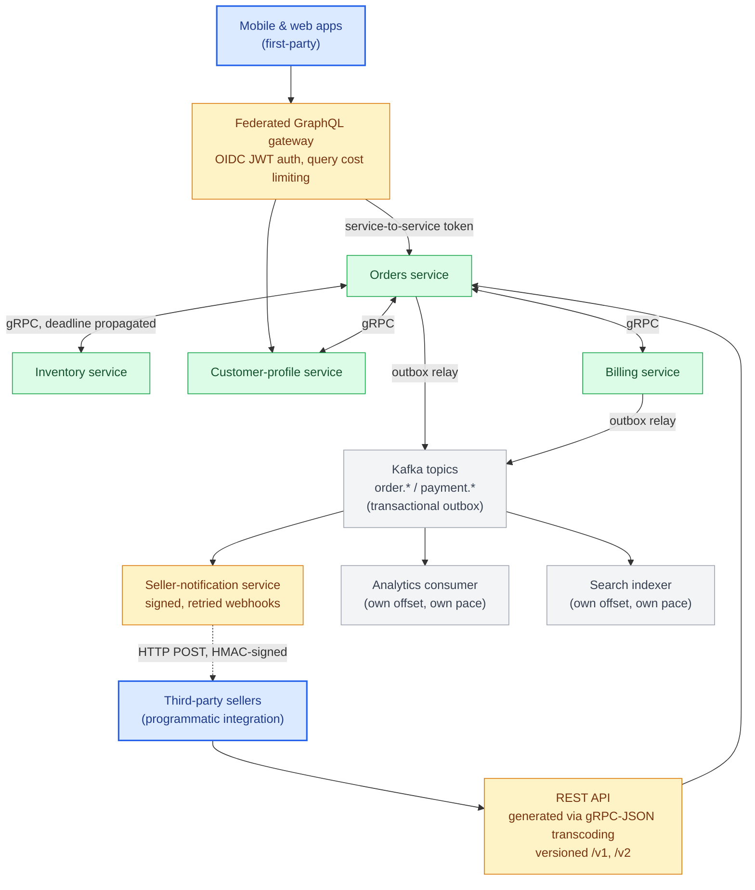
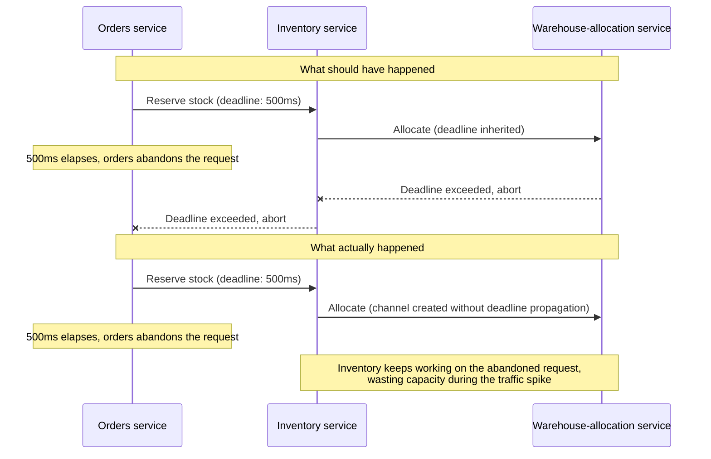

# Chapter 22: Production Case Study — A Polyglot API Platform

## The system

Consider a mid-sized e-commerce platform: an orders service, an inventory service, a customer-profile service, and a billing service, each owned by a different team, each written in Python, each needing to serve three very different consumer populations — the company's own mobile and web apps, third-party sellers integrating programmatically, and each other.

## Layer 1: gRPC between internal services

Orders, inventory, customer-profile, and billing communicate with each other exclusively over gRPC (Part IV). When the orders service creates an order, it makes a unary gRPC call to inventory to reserve stock, with a 500ms deadline (Chapter 10) that propagates to inventory's own downstream call to the warehouse-allocation service — so if the whole chain is taking too long, every hop finds out and can abort rather than continuing to do doomed work.

Each service exposes a gRPC health check (Chapter 11) that Kubernetes readiness probes key off directly. Load balancing between services uses headless Kubernetes Services with client-side round-robin (Chapter 12), avoiding the Layer-4-load-balancer connection-pinning trap. An Istio service mesh (Chapter 14) handles mTLS between all four services automatically, so none of the four teams had to build certificate rotation themselves.

## Layer 2: A federated GraphQL graph for first-party clients

The mobile and web teams consume a federated GraphQL graph (Chapter 9), where each backend service owns a subgraph reflecting its domain — the orders team owns `Order`, the customer-profile team owns `Customer` and extends `Order.customer`. A gateway composes the graph and is the only thing the client apps talk to directly.

Query cost limiting (Chapter 9) is enforced at the gateway, calibrated against real production query logs rather than a guessed budget. DataLoaders exist at each subgraph resolver boundary specifically to prevent the federated fan-out problem — a naive federated query listing 50 orders with customer data would otherwise trigger 50 individual cross-service gRPC calls from the gateway to customer-profile instead of one batched call.

Authentication (Chapter 13) happens once at the gateway via OIDC-issued JWTs; the gateway forwards a service-to-service token (not the original user JWT) to each subgraph, since the subgraphs authenticate the gateway as a trusted internal caller, not the end user directly — user-level authorization decisions (can this user see this order) are still enforced per-field at the subgraph level using claims embedded in the forwarded context, not skipped just because the gateway already checked "is this a valid session."

## Layer 3: REST for third-party sellers

Third-party sellers integrate via a REST API (Part II) that is not hand-maintained separately — it's generated via gRPC-JSON transcoding (Chapter 14) directly from the same `.proto` definitions the internal gRPC services use, annotated with HTTP mappings. This means the REST API and the internal gRPC contract cannot drift apart silently; a proto change automatically updates both.

This REST API is versioned at the URI level (`/v1`, `/v2` — Chapter 6), since third-party sellers are exactly the consumer population you cannot coordinate a synchronized migration with. Rate limiting (Chapter 15) here is stricter and quota-based per seller API key, enforced at the gateway using a Redis-backed token bucket shared across all API gateway replicas.

## Layer 4: Events and webhooks

The synchronous REST call a seller makes to create a fulfillment is not how they learn an order shipped — that can take hours. The orders service publishes domain events (`order.placed`, `order.shipped`, `payment.settled`) to a Kafka topic keyed by order id, using the transactional outbox pattern (Chapter 20): the event row is written in the same database transaction as the state change, and a relay publishes it, so the database and the event stream can't disagree. Internal consumers — analytics, the seller-notification service, a search indexer — read the log at their own offsets.

The seller-notification service turns those events into outbound **webhooks**: it `POST`s each event to the URL a seller registered, signs the body with an HMAC over `timestamp + body` using a per-seller secret, retries non-2xx responses with exponential backoff and jitter over a 24-hour window, and dead-letters (and disables, with an alert to the seller) any endpoint that fails every delivery for a day. Every event envelope carries an `event_id` and `occurred_at`, and the integration docs state plainly that delivery is at-least-once and unordered — sellers must dedupe on `event_id`.

Every one of the four independent consumers on the bus — the seller-notification service, analytics, the search indexer, and (in the scenarios below) billing's own event reactions — reads the same log at its own offset and its own pace. That's the architectural point of a log-based stream over direct calls: adding a fifth consumer tomorrow (fraud detection, say) means subscribing to the existing topic, not modifying the orders service or coordinating a deploy with it.

## Seven forces this architecture has to survive

A diagram of boxes and arrows says nothing about whether the design actually holds up. Seven concrete failures, run through the same system, are what actually test it — each one is a different chapter's mechanism showing up as the thing standing between "handled" and "incident":

1. **Inventory succeeds, payment fails.** Orders and billing are separate services with separate local transactions — there's no database transaction spanning both, so "roll it back" isn't a single operation. This is exactly the saga shape from Chapter 20: the failed payment triggers a compensating action (release the inventory reservation) published as its own event, not a rollback. Orchestration versus choreography (Chapter 20) decides whether orders itself drives that compensation explicitly or inventory reacts to a `payment.failed` event on its own — either way, the order sits in a first-class `payment_failed` state, not silently vanishes.
2. **The mobile client is offline when the response would arrive.** A `createOrder` mutation that takes long enough to complete but the client's connection has already dropped is exactly the "should this have been synchronous at all" question from Chapter 1 and Chapter 20 — the fix isn't a longer timeout, it's treating order creation as job-shaped: return fast with a job/order id, let the client re-fetch order status on reconnect (or receive a push notification) rather than depending on holding one connection open across a mobile network drop.
3. **A third-party seller needs to learn about a state change asynchronously.** This is the webhook scenario, and it's worth walking in full below rather than summarizing — it's where the largest number of this book's mechanisms have to cooperate correctly at once.
4. **10,000 events arrive at once** — a bulk relabeling job touches every order in a large batch, or a partner's backfill fires a burst of updates. This is Chapter 12's backpressure problem, generalized from a single streaming RPC to an entire consumer: if the seller-notification service can only process 1,000 events/sec against a sudden 10,000/sec inflow, Kafka's retention absorbs the burst (Chapter 20) without data loss, consumer lag (Chapter 17) climbs and is the visible signal, and the webhook layer's own rate limiting (Chapter 15) protects individual sellers' endpoints from receiving that same burst compressed into a few seconds.
5. **The inventory service changes its event schema.** A field renamed or retyped on `order.placed`'s payload is a breaking change under Chapter 19's rules regardless of how many services read that topic, and — because the schema is compatibility-checked in CI (Chapter 19) with the same discipline as the internal `.proto` contracts — the change either ships as additive (a new field, old consumers unaffected) or goes through a deprecation window with tolerant-reader consumers, not as a surprise that silently corrupts the analytics consumer's read path.
6. **Billing responds slowly under load.** The order-creation call chain has a deadline budget (Chapter 10) that includes the hop to billing; a billing service running slow either returns within its allotted slice of that budget or the whole chain aborts with `DEADLINE_EXCEEDED` rather than the customer waiting indefinitely — and a circuit breaker (Chapter 16) in front of billing means that once it's clearly unhealthy, orders stops sending it doomed calls and fails fast instead of piling up threads waiting on a service that isn't going to answer.
7. **A client retries a payment request after a timeout.** The client can't tell whether its first `createOrder` call actually succeeded before the connection dropped — retrying blindly risks a duplicate charge. This is Chapter 3's idempotency-key discipline applied to the gateway's mutation: the client sends the same idempotency key on the retry, and orders' atomic claim-then-write (not check-then-act) guarantees the second attempt returns the first attempt's result instead of creating a second order and a second charge.

Scenarios 1, 2, 4, 5, and 7 are each a self-contained illustration of one mechanism; scenario 6 already showed up as a real incident below. Scenario 3 is worth more than a paragraph, because it's the one where the most independent mechanisms have to hold simultaneously — that's next.

## Scenario 3, walked in full: the notification service is down

Put a concrete failure through the whole stack at once: a customer places an order on the mobile app. Payment succeeds. Inventory reservation succeeds. The seller-notification service — the one that turns Kafka events into outbound webhooks — is temporarily unavailable. What actually happens, layer by layer?

1. **Mobile app → GraphQL gateway → Orders (gRPC), synchronous path.** The mobile app's `createOrder` mutation only depends on the orders, inventory, and billing services answering — the notification service isn't in this call path at all. Deadlines (Chapter 10) are set per downstream gRPC hop; as long as payment and inventory respond inside their budgets, the mutation returns `200` with the created order. **Authorization** (Chapter 13) is checked once at the gateway (is this an authenticated session) and again per-field at the orders subgraph (does this customer own this cart) — neither check has anything to do with notification health, which is exactly why a downstream notification outage can't and shouldn't block order creation.
2. **Orders writes state and publishes, atomically.** The order status change and the `order.placed` event are written in the same database transaction via the outbox (Chapter 20) — this is unaffected by any downstream consumer's availability, because the outbox relay, not the orders service, is responsible for actually getting the event to Kafka.
3. **Notification service is down — the event just waits.** Kafka retains the event; the seller-notification service's consumer group simply isn't advancing its offset while it's unavailable. This is the point of a log-based stream over a direct call: **eventual consistency** is explicit and designed-for here, not an accident — the seller's webhook will be late, not lost, and the system's correctness doesn't depend on notification being up at the moment the order was placed.
4. **Notification service recovers and catches up.** It resumes consuming from its last committed offset — not from "now" — so it processes every event that queued up while it was down. Kafka guarantees order only within a partition, not across the whole topic; using `order_id` as the partition key is what places every event for a given order into the same partition, and therefore in the same relative order they were published — the ordering guarantee is a property of the partitioning choice, not something Kafka provides for "orders" as a concept (Chapter 20). Each webhook delivery still carries its `event_id`; if notification's own crash-and-restart caused it to reprocess an event it had partially handled before dying, the receiving seller's dedupe logic (Chapter 20's idempotent-consumer pattern) absorbs the duplicate.
5. **If delivery still fails at the seller's endpoint**, the retry-with-backoff-and-jitter policy (Chapter 16, applied to Chapter 20's webhook delivery) takes over independently of why notification was down in the first place — the seller's endpoint being flaky and the notification service having been down are two unrelated failure axes, and the retry/DLQ machinery doesn't need to distinguish them.
6. **What an operator sees.** Consumer lag on the notification service's Kafka group (Chapter 17) climbs while it's down and drains once it recovers — that lag metric is the whole story, visible before a single seller complains. A trace (Chapter 17) for any individual order shows the REST/GraphQL/gRPC synchronous portion completing normally, with the event-to-webhook leg appearing as a separately timed, asynchronous continuation rather than blocking or failing the original request's trace.
7. **What doesn't need to change.** No REST or GraphQL contract changed. No `.proto` changed. This entire failure and recovery sequence is absorbed by the async layer's design (the outbox, the log's retention, offset-based consumer state, idempotent delivery) without the synchronous protocols even being aware anything went wrong — which is the actual point of decoupling order creation from notification delivery in the first place, and the reason Layer 4 exists as a separate architectural layer rather than one more synchronous call bolted onto order creation.

The scenario doesn't introduce a new failure mode — it's a composition of mechanisms this book already covers individually (deadlines, the outbox, consumer offsets, idempotent webhook delivery, retry-with-backoff, consumer-lag observability, and field-level authorization) demonstrating why each one has to be in place *together*: remove any single piece — no outbox, no idempotency key, no lag metric — and this same scenario turns into one of the incidents below instead of a non-event. The other six scenarios above are the same exercise at less length: pick any one of them, remove the mechanism named as its answer, and it stops being a scenario the architecture survives and becomes the next postmortem.

## What broke, and what the postmortems changed

An early version of the federated graph had DataLoaders scoped at the wrong lifetime — created once per gateway process instead of once per request — which silently leaked cached order data between users under concurrent load for several hours before detection (Chapter 8's exact warning). The fix was mechanical once diagnosed, but the detection gap led directly to the correlation-ID-based tracing investment in Chapter 17 being prioritized: without a shared trace ID across the gateway and subgraphs, the incident took far longer to root-cause than it should have.

A separate incident: the orders-to-inventory gRPC call had a deadline, but the inventory-to-warehouse call downstream did not inherit it correctly due to a channel created without deadline propagation wired through — inventory kept working on requests orders had already timed out and abandoned, wasting capacity during exactly the traffic spike that caused the original slowness. This is precisely the deadline-propagation failure mode flagged in Chapter 10, and fixing it became a checklist item in every new gRPC service's review, not just a one-off patch.

A third incident predated the outbox: for its first year the orders service updated its database and then published `order.shipped` to Kafka as two separate calls. During a broker failover, roughly 400 shipped-order events were never published — the database was correct, but the search index, the analytics revenue numbers, and the sellers' webhooks all silently missed those orders, and the discrepancy wasn't noticed until a seller reconciliation flagged it weeks later. This is the dual-write failure mode from Chapter 20 exactly; the fix was to move every event publish behind a transactional outbox, and "does this write to another system happen in the same transaction as the state change?" became a design-review question for every new event.

## The lesson generalized

None of these protocols failed because they were the wrong choice at a macro level — gRPC internally, GraphQL for first-party clients, REST for third parties, and an event backbone with signed webhooks for asynchronous delivery remains the right shape for this platform. Every incident traced back to a specific, well-documented failure mode from earlier in this book (DataLoader lifetime, deadline propagation, dual writes) that wasn't caught before production traffic exposed it. The protocols themselves are mature and well-understood; the discipline required to operate them correctly at scale is where the actual engineering work — and the actual seniority — lives.

## Exercises

Exercises for this chapter live in [22a-production-case-study-exercises.md](22a-production-case-study-exercises.md). Solutions are available separately in [resources/solutions/](../resources/solutions/).
